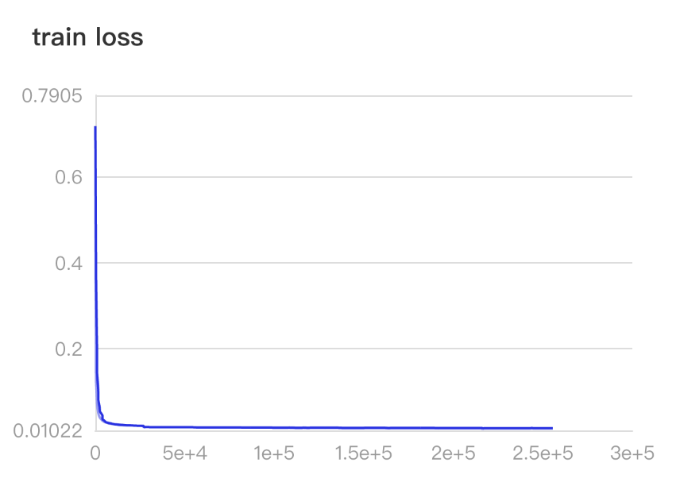

# Training Audio-tagging networks using PaddleAudio

In this example, we showcase how to train a typical CNN using PaddleAudio. 
Different from [PANNS](https://github.com/qiuqiangkong/audioset_tagging_cnn)\[1\],which used a customized CNN14, we are using [resnet50](https://arxiv.org/abs/1512.03385v1)\[2\], which is more common in deep learning community and has mush fewer parameters than the netorks in PANNS. We acheived similar [Audioset](https://research.google.com/audioset/) mAP in the version of balanced evaluation datasets we can gathered. 


## Introduction

Audio-tagging is the task to gerenate tags for the input audio file. It is usually tackled  as a multi-label classication problem. Multi-label classification is a generalization of multiclass classification, which is the single-label problem of categorizing instances into precisely one of more than two classes\[3\]. 


The key differenes of this example from common classiciation problem (e.g., imagenet classificaiton) is   summarized as follows. 

- Use of extra font-end feature extraction, i.e., convert the audio from wavform to mel-spectrogram. In image classifiaiton task, no extra feature extraction is necessary(e.g., not need to convert to frequency domain)
- Use of weight averaging to reduce the variance, and thus improves generalization. This is necessary to reduce overfitting. (In our example, weight-averaging improved mAP from 0.375 to 0.400)
- Use of resnet50 with 1-channel input and many dropout layers with large dropout rate. This is motivated by the great work of PANNS. 

- Use of mixup training and setting mixup\[4\] gamma to 0.5. Mixup training is quite useful for audio scenario. 
- Use the pretrained weight from imagenet classication task . This approach is sometimes seen in audio classicaiton task, such as \[??\]. In our example, it accelates the training processing at the very first epoch. 
- Use of learning-rate warmup heuristic.  Learning-rate Warnup is commonly used in training CNNs and trasformers. \[\]. We found it stablized the training and imporved final mAP.

The other attributes of this example include
- On par with state-of-the-art, but the network size is much smaller in terms of Flops of number of parameters(see the following table). When saved to disk, the  weight of this work is only 166 MiB in size, in contrast to 466MiB for CNN14.
- Use balance sampling to make sure each class of the audioset is treated evenly.


|  Model      |  Flops   | Params     |
| :------------- | :----------: | -----------: |
| CNN14* | 1,658,961,018   |  80,769,871 |
| Resnet50(This example) | 1,327,513,088   | 28,831,567| 

(* Note: we use ```paddle.flops()``` to cacludate flops and parameters, which is slightly different from the statistics in origin paper)
## Features

The featrue we use in this example is mel-spectrogram, similary to that of [PANNS](https://github.com/qiuqiangkong/audioset_tagging_cnn). The details of the feature parameters is listed in [config.yaml](config.yaml) and also described below:
```
sample_rate: 32000
window_size: 1024
hop_size: 640
mel_bins: 128
fmin: 50
fmax: 16000
```
we provide a script file [wav2mel](../tools/wav2mel.py) to process the audio files. You can use it to do preprocessing if you have already downloaded the audioset. 


## Network

Since the input audio featrue is a one-channel spectrogram, 
we modified the resnet50 to accept 1-channel inputs by setting conv1 as
```
self.conv1 = nn.Conv2D(1, self.inplanes, kernel_size=7, stride=2, padding=3, bias_attr=False)
```

We also added a dropout layer before the last fully-connect layer and set the dropout rate to ```0.25```

The network is defined in [model.py](./model.py)

## Training 


### Training data

The dataset used in both training and evlatuion is [Audioset](https://research.google.com/audioset/). We mannuly download the video files from youtube according to the youtube-id listed in the dataset, and convert the audio to wav format of 1-channel and 32K sample rate. We then extract the mel-spetrogram features as described above and store the features as numpy array into seperate h5 file. Each h5 arxive contains features extracted from 10,000 aduio files. 

For this experience we have sucessfully downloaded ```1714174``` valid files for unbalance segment, ```16906``` for balanced training segment, and ```17713``` for balanced evaluation segment. The data statistics are summaried in the following table:

|        | unbalanced    | balanced train     |Evaluation     |
| :------------- | :----------: | :-----------: |-----------: |
| [Original](https://research.google.com/audioset/download.html) | 2,042,985   | 22,176 | 20,383 |
| [PANNS](https://arxiv.org/pdf/1912.10211.pdf)   | 1,913,637 |  20,550 |18,887 |
| This example  | 1,714,174 | 16,906 |17,713 |

Our version of dataset contains fewer audio than PANN due to the reasons that video will gradually become private or simply  deleted by the authors.  We use all of the audio files from balanced segment and unbalanced segent for training and the rest evaluation segment for testing. This gives up 1,714,174 traning files (unevenly) distributed  across 527 labels. The label information can be found int [this location](https://research.google.com/audioset/ontology/index.html) and the paper\[7\]

### Run the training
Set all necessary path and training configurations in the file [config.yaml](./config.yaml), then run 
```
python train.py --device <device_number> 
```
for single gpu training. It takes about 3 hours for training one epoch with balance-sampling strategy. 

To restore from a checkpoint, run 
```
python train.py --device <device_number>  --restore <epoch_num>
```

For multi-gpu training, run 
```
python -m paddle.distributed.launch --selected_gpus='0,1,2,3' ./train.py --distributed=1 

```

### Training loss



## Evaluation


We evaludate audio tagging performance using the sampel metric as described in PANNS, namely mAP, AUC. 

Since our version of evaluation dataset is 


To get the statistics, run 
```
python evaluation.py
```
It will automatically download the our version of evaludation dataset and do the evalatuion. 

| Model |mAP    |AUC     |d-prime|
| :------------- | :----------: |:-----------: |-----------: |
| TAL Net \[5\]* | 0.362| 0.965 |2.56|
| DeepRes \[6\]* | 0.392 | 0.971|2.68|
| PANNS \[1\]  |  0.420 ** |  0.970|2.66|
| This example  |  0.400 |  0.967  |2.60|

(* indicate different evaluation set than ours, ** stats are different from the paper as we re-evaluated on our version of dataset)

## Inference 

You can do inference give an input audio file by

```
python inference.py --wav_file <path-to-your-wav-file> --top_k 5
```
which will give you a reslult like this
```

```


## Reference

- \[1\] Kong, Qiuqiang, et al. “PANNs: Large-Scale Pretrained Audio Neural Networks for Audio Pattern Recognition.” IEEE Transactions on Audio, Speech, and Language Processing, vol. 28, 2020, pp. 2880–2894.

- \[2\] He, Kaiming, et al. “Deep Residual Learning for Image Recognition.” 2016 IEEE Conference on Computer Vision and Pattern Recognition (CVPR), 2016, pp. 770–778.

- \[3\] https://en.wikipedia.org/wiki/Multi-label_classification
- \[4\] Zhang, Hongyi, et al. “Mixup: Beyond Empirical Risk Minimization.” International Conference on Learning Representations, 2017.
- \[5\] Kong, Qiuqiang, et al. “Audio Set Classification with Attention Model: A Probabilistic Perspective.” 2018 IEEE International Conference on Acoustics, Speech and Signal Processing (ICASSP), 2018, pp. 316–320.
- \[6\] Ford, Logan, et al. “A Deep Residual Network for Large-Scale Acoustic Scene Analysis.” Interspeech 2019, 2019, pp. 2568–2572.
- \[7]\ Gemmeke, Jort F., et al. “Audio Set: An Ontology and Human-Labeled Dataset for Audio Events.” 2017 IEEE International Conference on Acoustics, Speech and Signal Processing (ICASSP), 2017, pp. 776–780.


