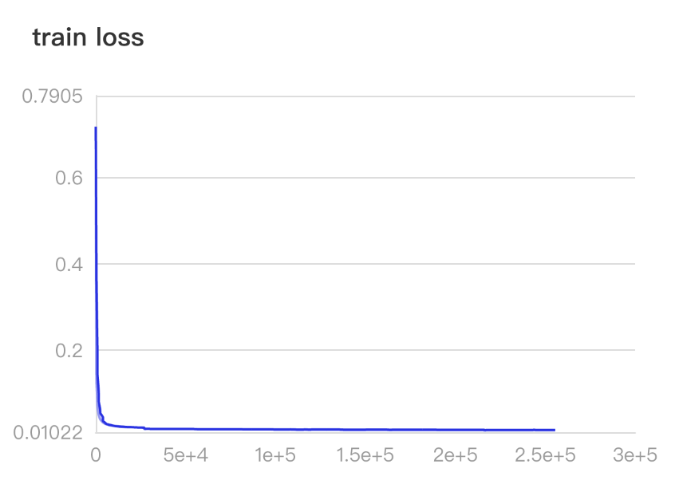

# Training Audio-tagging networks using PaddleAudio

In this example, we showcase how to train a typical CNN using PaddleAudio.
Different from [PANNS](https://github.com/qiuqiangkong/audioset_tagging_cnn)\[1\], which used a customized CNN14, here we are using [resnet50](https://arxiv.org/abs/1512.03385v1)\[2\], a kind of network more commonly-used in deep learning community and has much fewer parameters than the networks used in PANNS. We achieved similar [Audioset](https://research.google.com/audioset/) mAP in our version of balanced evaluation dataset.


## Introduction

Audio-tagging is the task to generate tags for input audio file. It is usually tackled  as a multi-label classification problem. Different from commonly-seen multi-class classification which is a single-label problem of categorizing instances into precisely one of more than two classes\[3\], multi-label classification task categorizes instances into one or more classes.


To solve the audio-tagging we can borrow ideas from image-recognition community. For example, we can use residual networks trained on imagenet dataset but change the classification head from 1000-classes to 527-classes for Audioset. We can also use BCE-loss to do multi-label classification, avoiding the label-competition brought by softmax activation and cross-entropy loss (since we allow multiple labels or tags for the same audio instance). However, as mentioned by previous work\[1,4,5\], audioset is weakly labelled(No time information for the exact location of the labels) and highly imbalanced(The training dataset is largely dominated by speech and music), the training is highly prone to over-fitting and we have to change the network and training strategy accordingly as follows.

- Use of extra front-end feature extraction, i.e., convert the audio from waveform to mel-spectrogram. In image classification task, no extra feature extraction is necessary(e.g., not need to convert image to frequency domain)
- Use of weight averaging to reduce the variance and improve generalization. This is necessary to reduce over-fitting. (In our example, weight-averaging improved mAP from 0.375 to 0.401)
- Use resnet50 with 1-channel input and add 4 dropout layers each after the 4 convolution blocks in residual networks. This is motivated by PANNS.
- Use of mixup training. we set mixup\[4\] gamma to 0.5 and verify that mixup training is quite useful for this scenario.
- Use the pretrained weight from imagenet classification task . This approach is sometimes used in audio classification task. In our example, it accelerates the training process at the very first epoch.
- Use of learning-rate warmup heuristic.  Learning-rate warmup is commonly used in training CNNs and transformers.  We found it stabilize the training and improve final mAP.
- Use balanced sampling to make sure each class of the Audioset is treated evenly.
- Use random cropping,  spectrogram permutation, time-freq masking to do training augmentation.

With the above strategies, we have achieved results that on par with the sota, and our network size is much smaller in terms of FLOPs of number of parameters(see the following table). When saved to disk, the  weight of this work is only 166 MiB in size, in contrast to 466MiB for CNN14.


|  Model      |  Flops   | Params     |
| :------------- | :----------: | -----------: |
| CNN14* | 1,658,961,018   |  80,769,871 |
| Resnet50(This example) | 1,327,513,088   | 28,831,567|

(* Note: we use ```paddle.flops()``` to calculate flops and parameters, which gives slightly different results from the origin paper)

## Features

The feature we use in this example is mel-spectrogram, similar to that of [PANNS](https://github.com/qiuqiangkong/audioset_tagging_cnn). The details of the feature parameters are listed in [config.yaml](config.yaml) and also described below:
```
sample_rate: 32000
window_size: 1024
hop_size: 640
mel_bins: 128
fmin: 50
fmax: 16000
```
We provide a script file [wav2mel](./wav2mel.py) to preprocess audio files into mel-spectrograms and stored them as multiple h5 files. You can use it to do preprocessing if you have already downloaded the Audioset.


## Network

Since the input audio feature is a one-channel spectrogram,
we modify the resnet50 to accept 1-channel inputs by setting conv1 as
```
self.conv1 = nn.Conv2D(1, self.inplanes, kernel_size=7, stride=2, padding=3, bias_attr=False)
```
As mentioned, we add dropout layers each after the convolution block in resnet50.
We also added a dropout layer before the last fully-connect layer and set the dropout rate to ```0.2```

The network is defined in [model.py](./model.py)

## Training

Everything about data, feature, training controls, etc,  can be found in the [config file](./assets/config.yaml).  
In this section we will describe training data and steps on how to run the training.


### Training data

The dataset used in both training and evaluation is [Audioset](https://research.google.com/audioset/). We manually download the video files from Youtube according to the youtube-id listed in the dataset, and convert the audio to wav format of 1-channel and 32K sample rate. We then extract the melspetrogram features as described above and store the features as numpy array into separated h5 file. Each h5 file contains features extracted from 10,000 audio files.

For this experience we have successfully downloaded ```1714174``` valid files for unbalance segment, ```16906``` for balanced training segment, and ```17713``` for balanced evaluation segment. The data statistics are summarized in the following table:

|        | unbalanced    | balanced train     |Evaluation     |
| :------------- | :----------: | :-----------: |-----------: |
| [Original](https://research.google.com/audioset/download.html) | 2,042,985   | 22,176 | 20,383 |
| [PANNS](https://arxiv.org/pdf/1912.10211.pdf)   | 1,913,637 |  20,550 |18,887 |
| This example  | 1,714,174 | 16,906 |17,713 |

Our version of dataset contains fewer audio than those of PANNs due to the reasons that video will gradually become private or simply  deleted by the authors.  We use all of the audio files from balanced segment and unbalanced segment for training and the rest evaluation segment for testing. This gives up 1,714,174 training files (unevenly) distributed  across 527 labels. The label information can be found int [this location](https://research.google.com/audioset/ontology/index.html) and the paper\[7\]

### Run the training
Set all necessary path and training configurations in the file [config.yaml](./config.yaml), then run
```
python train.py --device <device_number>
```
for single gpu training. It takes about 3 hours for training one epoch with balance-sampling strategy.

To restore from a checkpoint, run
```
python train.py --device <device_number>  --restore <epoch_num>
```

For multi-gpu training, run
```
python -m paddle.distributed.launch --selected_gpus='0,1,2,3' ./train.py --distributed=1

```

### Training loss function
We use mixup loss described in the paper \[4\]. It's better than simply using binary cross entropy loss in the
multi-label Audioset tagging problem.

### Training log
We use [VisualDL](https://github.com/PaddlePaddle/VisualDL.git) to record training loss and evaluation metrics.



## Evaluation


We evaluate audio tagging performance using the same metrics as described in PANNS, namely mAP, AUC,d-prime.

Since our version of evaluation dataset is different from PANNs,  we re-evaluate the performance of PANNS using their code and pre-trained weights. For the TAL Net\[5\] and DeepRes\[6\], we directly use the results in the original paper.


To get the statistics of our pre-trained model in this example, run
```
python evaluation.py
```

| Model |mAP    |AUC     |d-prime|
| :------------- | :----------: |:-----------: |-----------: |
| TAL Net \[5\]* | 0.362| 0.965 |2.56|
| DeepRes \[6\]* | 0.392 | 0.971|2.68|
| PANNS \[1\]  |  0.420 ** |  0.970|2.66|
| This example  |  0.416 |  0.968  |2.62|

(* indicate different evaluation set than ours, ** stats are different from the paper as we re-evaluated on our version of dataset)

## Inference

You can do inference by passing an input audio file to [inference.py](./inference.py）

```
python inference.py --wav_file <path-to-your-wav-file> --top_k 5
```
which will give you a result like this:
```
labels	prob
------------
Speech: 0.744
Cat: 0.721
Meow: 0.681
Domestic animal: 0.627
Animal: 0.488
```


## Reference

- \[1\] Kong, Qiuqiang, et al. “PANNs: Large-Scale Pretrained Audio Neural Networks for Audio Pattern Recognition.” IEEE Transactions on Audio, Speech, and Language Processing, vol. 28, 2020, pp. 2880–2894.

- \[2\] He, Kaiming, et al. “Deep Residual Learning for Image Recognition.” 2016 IEEE Conference on Computer Vision and Pattern Recognition (CVPR), 2016, pp. 770–778.

- \[3\] https://en.wikipedia.org/wiki/Multi-label_classification
- \[4\] Zhang, Hongyi, et al. “Mixup: Beyond Empirical Risk Minimization.” International Conference on Learning Representations, 2017.
- \[5\] Kong, Qiuqiang, et al. “Audio Set Classification with Attention Model: A Probabilistic Perspective.” 2018 IEEE International Conference on Acoustics, Speech and Signal Processing (ICASSP), 2018, pp. 316–320.
- \[6\] Ford, Logan, et al. “A Deep Residual Network for Large-Scale Acoustic Scene Analysis.” Interspeech 2019, 2019, pp. 2568–2572.
- \[7]\ Gemmeke, Jort F., et al. “Audio Set: An Ontology and Human-Labeled Dataset for Audio Events.” 2017 IEEE International Conference on Acoustics, Speech and Signal Processing (ICASSP), 2017, pp. 776–780.
