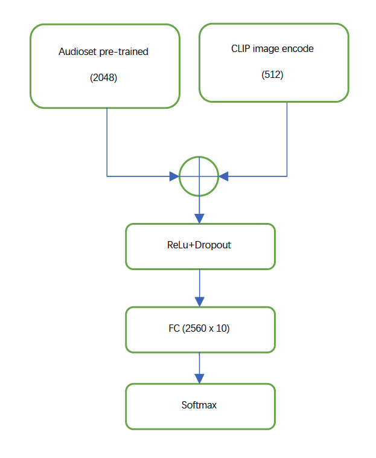

# DCASE challenge 2021 task1b, Audio-visual scene classification
In this example, we give a much <b>stronger</b> baseline for the [task-1b of DCASE challenge](http://dcase.community/challenge2021/task-acoustic-scene-classification#subtask-b).

## Introduction
The task of audio-visual scene classification is to combine audio stream and video stream in order to do scene classification.  Different from sound event classification, scene classification is more complex as different combination of sound events can occur in the same scene. Therefore, scene classification is more prune to over-fitting. In this example, we utilize our pre-trained resent50 in the [audioset training example](../audioset_training) for audio-only classification. For video-only track, we use recent advance in contrastive language-image pre-training, aka CLIP\[5\] to do zero-shot/linear-probe image scene classification, obtained 0.772 and 0.88  overall classification accuracy respectively.

Finally, we combined both audio and visual stream in later-fusion manner and obtained 0.925 overall accuracy, which largely over-takes the performance in the [ICASSP paper](https://github.com/shanwangshan/TAU-urban-audio-visual-scenes)\[1\].

## Demo structure
- [model.py](model.py): the modified resent models, support both audio-visual and audio-only tasks
- [train.py](train.py): for training the model
- [dataset.py](dataset.py): read mel features from h5
- [utils.py](utils.py): some utility functions, e.g., mixup
- [evaluate.py](evaluate.py): for evaluation for audio-visual and audio-only
- [evaluate_visual_lp.py](evaluate_visual_lp.py): linear-probe using clip for video-only task
- [evaluate_visual_zs.py](evaluate_visual_zs.py): zero-shot evaluation using clip for video-only task
- [assets](assets): all the necessary files/data/config

## Dataset
Data was recorded in the following 10 scenes:
- Airport - airport
- Indoor shopping mall - shopping_mall
- Metro station - metro_station
- Pedestrian street - street_pedestrian
- Public square - public_square
- Street with medium level of traffic - street_traffic
- Travelling by a tram - tram
- Travelling by a bus - bus
- Travelling by an underground metro - metro
- Urban park - park

### Audio-only
For audio-only scene classification, we extract the same feature as described in  [audioset training example](../audioset_training) and use the same network, namely resent50, except that we add extra fc-layers and one final classification head for the 10-way classification. We also add dropout to reduce over-fitting. See [model.py](model.py) for details.

Training audio-only network:
``` sh
python train.py --device='gpu' --task_type=audio_only --config='./assets/config.yaml'
```

To evaluate using our pre-trained weights, try
``` sh
python evaluate.py --device='gpu' --task_type=audio_only --config='./assets/config.yaml'
```

### Video-only
For video-only task, we use OpenAI CLIP for scene classification. 
#### Convert video to images
We first extract images at 1 frame per second from the provided video files for further process. Using ffmpeg, this can be done as follows,

``` sh
mkdir -p images
for f in `ls video/*.mp4`; do
    file=`echo $f |cut -d . -f 1|cut -d / -f 2`
    ffmpeg -i $f -vf fps=1 ./images/$file-%02d.png
done
```
The above script assumes that you put all video files under folder './video'.

#### Zero-shot classification
After converting video to images, we use OpenAI clip to extract class probability in zero-shot manner. We use the 5th frame to represent the whole video. The usage of zero-shot image classification is explained in [OpenAI's implementation](https://github.com/openai/CLIP) in Pytorch, and also in a third-party  [implementation](https://github.com/ranchlai/CLIP.paddle).

The overall zero-shot video-only accuracy is 0.697 and 0.729 for validation split and whole dataset respectively without any heavy prompt engineering.
To evaluate zero-shot accuracy, run
``` sh
python evaluate_visual_zs.py
```

The above script will automatically download pre-extracted zero-shot features and perform the evaluation.

#### Linear-probe classification
For linear-probe, see [README_LP.md](README_LP.md)

### Audio-visual task
We can combine audio and video branch in a late-fusion manner. THe network architecture is as follows,


The audio-visual task utilizes embedding output form CLIP image encoder. For the convenience of this demo, the embedding has been pre-extracted and will be automatically downloaded before training.


To train audio-visual network, run
``` sh
python train.py --device='gpu' --task_type='audio_visual' --config='./assets/config.yaml'
```

To evaluate using our pre-trained weights, run
``` sh
python evaluate.py --device='gpu' --task_type='audio_visual' --config='./assets/config.yaml'
```

With audioset\[4\] pre-training, mixup\[3\] and spectrogram augmentation techniques, we achieve <b>92.5%</b> overall classification score.  

### Performance
|task|acc|
|--|--|
|video-only(linear probe)|0.893|
|video-only(zero-shot),whole dataset|0.729|
|video-only(zero-shot),validation|0.697|
|audio-only|0.771|
|audio-visual|0.925|

## Reference
- \[1\] Wang, Shanshan, et al. “A Curated Dataset of Urban Scenes for Audio-Visual Scene Analysis.” ArXiv Preprint ArXiv:2011.00030, 2020.

- \[2\] He, Kaiming, et al. “Deep Residual Learning for Image Recognition.” 2016 IEEE Conference on Computer Vision and Pattern Recognition (CVPR), 2016, pp. 770–778.

- \[3\] Zhang, Hongyi, et al. “Mixup: Beyond Empirical Risk Minimization.” International Conference on Learning Representations, 2017.

- \[4\] Gemmeke, Jort F., et al. “Audio Set: An Ontology and Human-Labeled Dataset for Audio Events.” 2017 IEEE International Conference on Acoustics, Speech and Signal Processing (ICASSP), 2017, pp. 776–780.
- \[5\] Radford, Alec, et al. “Learning Transferable Visual Models From Natural Language Supervision.” ArXiv Preprint ArXiv:2103.00020, 2021.
