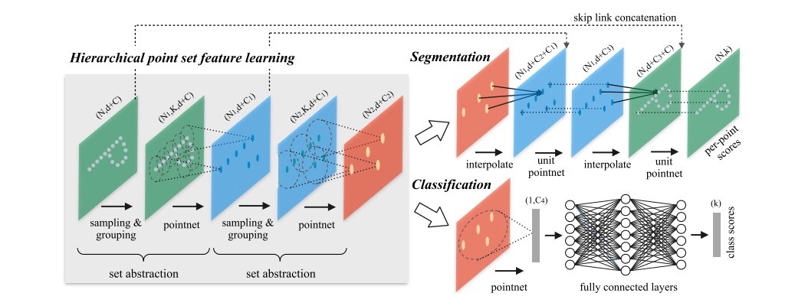

# PointNet++ 分类和语义分割模型

---
## 内容

- [简介](#简介)
- [快速开始](#快速开始)
- [参考文献](#参考文献)
- [版本更新](#版本更新)

## 简介

[PointNet++](https://arxiv.org/abs/1706.02413) 是 Charles R. Qi, Li Yi, Hao Su, Leonidas J. Guibas 等人提出的，针对3D数据进行分类和语义分割的模型。该模型基于PointNet进行了拓展, 使用分层点集特征学习来提取点云数据的特征，首先通过对输入point进行分组和采样提取局部区域模式，然后使用多层感知器来获取点特征。PointNet++ 还将点特征传播用于语义分割模型，采用基于距离插值和跨级跳转连接的分层传播策略，对点特征进行向上采样，获得所有原始点的点特征。


网络结构如下所示：

<p align="center">
 <br />
用于点云分类和分割的 PointNet++ 网络结构
</p>

集合抽象层是网络的基本模块，每个集合抽象层由三个关键层构成:采样层、分组层和特征提取层。

- **采样层**：采样层使用最远点采样(FPS)的方法，从输入点中选择一组点，它定义了局部区域的中心。与随机抽样的方法相比，在质心数目相同的情况下，FPS可以更好的覆盖整个点集。

- **分组层**：分组层通过寻找中心体周围的“邻近”点来构造局部区域集。在度量空间采样的点集中，点的邻域由度量距离定义。这种方法被称为“query ball”，它使得局部区域的特征在空间上更加一般化。

- **特征提取层**: 特征提取层使用 mini-PointNet 对分组层给出的各个区域进行特征提取，获得局部特征。


**注意:** PointNet++ 模型构建依赖于自定义的 C++ 算子，目前仅支持GPU设备在Linux/Unix系统上进行编译，本模型**不能运行在Windows系统或CPU设备上**


## 快速开始

### 安装

**安装 [PaddlePaddle](https://github.com/PaddlePaddle/Paddle):**

在当前目录下运行样例代码需要 PaddelPaddle Fluid [develop每日版本](https://www.paddlepaddle.org.cn/install/doc/tables#多版本whl包列表-dev-11)或使用PaddlePaddle [develop分支](https://github.com/PaddlePaddle/Paddle/tree/develop)源码编译安装. 

为了使自定义算子与paddle版本兼容，建议您**优先使用源码编译paddle**，源码编译方式请参考[编译安装](https://www.paddlepaddle.org.cn/install/doc/source/ubuntu)


### 编译自定义OP

**注意：** 请使用4.8及以上版本的`gcc`进行自定义OP的编译，否则可能引入兼容性问题。

请确认Paddle版本为PaddelPaddle Fluid develop每日版本或基于Paddle develop分支源码编译安装，**推荐使用源码编译安装的方式**。

自定义OP编译方式如下：

    进入 `ext_op/src` 目录，执行编译脚本
    ```
    cd ext_op/src
    sh make.sh
    ```

    成功编译后，`ext_op/src` 目录下将会生成 `pointnet2_lib.so` 

    执行下列操作，确保自定义算子编译正确：

    ```
    # 设置动态库的路径到 LD_LIBRARY_PATH 中
    export LD_LIBRARY_PATH=$LD_LIBRARY_PATH:`python -c 'import paddle; print(paddle.sysconfig.get_lib())'`

    # 回到 ext_op 目录，添加 PYTHONPATH
    cd ..
    export PYTHONPATH=$PYTHONPATH:`pwd`

    # 运行单测 
    python tests/test_farthest_point_sampling_op.py
    python tests/test_gather_point_op.py
    python tests/test_group_points_op.py
    python tests/test_query_ball_op.py
    python tests/test_three_interp_op.py
    python tests/test_three_nn_op.py
    ```
    单测运行成功会输出提示信息，如下所示：

    ```
    .
    ----------------------------------------------------------------------
    Ran 1 test in 13.205s

    OK
    ```

**说明：** 更多关于自定义OP的编译说明，请参考[自定义OP编译](./ext_op/README.md)


### 数据准备

**ModelNet40 数据集:**

PointNet++ 分类模型在 [ModelNet40 数据集](https://shapenet.cs.stanford.edu/media/modelnet40_ply_hdf5_2048.zip)上进行训练，我们提供了数据集下载脚本：

```
cd dataset/ModelNet40
sh download.sh
```

数据目录结构如下所示：

```
  dataset/ModelNet40/modelnet40_ply_hdf5_2048
  ├── train_files.txt
  ├── test_files.txt
  ├── shape_names.txt
  ├── ply_data_train0.h5
  ├── ply_data_train_0_id2file.json
  ├── ply_data_test0.h5
  ├── ply_data_test_0_id2file.json
  |   ...

```

**Indoor3DSemSeg 数据集:**

PointNet++ 分割模型在 [Indoor3DSemSeg 数据集](https://shapenet.cs.stanford.edu/media/indoor3d_sem_seg_hdf5_data.zip)上进行训练，我们提供了数据集下载脚本：

```
cd dataset/Indoor3DSemSeg
sh download.sh
```

数据目录结构如下所示：

```
  dataset/Indoor3DSemSeg/
  ├── all_files.txt
  ├── room_filelist.txt
  ├── ply_data_all_0.h5
  ├── ply_data_all_1.h5
  |   ...

```

### 训练

分类/分割模型默认使用单卡训练，在启动训练前请指定单卡GPU，并将动态库的路径添加到 LD_LIBRARY_PATH 中：

```
# 指定0号卡进行GPU训练
export CUDA_VISIBLE_DEVICES=0

# 设置动态库的路径到 LD_LIBRARY_PATH 中
export LD_LIBRARY_PATH=$LD_LIBRARY_PATH:`python -c 'import paddle; print(paddle.sysconfig.get_lib())'`

```

**分类模型:**

可通过如下方式启动 PointNet++ 分类模型的训练：

```
# 开始训练
python train_cls.py --model=MSG --batch_size=16 --save_dir=checkpoints_msg_cls
```

我们同时提供了训练分类模型的“快速开始”脚本：

```
sh scripts/train_cls.sh
```

**语义分割模型:**

可通过如下方式启动 PointNet++ 语义分割模型的训练：

```
# 开始训练
python train_seg.py --model=MSG --batch_size=32 --save_dir=checkpoints_msg_seg
```

我们同时提供了训练语义分割模型的“快速开始”脚本：

```
sh scripts/train_seg.sh
```

### 模型评估


分类/分割模型默认使用单卡评估，首先指定单卡GPU，并将动态库的路径添加到 LD_LIBRARY_PATH 中：

```
# 指定0号卡进行GPU评估
export CUDA_VISIBLE_DEVICES=0

# 设置动态库的路径到 LD_LIBRARY_PATH 中
export LD_LIBRARY_PATH=$LD_LIBRARY_PATH:`python -c 'import paddle; print(paddle.sysconfig.get_lib())'`

```

**分类模型:**

可通过如下方式启动 PointNet++ 分类模型的评估：

```
# 对给定权重进行评估
python eval_cls.py --model=MSG --weights=checkpoints_cls/200
```

我们同时提供了评估分类模型的“快速开始”脚本：

```
sh scripts/eval_cls.sh
```

分类模型的评估结果如下所示：

| model | Top-1 | download |
| :----- | :---: | :---: |
| SSG(Single-Scale Group) | 89.3 | [model](https://paddlemodels.bj.bcebos.com/Paddle3D/pointnet2_ssg_cls.tar) |
| MSG(Multi-Scale Group)  | 90.0 | [model](https://paddlemodels.bj.bcebos.com/Paddle3D/pointnet2_msg_cls.tar) |

**语义分割模型:**

可通过如下方式启动 PointNet++ 语义分割模型的评估：

```
# 对给定权重进行评估
python eval_seg.py --model=MSG --weights=checkpoints_seg/200
```

我们同时提供了评估语义分割模型的“快速开始”脚本：

```
sh scripts/eval_seg.sh
```

语义分割模型的评估结果如下所示：

| model | Top-1 | download |
| :----- | :---: | :---: |
| SSG(Single-Scale Group) | 86.1 | [model](https://paddlemodels.bj.bcebos.com/Paddle3D/pointnet2_ssg_seg.tar) |
| MSG(Multi-Scale Group)  | 86.6 | [model](https://paddlemodels.bj.bcebos.com/Paddle3D/pointnet2_msg_seg.tar) |

## 参考文献

- [PointNet++: Deep Hierarchical Feature Learning on Point Sets in a Metric Space](https://arxiv.org/abs/1706.02413), Charles R. Qi, Li Yi, Hao Su, Leonidas J. Guibas.
- [PointNet: Deep Learning on Point Sets for 3D Classification and Segmentation](https://www.semanticscholar.org/paper/PointNet%3A-Deep-Learning-on-Point-Sets-for-3D-and-Qi-Su/d997beefc0922d97202789d2ac307c55c2c52fba), Charles Ruizhongtai Qi, Hao Su, Kaichun Mo, Leonidas J. Guibas.

## 版本更新

- 11/2019, 新增 PointNet++ 分类和语义分割模型。
