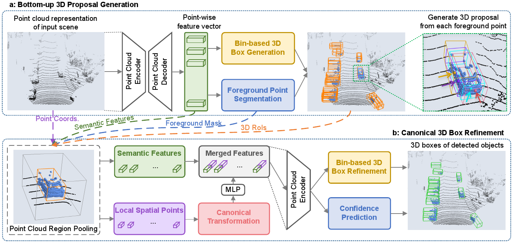

# PointRCNN 3D目标检测模型

---
## 内容

- [简介](#简介)
- [快速开始](#快速开始)
- [参考文献](#参考文献)
- [版本更新](#版本更新)

## 简介

[PointRCNN](https://arxiv.org/abs/1812.04244) 是 Shaoshuai Shi, Xiaogang Wang, Hongsheng Li. 等人提出的，是第一个仅使用原始点云的2-stage(两阶段)3D目标检测器，第一阶段将 Pointnet++ with MSG（Multi-scale Grouping）作为backbone，直接将原始点云数据分割为前景点和背景点，并利用前景点生成bounding box。第二阶段在标准坐标系中对生成对bounding box进一步筛选和优化。该模型还提出了基于bin的方式，把回归问题转化为分类问题，验证了在三维边界框回归中的有效性。PointRCNN在KITTI数据集上进行评估，论文发布时在KITTI 3D目标检测排行榜上获得了最佳性能。

网络结构如下所示：

<p align="center">
 <br />
用于点云的目标检测器 PointNet++
</p>

**注意:** PointRCNN 模型构建依赖于自定义的 C++ 算子，目前仅支持GPU设备在Linux/Unix系统上进行编译，本模型**不能运行在Windows系统或CPU设备上**


## 快速开始

### 安装

**安装 [PaddlePaddle](https://github.com/PaddlePaddle/Paddle):**

在当前目录下运行样例代码需要 PaddelPaddle Fluid [develop每日版本](https://www.paddlepaddle.org.cn/install/doc/tables#多版本whl包列表-dev-11)或使用PaddlePaddle [develop分支](https://github.com/PaddlePaddle/Paddle/tree/develop)源码编译安装. 

为了使自定义算子与paddle版本兼容，建议您**优先使用源码编译paddle**，源码编译方式请参考[编译安装](https://www.paddlepaddle.org.cn/install/doc/source/ubuntu)

**安装PointRCNN:**

1. 下载[PaddlePaddle/models](https://github.com/PaddlePaddle/models)模型库

通过如下命令下载Paddle models模型库：

```
git clone https://github.com/PaddlePaddle/models
```

2. 在`PaddleCV/Paddle3D/PointRCNN`目录下下载[pybind11](https://github.com/pybind/pybind11)

`pts_utils`依赖`pybind11`编译，须在`PaddleCV/Paddle3D/PointRCNN`目录下下载`pybind11`子库，可使用如下命令下载：

```
cd PaddleCV/Paddle3D/PointRCNN
git clone https://github.com/pybind/pybind11
```

3. 安装python依赖库

使用如下命令安装python依赖库：

```
pip install -r requirement.txt
```

**注意：** KITTI mAP评估工具只能在python 3.6及以上版本中使用，且python3环境中需要安装`scikit-image`,`Numba`,`fire`等子库。
`requirement.txt`中的`scikit-image`,`Numba`,`fire`即为KITTI mAP评估工具所需依赖库。

4. 编译安装`pts_utils`, `kitti_utils`, `roipool3d_utils`, `iou_utils` 等模块

使用如下命令编译安装`pts_utils`, `kitti_utils`, `roipool3d_utils`, `iou_utils` 等模块：
```
sh build_and_install.sh
```

### 编译自定义OP

**注意：** 请使用4.8及以上版本的`gcc`进行自定义OP的编译，否则可能引入兼容性问题。

请确认Paddle版本为PaddelPaddle Fluid develop每日版本或基于Paddle develop分支源码编译安装，**推荐使用源码编译安装的方式**。

自定义OP编译方式如下：

    进入 `ext_op/src` 目录，执行编译脚本
    ```
    cd ext_op/src
    sh make.sh
    ```

    成功编译后，`ext_op/src` 目录下将会生成 `pointnet_lib.so` 

    执行下列操作，确保自定义算子编译正确：

    ```
    # 设置动态库的路径到 LD_LIBRARY_PATH 中
    export LD_LIBRARY_PATH=$LD_LIBRARY_PATH:`python -c 'import paddle; print(paddle.sysconfig.get_lib())'`

    # 回到 ext_op 目录，添加 PYTHONPATH
    cd ..
    export PYTHONPATH=$PYTHONPATH:`pwd`

    # 运行单测 
    python tests/test_farthest_point_sampling_op.py
    python tests/test_gather_point_op.py
    python tests/test_group_points_op.py
    python tests/test_query_ball_op.py
    python tests/test_three_interp_op.py
    python tests/test_three_nn_op.py
    ```
    单测运行成功会输出提示信息，如下所示：

    ```
    .
    ----------------------------------------------------------------------
    Ran 1 test in 13.205s

    OK
    ```

**说明：** 自定义OP编译与[PointNet++](../PointNet++)下一致，更多关于自定义OP的编译说明，请参考[自定义OP编译](../PointNet++/ext_op/README.md)

### 数据准备

**KITTI 3D object detection 数据集:**

PointRCNN使用数据集[KITTI 3D object detection](http://www.cvlibs.net/datasets/kitti/eval_object.php?obj_benchmark=3d) 
上进行训练。

可通过如下方式下载数据集：

```
cd data/KITTI/object
sh download.sh
```

此处的images只用做可视化，训练过程中使用[road planes](https://drive.google.com/file/d/1d5mq0RXRnvHPVeKx6Q612z0YRO1t2wAp/view?usp=sharing)数据来做训练时的数据增强，
请下载并解压至`./data/KITTI/object/training`目录下。

数据目录结构如下所示：

```
PointRCNN
├── data
│   ├── KITTI
│   │   ├── ImageSets
│   │   ├── object
│   │   │   ├──training
│   │   │   │  ├──calib & velodyne & label_2 & image_2 & planes
│   │   │   ├──testing
│   │   │   │  ├──calib & velodyne & image_2

```


### 训练

**PointRCNN模型:**

可通过如下方式启动 PointRCNN模型的训练：

1. 指定单卡训练并设置动态库路径

```
# 指定单卡GPU训练
export CUDA_VISIBLE_DEVICES=0

# 设置动态库的路径到 LD_LIBRARY_PATH 中
export LD_LIBRARY_PATH=$LD_LIBRARY_PATH:`python -c 'import paddle; print(paddle.sysconfig.get_lib())'`
```

2. 生成Groud Truth采样数据，命令如下：

```
python tools/generate_gt_database.py --class_name 'Car' --split train
```

3. 训练 RPN 模型

```
python train.py --cfg=./cfgs/default.yml \
                --train_mode=rpn \
                --batch_size=16 \
                --epoch=200 \
                --save_dir=checkpoints
```

RPN训练checkpoints默认保存在`checkpoints/rpn`目录，也可以通过`--save_dir`来指定。

4. 生成增强离线场景数据并保存RPN模型的输出特征和ROI，用于离线训练 RCNN 模型

生成增强的离线场景数据命令如下：

```
python tools/generate_aug_scene.py --class_name 'Car' --split train --aug_times 4
```

保存RPN模型对离线增强数据的输出特征和ROI，可以通过参数`--weights`来指定RPN训练最终权重保存路径，RPN权重默认保存在`checkpoints/rpn`目录。
保存输出特征和ROI时须指定`TEST.SPLIT`为`train_aug`，指定`TEST.RPN_POST_NMS_TOP_N`为`300`, `TEST.RPN_NMS_THRESH`为`0.85`。
通过`--output_dir`指定保存输出特征和ROI的路径，默认保存到`./output`目录。

```
python eval.py --cfg=cfgs/default.yml  \
               --eval_mode=rpn \
               --weights=./checkpoints/rpn/199 \
               --save_rpn_feature \
               --output_dir=output \
               --set TEST.SPLIT train_aug TEST.RPN_POST_NMS_TOP_N 300 TEST.RPN_NMS_THRESH 0.85
```

`--output_dir`下保存的数据目录结构如下：

```
output
├── detections 
│   ├── data          # 保存ROI数据
│   │   ├── 000000.txt
│   │   ├── 000003.txt
│   │   ├── ...
├── features          # 保存输出特征
│   ├── 000000_intensity.npy
│   ├── 000000.npy
│   ├── 000000_rawscore.npy
│   ├── 000000_seg.npy
│   ├── 000000_xyz.npy
│   ├── ...
├── seg_result        # 保存语义分割结果
│   ├── 000000.npy
│   ├── 000003.npy
│   ├── ...
```

5. 离线训练RCNN，并且通过参数`--rcnn_training_roi_dir` and `--rcnn_training_feature_dir` 来指定 RPN 模型保存的输出特征和ROI路径。

```
python train.py --cfg=./cfgs/default.yml \
                --train_mode=rcnn_offline \
                --batch_size=4 \
                --epoch=30 \
                --save_dir=checkpoints \
                --rcnn_training_roi_dir=output/detections/data \
                --rcnn_training_feature_dir=output/features \
                --set TRAIN.SPLIT train_aug
```

RCNN模型训练权重默认保存在`checkpoints/rcnn`目录下，可通过`--save_dir`参数指定。

**注意**: 最好的模型是通过保存RPN模型输出特征和ROI并离线数据增强的方式训练RCNN模型得出的，目前默认仅支持这种方式。


### 模型评估

**PointRCNN模型:**

可通过如下方式启动 PointRCNN 模型的评估：

1. 指定单卡训练并设置动态库路径

```
# 指定单卡GPU训练
export CUDA_VISIBLE_DEVICES=0

# 设置动态库的路径到 LD_LIBRARY_PATH 中
export LD_LIBRARY_PATH=$LD_LIBRARY_PATH:`python -c 'import paddle; print(paddle.sysconfig.get_lib())'`

```

2. 保存RPN模型对评估数据的输出特征和ROI

保存RPN模型对评估数据的输出特征和ROI命令如下，可以通过参数`--weights`来指定RPN训练最终权重保存路径，RPN权重默认保存在`checkpoints/rpn`目录。
通过`--output_dir`指定保存输出特征和ROI的路径，默认保存到`./output`目录。

```
python eval.py --cfg=cfgs/default.yml \
               --eval_mode=rpn \
               --weights=./checkpoints/rpn/199 \
               --save_rpn_feature \
               --output_dir=output/val
```

保存RPN模型对评估数据的输出特征和ROI保存的目录结构与上述保存离线增强数据保存目录结构一致。

3. 评估离线RCNN模型

评估离线RCNN模型命令如下:

```
python eval.py --cfg=cfgs/default.yml \
               --eval_mode=rcnn_offline \
               --weights=./checkpoints/rcnn_offline/29 \
               --rcnn_eval_roi_dir=output/val/detections/data \
               --rcnn_eval_feature_dir=output/val/features \
               --save_result
```

最终目标检测结果文件保存在`./result_dir`目录下`final_result`文件夹下，同时可通过`--save_result`开启保存`roi_output`和`refine_output`结果文件。
`result_dir`目录结构如下：

```
result_dir
├── final_result
│   ├── data          # 最终检测结果
│   │   ├── 000001.txt
│   │   ├── 000002.txt
│   │   ├── ...
├── roi_output
│   ├── data          # RCNN模型输出检测ROI结果
│   │   ├── 000001.txt
│   │   ├── 000002.txt
│   │   ├── ...
├── refine_output
│   ├── data          # 解码后的检测结果
│   │   ├── 000001.txt
│   │   ├── 000002.txt
│   │   ├── ...
```

4. 使用KITTI mAP工具获得评估结果

若在评估过程中使用的python版本为3.6及以上版本，则程序会自动运行KITTI mAP评估，若使用python版本低于3.6，
由于KITTI mAP仅支持python 3.6及以上版本，须使用对应python版本通过如下命令进行评估：

```
python3 tools/kitti_eval.py
```

使用训练最终权重[RPN模型](https://paddlemodels.bj.bcebos.com/Paddle3D/pointrcnn_rpn.tar)和[RCNN模型](https://paddlemodels.bj.bcebos.com/Paddle3D/pointrcnn_rcnn_offline.tar)评估结果如下所示：

|  Car AP@ | 0.70(easy) | 0.70(moderate) | 0.70(hard) |
| :------- | :--------: | :------------: | :--------: |
| bbox AP: |   90.20    |     88.85      |   88.59    |
| bev  AP: |   89.50    |     86.97      |   85.58    |
| 3d   AP: |   86.66    |     76.65      |   75.90    |
| aos  AP: |   90.10    |     88.64      |   88.26    |


## 参考文献

- [PointRCNN: 3D Object Proposal Generation and Detection From Point Cloud](https://arxiv.org/abs/1812.04244), Shaoshuai Shi, Xiaogang Wang, Hongsheng Li.
- [PointNet++: Deep Hierarchical Feature Learning on Point Sets in a Metric Space](https://arxiv.org/abs/1706.02413), Charles R. Qi, Li Yi, Hao Su, Leonidas J. Guibas.
- [PointNet: Deep Learning on Point Sets for 3D Classification and Segmentation](https://www.semanticscholar.org/paper/PointNet%3A-Deep-Learning-on-Point-Sets-for-3D-and-Qi-Su/d997beefc0922d97202789d2ac307c55c2c52fba), Charles Ruizhongtai Qi, Hao Su, Kaichun Mo, Leonidas J. Guibas.

## 版本更新

- 11/2019, 新增 PointRCNN模型。

