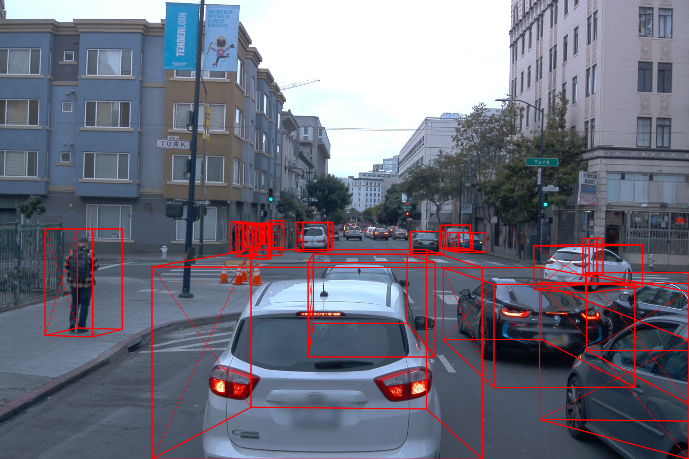

# SMOKE: Single-Stage Monocular 3D Object Detection via Keypoint Estimation

## Requirements
All codes are tested under the following environment:
*   CentOS 7.5
*   Python 3.7
*   PaddlePaddle 2.1.0
*   CUDA 10.2

## Preparation
1. PaddlePaddle installation
```bash

conda create -n paddle_latest python=3.7

conda actviate paddle_latest

pip install paddlepaddle -i https://mirror.baidu.com/pypi/simple

pip install -r requirement.txt
```

2. Dataset preparations
Please first download the dataset and organize it as following structure:
```
kitti
│──training
│    ├──calib 
│    ├──label_2 
│    ├──image_2
│    └──ImageSets
└──testing
     ├──calib 
     ├──image_2
     └──ImageSets
```
The make a soft link of kitti dataset and put it under `datasets/` folder.
```bash
mkdir datasets
ln -s path_to_kitti datasets/kitti
```

Note: If you want to use Waymo dataset for training, you should also organize it following the above structure.


3. Compile KITTI evaluation codes
```bash
cd tools/kitti_eval_offline
g++ -O3 -DNDEBUG -o evaluate_object_3d_offline evaluate_object_offline_40p.cpp
```
Note: evaluate\_object\_3d\_40/11p.cpp stands for 40-point/11-point evaluation.
For further details please refer to [KITTI 3D Object Dataset](http://www.cvlibs.net/datasets/kitti/eval_object.php?obj_benchmark=3d) and [Disentangling Monocular 3D Object Detection](https://arxiv.org/abs/1905.12365). 
For 11-point evaluation, simply change `evaluate_object_offline_40p.cpp` to `evaluate_object_offline_11p.cpp`.


## Training

Please download the [pre-trained weights](https://bj.bcebos.com/paddleseg/3d/smoke/dla34.pdparams). Put it into ```./pretrained```.


#### Single GPU
```bash
python train.py --config configs/train_val_kitti.yaml --log_iters 100 --save_interval 5000 --num_workers 2
```
#### Multi-GPUs

Take two cards as an example.
```bash
export CUDA_VISIBLE_DEVICES="6, 7" && python -m paddle.distributed.launch train.py --config configs/train_val_kitti.yaml --log_iters 100 --save_interval 5000 --num_workers 2
```
#### VisualDL
Run the following command. If successful, view the training visualization via browser.
```bash
visualdl --logdir ./output
```

## Evaluation

```bash
python val.py --config configs/train_val_kitti.yaml --model_path path-to-model/model.pdparams --num_workers 2
```

The performance on KITTI 3D detection is as follows:

|             |  Easy |  Moderate   |  Hard  |
|-------------|:-----:|:-----------:|:------:|
| Car         | 6.51  | 4.98    | 4.63  | 
| Pedestrian  | 4.44    | 3.73  | 2.99  | 
| Cyclist     | 1.40   | 0.57   | 0.60  |

The performance on WAYMO 3D detection is as follows:

|             |  Easy |  Moderate   |  Hard  |
|-------------|:-----:|:-----------:|:------:|
| Car         | 6.17  | 5.74    | 5.74  | 
| Pedestrian  | 0.35    | 0.34  | 0.34  | 
| Cyclist     | 0.54   | 0.53   | 0.53  |

Download the well-trained models here, [smoke-release](https://bj.bcebos.com/paddleseg/3d/smoke/smoke-release.zip).


## Testing

Please download and uncompress above model weights first.
```bash
python test.py --config configs/test_export.yaml --model_path path-to-model/model_waymo.pdparams --input_path examples/0615037.png --output_path paddle.png
```



## Model Deployment

1. Convert to a static-graph model
```bash
export PYTHONPATH="$PWD"
```
```bash
python deploy/export.py --config configs/test_export.yaml --model_path path-to-model/model_waymo.pdparams
```

Running the above command will generate three files in ```./depoly```, i.e. 1) inference.pdmodel, which maintains model graph/structure, 2) inference.pdiparams, which is well-trained parameters of the model, 3) inference.pdiparams.info, which includes extra meta info of the model.

2. Visualize the model stucture.
```bash
visualdl --model deploy/inference.pdmodel
```

The above command could be a little bit slow. Instead, open the browser first via the following command, and then open the pdmodel locally.
```bash
visualdl
```
Note: If you are using remote server, please specify the ```--host```, e.g. 10.9.189.6
```bash
visualdl --model deploy/inference.pdmodel --host 10.9.189.6
```

3. Python Inference on the converted model.

Now you can run the inference anywhere without the repo. We provive an example for python inference.

```bash
python deploy/infer.py --model_file deploy/inference.pdmodel --params_file deploy/inference.pdiparams --input_path examples/0615037.png --output_path paddle.png
```


## Reference

> Liu, Zechen, Zizhang Wu, and Roland Tóth. "Smoke: single-stage monocular 3d object detection via keypoint estimation." In Proceedings of the IEEE/CVF Conference on Computer Vision and Pattern Recognition Workshops, pp. 996-997. 2020.
