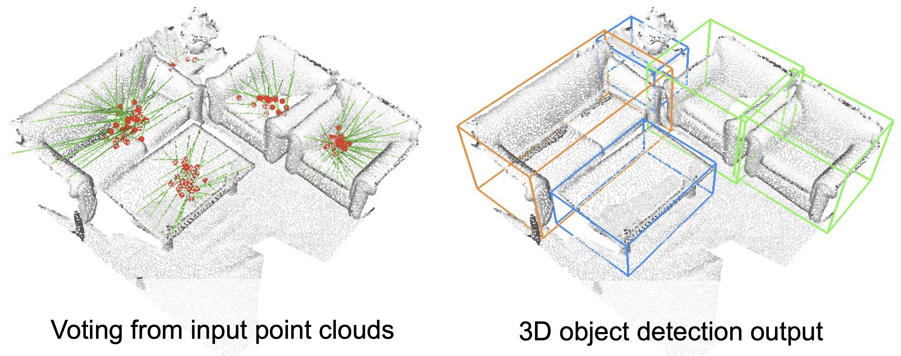
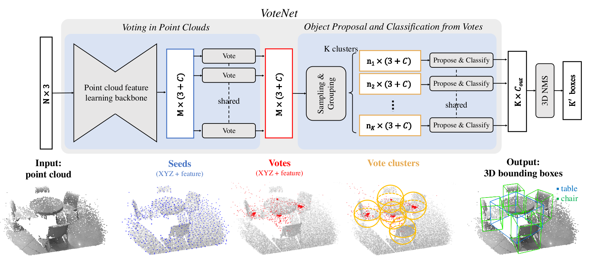

# VoteNet 3D物体检测模型[施工中...]

<p align="center">



</p>

## 内容

- [简介](#简介)
- [快速开始](#快速开始)
- [参考文献](#参考文献)
- [版本更新](#版本更新)

## TODOs

- [ ] VoteNet backbone改写paddle（2天）
  - [ ] PointNet Backbone module
  - [ ] Voting module
  - [ ] Proposal module
  - [ ] VoteNet
  - [ ] BoxNet
- [ ] ScanNet数据集处理代码改写paddle（1天）
  - [ ] 原始数据集预处理script
  - [ ] ScanNet reader script
- [ ] 改写训练部分代码和调试（2天）

## 简介

[VoteNet](https://arxiv.org/abs/1904.09664v2)是Charles R. Qi, Or Litany, Kaiming He, Leonidas J. Guibas等人提出的，针对3D数据进行物体检测的模型。该模型基于PointNet++进行了扩展，首先借助PointNet++对一个`N x 3`的原始点云进行特征提取（3代表xyz三个通道），得到输出形状为`M x (3 + C)`的种子点(**seed points**)子集( M < N )，C是每个点的特征通道，之后将每一个点独立的输入投票网络(**voting module**)，回归出每个种子点的“投票” $(dx, dy, dz)$，即物体可能存在的中心点$O_{center} = (x+dx, y+dy, z+dz)$，最终把这些投票聚类之后输入(**Proposal Module**)得到物体的bbox框

<p align="center">
 <br />
用于3D检测的VoteNet网络结构

</p>


## 快速开始

### 安装

**安装 [PaddlePaddle](https://github.com/PaddlePaddle/Paddle):**

在当前目录下运行样例代码需要 PaddelPaddle Fluid [develop每日版本](https://www.paddlepaddle.org.cn/install/doc/tables#多版本whl包列表-dev-11)或使用PaddlePaddle [develop分支](https://github.com/PaddlePaddle/Paddle/tree/develop)源码编译安装. 

为了使自定义算子与paddle版本兼容，建议您**优先使用源码编译paddle**，源码编译方式请参考[编译安装](https://www.paddlepaddle.org.cn/install/doc/source/ubuntu)


### 编译自定义OP

**注意：** 请使用4.8及以上版本的`gcc`进行自定义OP的编译，否则可能引入兼容性问题。

请确认Paddle版本为PaddelPaddle Fluid develop每日版本或基于Paddle develop分支源码编译安装，**推荐使用源码编译安装的方式**。

自定义OP编译方式如下：

    进入 `ext_op/src` 目录，执行编译脚本
    ```
    cd ext_op/src
    sh make.sh
    ```
    
    成功编译后，`ext_op/src` 目录下将会生成 `pointnet2_lib.so` 
    
    执行下列操作，确保自定义算子编译正确：
    
    ```
    # 设置动态库的路径到 LD_LIBRARY_PATH 中
    export LD_LIBRARY_PATH=$LD_LIBRARY_PATH:`python -c 'import paddle; print(paddle.sysconfig.get_lib())'`
    
    # 回到 ext_op 目录，添加 PYTHONPATH
    cd ..
    export PYTHONPATH=$PYTHONPATH:`pwd`
    
    # 运行单测 
    python tests/test_farthest_point_sampling_op.py
    python tests/test_gather_point_op.py
    python tests/test_group_points_op.py
    python tests/test_query_ball_op.py
    python tests/test_three_interp_op.py
    python tests/test_three_nn_op.py
    ```
    单测运行成功会输出提示信息，如下所示：
    
    ```
    .
    ----------------------------------------------------------------------
    Ran 1 test in 13.205s
    
    OK
    ```

**说明：** 更多关于自定义OP的编译说明，请参考[自定义OP编译](./ext_op/README.md)

## 参考文献

-  [Deep Hough Voting for 3D Object Detection in Point Clouds](https://arxiv.org/abs/1904.09664v2) , Charles R. Qi, Or Litany, Kaiming He, Leonidas J. Guibas

## 版本更新

- 2020/07, 新增VoteNet 3D检测模型