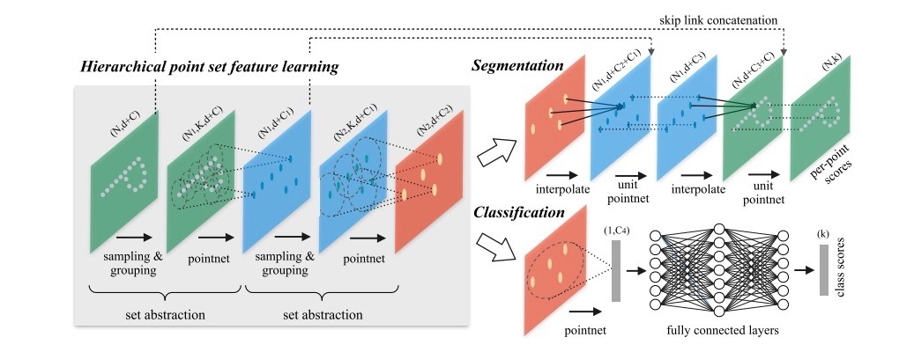

# PointNet++ classification and semantic segmentation model

---
## Table of Contents

- [Introduction](#introduction)
- [Quick Start](#quick-start)
- [Reference](#reference)
- [Update](#update)

## Introduction

[PointNet++](https://arxiv.org/abs/1706.02413) is a point classification and segmentation model for 3D data proposed by Charles R. Qi, Li Yi, Hao Su, Leonidas J. Guibas.
This model is a extension work based on PointNet extract features of point clouds data with hierarchical point set feature learning, perform set abstractions by grouping and sampling points at first to extract
local region patterns, then use multi-layer perceptron to get point features. PointNet++ also used point feature propagation for semantic segmentation model, adopt a hierarchical
propagation strategy with distance based interpolation and across level skip links, point features was upsampled to obtain point features for all the original points.

The network structure is shown as below.

<p align="center">
 <br />
PointNet++ architecture for Point set Segmentation and Classification
</p>

Set Abstraction layer is the basic module of the network, each set abstraction layer is made of three key layers：Sampling layer, Grouping layer and PointNet layer.

- **Sample layer**: Sampling layer uses farthest point sampling(FPS) to select a set of points from input points, which defines the centroids of local regions. Compared with random sampling, it has better converage of the entire point set given the same number of centroids.

- **Grouping layer**: Grouping layer constructs local region sets by finding "neighboring" points around the centroids. In a point set sampled from a metric space, the neighborhood of a point is defined by metric distance. This method is called "ball query", which make local region feature more generalizable across space.

- **PointNet layer**: PointNet layer uses a mini-PointNet to encode local region patterns into feature vectors.


**NOTE:** PointNet++ model builds base on custom C++ operations, which can only support GPU devices and compiled on Linux/Unix currently, this model **cannot run on Windows or CPU deivices**.


## Quick Start

### Installation

**Install [PaddlePaddle](https://github.com/PaddlePaddle/Paddle):**

Running sample code in this directory requires PaddelPaddle Fluid develop [daily version wheel](https://www.paddlepaddle.org.cn/install/doc/tables#多版本whl包列表-dev-11) or compiled from PaddlePaddle [develop branch](https://github.com/PaddlePaddle/Paddle/tree/develop).

In order to make the custom OP compatible with the Paddle version, it is recommended to **compile from PaddlePaddle develop branch source code**. For source code compilation, please refer to [Compile and Install](https://www.paddlepaddle.org.cn/install/doc/source/ubuntu)

### Compile custom operations

Please make sure you are using PaddlePaddle Fluid develop daily version or compiled from PaddlePaddle develop branch.
Custom operations can be compiled as follows:

```
cd ext_op/src
sh make.sh
```

If the compilation is finished successfully, `pointnet2_lib.so` will be generated under `exr_op/src`.

Make sure custom operations pass as follows:

```
# export paddle libs to LD_LIBRARY_PATH for custom op library
export LD_LIBRARY_PATH=$LD_LIBRARY_PATH:`python -c 'import paddle; print(paddle.sysconfig.get_lib())'`

# back to ext_op and add PYTHONPATH
cd ..
export PYTHONPATH=$PYTHONPATH:`pwd`

# Run unit tests
python test/test_farthest_point_sampling_op.py
python test/test_gather_point_op.py
python test/test_group_points_op.py
python test/test_query_ball_op.py
python test/test_three_interp_op.py
python test/test_three_nn_op.py
```
The prompt message for successful running is as follows:

```
.
----------------------------------------------------------------------
Ran 1 test in 13.205s

OK
```

### Data preparation

**ModelNet40 dataset:**

PointNet++ classification models are trained on [ModelNet40 dataset](https://shapenet.cs.stanford.edu/media/modelnet40_ply_hdf5_2048.zip), we also provide download scripts as follows:

```
cd dataset/ModelNet40
sh download.sh
```

The dataset catalog structure is as follows:

```
  dataset/ModelNet40/modelnet40_ply_hdf5_2048
  ├── train_files.txt
  ├── test_files.txt
  ├── shape_names.txt
  ├── ply_data_train0.h5
  ├── ply_data_train_0_id2file.json
  ├── ply_data_test0.h5
  ├── ply_data_test_0_id2file.json
  |   ...

```

**Indoor3DSemSeg dataset:**

PointNet++ semantic segmentation models are trained on [Indoor3DSemSeg dataset](https://shapenet.cs.stanford.edu/media/indoor3d_sem_seg_hdf5_data.zip), we also provide download scripts as follows:

```
cd dataset/Indoor3DSemSeg
sh download.sh
```

The dataset catalog structure is as follows:

```
  dataset/Indoor3DSemSeg/
  ├── all_files.txt
  ├── room_filelist.txt
  ├── ply_data_all_0.h5
  ├── ply_data_all_1.h5
  |   ...

```

### Training

**Classification Model:**

For PointNet++ classification model, training can be start as follows:

```
# For single GPU deivces
export CUDA_VISIBLE_DEVICES=0

# enable gc to save GPU memory
export FLAGS_fast_eager_deletion_mode=1
export FLAGS_eager_delete_tensor_gb=0.0
export FLAGS_fraction_of_gpu_memory_to_use=0.98

# export paddle libs to LD_LIBRARY_PATH for custom op library
export LD_LIBRARY_PATH=$LD_LIBRARY_PATH:`python -c 'import paddle; print(paddle.sysconfig.get_lib())'`

# start training
python train_cls.py --model=MSG --batch_size=16 --save_dir=checkpoints_msg_cls
```

We also provided quick start script for training classification model as follows:

```
sh scripts/train_cls.sh
```

**Semantic Segmentation Model:**

For PointNet++ semantic segmentation model, training can be start as follows:

```
# For single GPU deivces
export CUDA_VISIBLE_DEVICES=0

# enable gc to save GPU memory
export FLAGS_fast_eager_deletion_mode=1
export FLAGS_eager_delete_tensor_gb=0.0
export FLAGS_fraction_of_gpu_memory_to_use=0.98

# export paddle libs to LD_LIBRARY_PATH for custom op library
export LD_LIBRARY_PATH=$LD_LIBRARY_PATH:`python -c 'import paddle; print(paddle.sysconfig.get_lib())'`

# start training
python train_seg.py --model=MSG --batch_size=32 --save_dir=checkpoints_msg_seg
```

We also provided quick start scripts for training semantic segmentation model as follows:

```
sh scripts/train_seg.sh
```

### Evaluation

**Classification Model:**

For PointNet++ classification model, evaluation can be start as follows:

```
# For single GPU deivces
export CUDA_VISIBLE_DEVICES=0

# export paddle libs to LD_LIBRARY_PATH for custom op library
export LD_LIBRARY_PATH=$LD_LIBRARY_PATH:`python -c 'import paddle; print(paddle.sysconfig.get_lib())'`

# start evaluation with given weights
python eval_cls.py --model=MSG --weights=checkpoints_cls/200
```

We also provided quick start script for training classification model as follows:

```
sh scripts/eval_cls.sh
```

Classification model evaluation result is shown as below:

| model | Top-1 | download |
| :----- | :---: | :---: |
| SSG(Single-Scale Group) | 89.3 | [model]() |
| MSG(Multi-Scale Group)  | 90.0 | [model]() |

**Semantic Segmentation Model:**

For PointNet++ semantic segmentation model, evaluation can be start as follows:

```
# For single GPU deivces
export CUDA_VISIBLE_DEVICES=0

# export paddle libs to LD_LIBRARY_PATH for custom op library
export LD_LIBRARY_PATH=$LD_LIBRARY_PATH:`python -c 'import paddle; print(paddle.sysconfig.get_lib())'`

# start evaluation with given weights 
python eval_seg.py --model=MSG --weights=checkpoints_seg/200
```

We also provided quick start scripts for training semantic segmentation model as follows:

```
sh scripts/eval_seg.sh
```

Semantic segmentation model evaluation result is shown as below:

| model | Top-1 | download |
| :----- | :---: | :---: |
| SSG(Single-Scale Group) | 86.1 | [model]() |
| MSG(Multi-Scale Group)  | 86.8 | [model]() |

## Reference

- [PointNet++: Deep Hierarchical Feature Learning on Point Sets in a Metric Space](https://arxiv.org/abs/1706.02413), Charles R. Qi, Li Yi, Hao Su, Leonidas J. Guibas.
- [PointNet: Deep Learning on Point Sets for 3D Classification and Segmentation](https://www.semanticscholar.org/paper/PointNet%3A-Deep-Learning-on-Point-Sets-for-3D-and-Qi-Su/d997beefc0922d97202789d2ac307c55c2c52fba), Charles Ruizhongtai Qi, Hao Su, Kaichun Mo, Leonidas J. Guibas.

## Update

- 11/2019, Add PointNet++ classification and semantic segmentation model.
