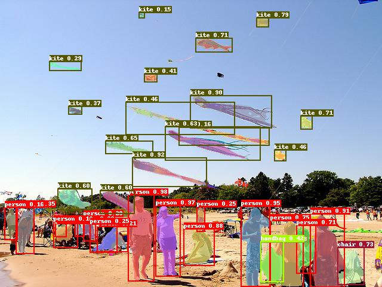

# PaddleDetection

PaddleDetection的目的是为工业界和学术界提供大量易使用的目标检测模型。PaddleDetection不仅性能完善，易于部署，同时能够灵活的满足算法研发需求。

<div align="center">
  
</div>


## 简介

特性：

- 易部署:

  C++和CUDA实现的主要算子，配合PaddlePaddle的高性能预测引擎，使得在服务器环境下易于部署。

- 高灵活度：

  PaddleDetection各个组件均为功能单元。例如，模型结构，数据预处理流程，能够通过修改配置文件轻松实现可定制化。

- 性能优化：

  在PaddlePaddle底层框架的帮助下，实现了更快的模型训练及更少的显存占用量。值得注意的是，Yolo v3的训练速度远快于其他框架。另外，Mask-RCNN(ResNet50)可以在Tesla V100 16GB环境下以每个GPU4张图片输入实现多卡训练。

支持的模型结构：

|                    | ResNet | ResNet-vd <sup>[1](#vd)</sup> | ResNeXt-vd | SENet | MobileNet | DarkNet |
|--------------------|:------:|------------------------------:|:----------:|:-----:|:---------:|:-------:|
| Faster R-CNN       | ✓      |                             ✓ | x          | ✓     | ✗         | ✗       |
| Faster R-CNN + FPN | ✓      |                             ✓ | ✓          | ✓     | ✗         | ✗       |
| Mask R-CNN         | ✓      |                             ✓ | x          | ✓     | ✗         | ✗       |
| Mask R-CNN + FPN   | ✓      |                             ✓ | ✓          | ✓     | ✗         | ✗       |
| Cascade R-CNN      | ✓      |                             ✗ | ✗          | ✗     | ✗         | ✗       |
| RetinaNet          | ✓      |                             ✗ | ✗          | ✗     | ✗         | ✗       |
| Yolov3             | ✓      |                             ✗ | ✗          | ✗     | ✓         | ✓       |
| SSD                | ✗      |                             ✗ | ✗          | ✗     | ✓         | ✗       |

<a name="vd">[1]</a> [ResNet-vd](https://arxiv.org/pdf/1812.01187) 模型提供了较大的精度提高和较少的性能损失。

高级特性：

- [x] **Synchronized Batch Norm**: 目前在Yolo v3中使用。
- [x] **Group Norm**: 预训练模型待发布。
- [x] **Modulated Deformable Convolution**: 预训练模型待发布。
- [x] **Deformable PSRoI Pooling**: 预训练模型待发布。

**注意:** Synchronized batch normalization 只能在多GPU环境下使用，不能在CPU环境或者单GPU环境下使用。

## 模型库

基于PaddlePaddle训练的目标检测模型可参考[PaddleDetection model zoo](docs/MODEL_ZOO.md).


## 安装

请参考[安装说明文档](docs/INSTALL.md).


## 开始

在预测阶段，可以通过运行以下指令得到可视化结果并保存在`output`目录下。

```bash
export PYTHONPATH=`pwd`:$PYTHONPATH
python tools/infer.py -c configs/mask_rcnn_r50_1x.yml \
    -o weights=https://paddlemodels.bj.bcebos.com/object_detection/mask_rcnn_r50_1x.tar \
    --infer_img=demo/000000570688.jpg
```

更多训练及评估流程，请参考[GETTING_STARTED.md](docs/GETTING_STARTED.md).

同时推荐用户参考[IPython Notebook demo](demo/mask_rcnn_demo.ipynb)

其他更多信息可参考以下文档内容：

- [配置流程介绍](docs/CONFIG.md)
- [自定义数据集和预处理流程介绍](docs/DATA.md)


## 未来规划

目前PaddleDetection处在持续更新的状态，接下来将会推出一系列的更新，包括如下特性：

- [ ] 混合精度训练
- [ ] 分布式训练
- [ ] Int8模式预测
- [ ] 用户自定义算子
- [ ] 进一步丰富模型库


## 版本更新

#### 7/22/2019

- 更新检测库中文文档
- 修复R-CNN系列模型训练同时进行评估的问题
- 新增ResNext101-vd + Mask R-CNN + FPN模型

#### 7/3/2019

- 首次发布PaddleDetection检测库和检测模型库
- 模型包括：Faster R-CNN, Mask R-CNN, Faster R-CNN+FPN, Mask
  R-CNN+FPN, Cascade-Faster-RCNN+FPN, RetinaNet, Yolo v3, 和SSD.

## 如何贡献代码

如果你可以修复某个issue或者增加一个新功能，欢迎给我们提交PR。如果对应的PR被接受了，我们将根据贡献的质量和难度进行打分（0-5分，越高越好）。如果你累计获得了10分，可以联系我们获得面试机会或者为你写推荐信。
