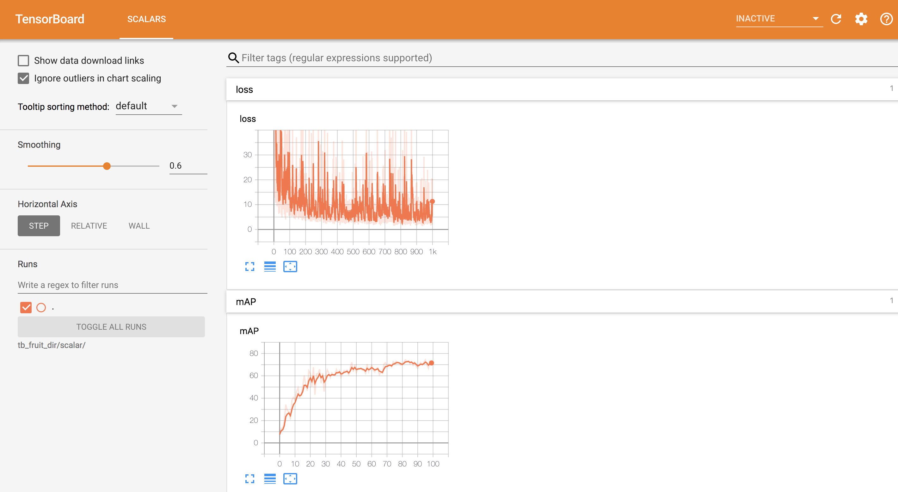
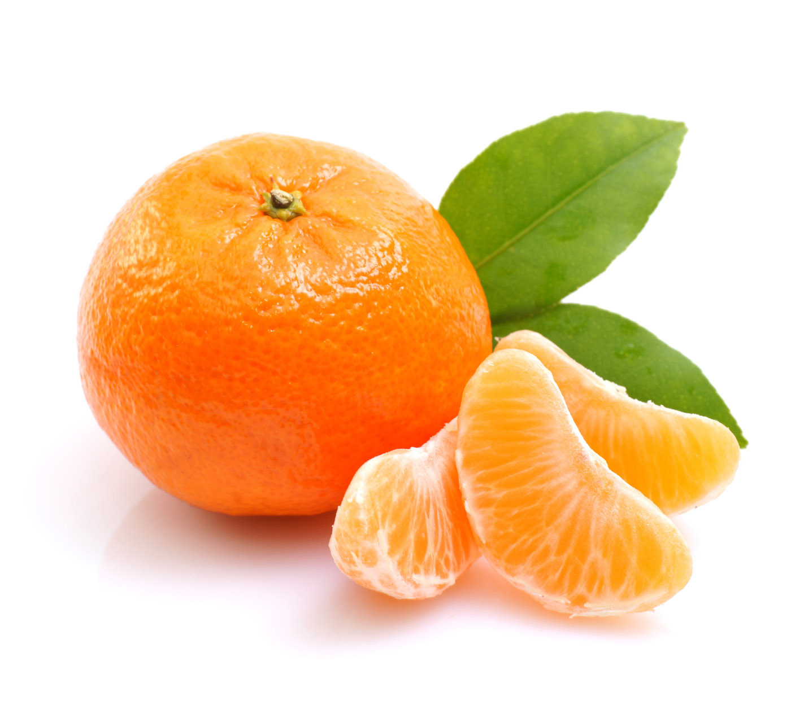

[English](README.md) | 简体中文

# PaddleDetection

PaddleDetection的目的是为工业界和学术界提供大量易使用的目标检测模型。PaddleDetection不仅性能完善，易于部署，同时能够灵活的满足算法研发需求。

<div align="center">
  
</div>


## 简介

特性：

- 易部署:

  PaddleDetection的模型中使用的主要算子均通过C++和CUDA实现，配合PaddlePaddle的高性能预测引擎，使得在服务器环境下易于部署。

- 高灵活度：

  PaddleDetection各个组件均为功能单元。例如，模型结构，数据预处理流程，用户能够通过修改配置文件轻松实现可定制化。

- 高性能：

  在PaddlePaddle底层框架的帮助下，实现了更快的模型训练及更少的显存占用量。值得注意的是，Yolo v3的训练速度远快于其他框架。另外，Mask-RCNN(ResNet50)可以在Tesla V100 16GB环境下以每个GPU4张图片输入实现多卡训练。

支持的模型结构：

|                    | ResNet | ResNet-vd <sup>[1](#vd)</sup> | ResNeXt-vd | SENet | MobileNet | DarkNet | VGG |
|--------------------|:------:|------------------------------:|:----------:|:-----:|:---------:|:-------:|:---:|
| Faster R-CNN       | ✓      |                             ✓ | x          | ✓     | ✗         | ✗       | ✗   |
| Faster R-CNN + FPN | ✓      |                             ✓ | ✓          | ✓     | ✗         | ✗       | ✗   |
| Mask R-CNN         | ✓      |                             ✓ | x          | ✓     | ✗         | ✗       | ✗   |
| Mask R-CNN + FPN   | ✓      |                             ✓ | ✓          | ✓     | ✗         | ✗       | ✗   |
| Cascade R-CNN      | ✓      |                             ✗ | ✗          | ✗     | ✗         | ✗       | ✗   |
| RetinaNet          | ✓      |                             ✗ | ✗          | ✗     | ✗         | ✗       | ✗   |
| Yolov3             | ✓      |                             ✗ | ✗          | ✗     | ✓         | ✓       | ✗   |
| SSD                | ✗      |                             ✗ | ✗          | ✗     | ✓         | ✗       | ✓   |

<a name="vd">[1]</a> [ResNet-vd](https://arxiv.org/pdf/1812.01187) 模型提供了较大的精度提高和较少的性能损失。

扩展特性：

- [x] **Synchronized Batch Norm**: 目前在Yolo v3中使用。
- [x] **Group Norm**: 预训练模型待发布。
- [x] **Modulated Deformable Convolution**: 预训练模型待发布。
- [x] **Deformable PSRoI Pooling**: 预训练模型待发布。

**注意:** Synchronized batch normalization 只能在多GPU环境下使用，不能在CPU环境或者单GPU环境下使用。

## 模型库

基于PaddlePaddle训练的目标检测模型可参考[PaddleDetection模型库](docs/MODEL_ZOO_cn.md).


## 安装

请参考[安装说明文档](docs/INSTALL_cn.md).


## 开始

## 快速开始

PaddleDetection提供了快速开始的demo利于用户能够快速上手，使用小数据集，[下载链接](https://dataset.bj.bcebos.com/PaddleDetection_demo/fruit-detection.tar)。

训练命令如下：

```bash
export PYTHONPATH=$PYTHONPATH:.
export CUDA_VISIBLE_DEVICES=0
python -u tools/train.py -c configs/yolov3_mobilenet_v1_fruit.yml \
                        --use_tb=True \
                        --tb_log_dir=tb_fruit_dir/scalar \
                        --eval \
```

训练期间可以通过tensorboard实时观察loss和精度值，启动命令如下：

```bash
tensorboard --logdir tb_fruit_dir/scalar/ --host <host_IP> --port <port_num>
```

tensorboard结果显示如下：

<div align="center">
  
</div>


训练模型[下载链接](https://paddlemodels.bj.bcebos.com/object_detection/yolov3_mobilenet_v1_fruit.tar)

评估命令如下：

```bash
export PYTHONPATH=$PYTHONPATH:.
export CUDA_VISIBLE_DEVICES=0
python -u tools/eval.py -c configs/yolov3_mobilenet_v1_fruit.yml
```

预测命令如下

```bash
export PYTHONPATH=$PYTHONPATH:.
export CUDA_VISIBLE_DEVICES=0
python -u tools/infer.py -c configs/yolov3_mobilenet_v1_fruit.yml
```

预测图片如下：

<p align="center">
  
  
</p>

更多训练及评估流程，请参考[GETTING_STARTED_cn.md](docs/GETTING_STARTED_cn.md).

详细的配置信息和参数说明，请参考[示例配置文件](docs/config_example/).

同时推荐用户参考[IPython Notebook demo](demo/mask_rcnn_demo.ipynb)

其他更多信息可参考以下文档内容：

- [配置流程介绍](docs/CONFIG_cn.md)
- [自定义数据集和预处理流程介绍](docs/DATA_cn.md)


## 未来规划

目前PaddleDetection处在持续更新的状态，接下来将会推出一系列的更新，包括如下特性：

- [ ] 混合精度训练
- [ ] 分布式训练
- [ ] Int8模式预测
- [ ] 用户自定义算子
- [ ] 进一步丰富模型库


## 版本更新

#### 7/22/2019

- 增加检测库中文文档
- 修复R-CNN系列模型训练同时进行评估的问题
- 新增ResNext101-vd + Mask R-CNN + FPN模型
- 新增基于VOC数据集的Yolo v3模型

#### 7/3/2019

- 首次发布PaddleDetection检测库和检测模型库
- 模型包括：Faster R-CNN, Mask R-CNN, Faster R-CNN+FPN, Mask
  R-CNN+FPN, Cascade-Faster-RCNN+FPN, RetinaNet, Yolo v3, 和SSD.

## 如何贡献代码

我们非常欢迎你可以为PaddleDetection提供代码，也十分感谢你的反馈。
