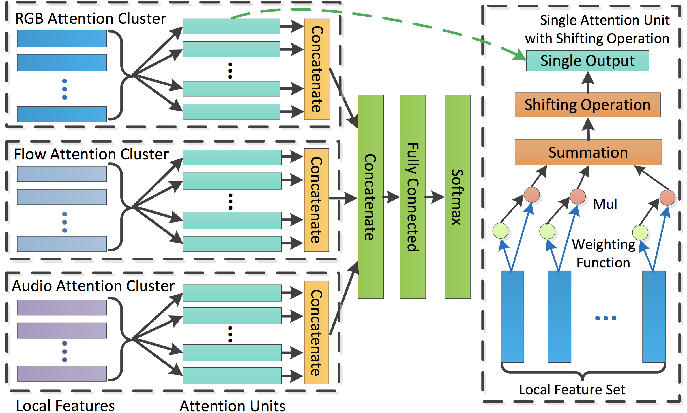

# Attention Cluster 视频分类模型

---
## 目录

- [模型简介](#模型简介)
- [数据准备](#数据准备)
- [模型训练](#模型训练)
- [模型评估](#模型评估)
- [模型推断](#模型推断)
- [参考论文](#参考论文)

## 模型简介

Attention Cluster模型为ActivityNet Kinetics Challenge 2017中最佳序列模型。该模型通过带Shifting Opeation的Attention Clusters处理已抽取好的RGB、Flow、Audio特征数据，Attention Cluster结构如下图所示。

  
Multimodal Attention Cluster with Shifting Operation

Shifting Operation通过对每一个attention单元的输出添加一个独立可学习的线性变换处理后进行L2-normalization，使得各attention单元倾向于学习特征的不同成分，从而让Attention Cluster能更好地学习不同分布的数据，提高整个网络的学习表征能力。

详细内容请参考[Attention Clusters: Purely Attention Based Local Feature Integration for Video Classification](https://arxiv.org/abs/1711.09550)

## 数据准备

Attention Cluster模型使用2nd-Youtube-8M数据集, 数据下载及准备请参考[数据说明](../../dataset/README.md)

## 模型训练

数据准备完毕后，可以通过如下两种方式启动训练：

    python train.py --model_name=AttentionCluster
            --config=./configs/attention_cluster.txt
            --save_dir=checkpoints
            --log_interval=10
            --valid_interval=1

    bash scripts/train/train_attention_cluster.sh

- 可下载已发布模型[model](https://paddlemodels.bj.bcebos.com/video_classification/attention_cluster_youtube8m.tar.gz)通过`--resume`指定权重存放路径进行finetune等开发

**数据读取器说明：** 模型读取Youtube-8M数据集中已抽取好的`rgb`和`audio`数据，对于每个视频的数据，均匀采样100帧，该值由配置文件中的`seg_num`参数指定。

**模型设置：** 模型主要可配置参数为`cluster_nums`和`seg_num`参数，当配置`cluster_nums`为32, `seg_num`为100时，在Nvidia Tesla P40上单卡可跑`batch_size=256`。

**训练策略：**

*  采用Adam优化器，初始learning\_rate=0.001。
*  训练过程中不使用权重衰减。
*  参数主要使用MSRA初始化

## 模型评估

可通过如下两种方式进行模型评估:

    python test.py --model_name=AttentionCluster
            --config=configs/attention_cluster.txt
            --log_interval=1
            --weights=$PATH_TO_WEIGHTS

    bash scripts/test/test_attention_cluster.sh

- 使用`scripts/test/test_attention_cluster.sh`进行评估时，需要修改脚本中的`--weights`参数指定需要评估的权重。

- 若未指定`--weights`参数，脚本会下载已发布模型[model](https://paddlemodels.bj.bcebos.com/video_classification/attention_cluster_youtube8m.tar.gz)进行评估

当取如下参数时:

| 参数 | 取值 |
| :---------: | :----: |
| cluster\_nums | 32 |
| seg\_num | 100 |
| batch\_size | 2048 |
| nums\_gpu | 7 |

在2nd-YouTube-8M数据集下评估精度如下:

| 精度指标 | 模型精度 |
| :---------: | :----: |
| Hit@1 | 0.87 |
| PERR | 0.78 |
| GAP | 0.84 |

## 模型推断

可通过如下命令进行模型推断：

    python infer.py --model_name=attention_cluster
            --config=configs/attention_cluster.txt
            --log_interval=1
            --weights=$PATH_TO_WEIGHTS
            --filelist=$FILELIST

- 模型推断结果存储于`AttentionCluster_infer_result`中，通过`pickle`格式存储。

- 若未指定`--weights`参数，脚本会下载已发布模型[model](https://paddlemodels.bj.bcebos.com/video_classification/attention_cluster_youtube8m.tar.gz)进行推断

## 参考论文

- [Attention Clusters: Purely Attention Based Local Feature Integration for Video Classification](https://arxiv.org/abs/1711.09550), Xiang Long, Chuang Gan, Gerard de Melo, Jiajun Wu, Xiao Liu, Shilei Wen
