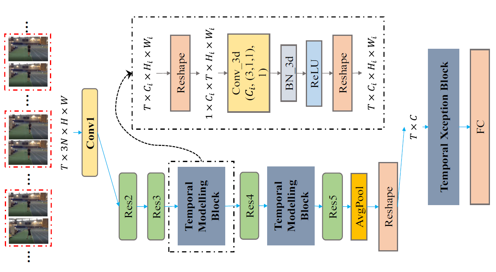

# StNet 视频分类模型

---
## 目录

- [模型简介](#模型简介)
- [数据准备](#数据准备)
- [模型训练](#模型训练)
- [模型评估](#模型评估)
- [模型推断](#模型推断)
- [参考论文](#参考论文)

## 模型简介

StNet模型框架为ActivityNet Kinetics Challenge 2018中夺冠的基础网络框架，本次开源的是基于ResNet50实现的StNet模型，基于其他backbone网络的框架用户可以依样配置。该模型提出“super-image"的概念，在super-image上进行2D卷积，建模视频中局部时空相关性。另外通过temporal modeling block建模视频的全局时空依赖，最后用一个temporal Xception block对抽取的特征序列进行长时序建模。StNet主体网络结构如下图所示：

  
StNet Framework Overview

详细内容请参考AAAI'2019年论文[StNet:Local and Global Spatial-Temporal Modeling for Human Action Recognition](https://arxiv.org/abs/1811.01549)

## 数据准备

StNet的训练数据采用由DeepMind公布的Kinetics-400动作识别数据集。数据下载及准备请参考[数据说明](../../data/dataset/README.md)

## 模型训练

数据准备完毕后，可以通过如下两种方式启动训练：

    export CUDA_VISIBLE_DEVICES=0,1,2,3,4,5,6,7
    python train.py --model_name=STNET \
                    --config=./configs/stnet.yaml \
                    --log_interval=10 \
                    --valid_interval=1 \
                    --use_gpu=True \
                    --save_dir=./data/checkpoints \
                    --fix_random_seed=False
                    --pretrain=$PATH_TO_PRETRAIN_MODEL

    bash run.sh train STNET ./configs/stnet.yaml

- 从头开始训练，需要加载在ImageNet上训练的ResNet50权重作为初始化参数，请下载此[模型参数](https://paddlemodels.bj.bcebos.com/video_classification/ResNet50_pretrained.tar.gz)并解压，将上面启动命令行或者run.sh脚本中的`pretrain`参数设置为解压之后的模型参数存放路径。如果没有手动下载并设置`pretrain`参数，则程序会自动下载并将参数保存在~/.paddle/weights/ResNet50\_pretrained目录下面  

- 可下载已发布模型[model](https://paddlemodels.bj.bcebos.com/video_classification/STNET_final.pdparams)通过`--resume`指定权重存放路径进行finetune等开发

**数据读取器说明：** 模型读取Kinetics-400数据集中的`mp4`数据，每条数据抽取`seg_num`段，每段抽取`seg_len`帧图像，对每帧图像做随机增强后，缩放至`target_size`。

**训练策略：**

*  采用Momentum优化算法训练，momentum=0.9
*  权重衰减系数为1e-4
*  学习率在训练的总epoch数的1/3和2/3时分别做0.1的衰减

## 模型评估

可通过如下两种方式进行模型评估:

    python eval.py --model_name=STNET \
                   --config=./configs/stnet.yaml \
                   --log_interval=1 \
                   --weights=$PATH_TO_WEIGHTS \
                   --use_gpu=True

    bash run.sh eval STNET ./configs/stnet.yaml

- 使用`run.sh`进行评估时，需要修改脚本中的`weights`参数指定需要评估的权重。

- 若未指定`weights`参数，脚本会下载已发布模型[model](https://paddlemodels.bj.bcebos.com/video_classification/STNET_final.pdparams)进行评估

- 评估结果以log的形式直接打印输出TOP1\_ACC、TOP5\_ACC等精度指标

- 使用CPU进行评估时，请将上面的命令行或者run.sh脚本中的`use_gpu`设置为False

当取如下参数时:

| 参数 | 取值 |
| :---------: | :----: |
| seg\_num | 25 |
| seglen | 5 |
| target\_size | 256 |

在Kinetics400的validation数据集下评估精度如下:

| 精度指标 | 模型精度 |
| :---------: | :----: |
| TOP\_1 | 0.69 |

## 模型推断

可通过如下两种方式启动模型推断：

    python predict.py --model_name=STNET \
                      --config=./configs/stnet.yaml \
                      --log_interval=1 \
                      --weights=$PATH_TO_WEIGHTS \
                      --filelist=$FILELIST \
                      --use_gpu=True \
                      --video_path=$VIDEO_PATH

    bash run.sh predict STNET ./configs/stnet.yaml

- 使用`run.sh`进行评估时，需要修改脚本中的`weights`参数指定需要用到的权重。

- 如果video\_path为'', 则忽略掉此参数。如果video\_path != ''，则程序会对video\_path指定的视频文件进行预测，而忽略掉filelist的值，预测结果为此视频的分类概率。

- 若未指定`--weights`参数，脚本会下载已发布模型[model](https://paddlemodels.bj.bcebos.com/video_classification/STNET_final.pdparams)进行推断

- 模型推断结果以log的形式直接打印输出，可以看到测试样本的分类预测概率。

- 使用CPU进行推断时，请将命令行或者run.sh脚本中的`use_gpu`设置为False

## 参考论文

- [StNet:Local and Global Spatial-Temporal Modeling for Human Action Recognition](https://arxiv.org/abs/1811.01549), Dongliang He, Zhichao Zhou, Chuang Gan, Fu Li, Xiao Liu, Yandong Li, Limin Wang, Shilei Wen

