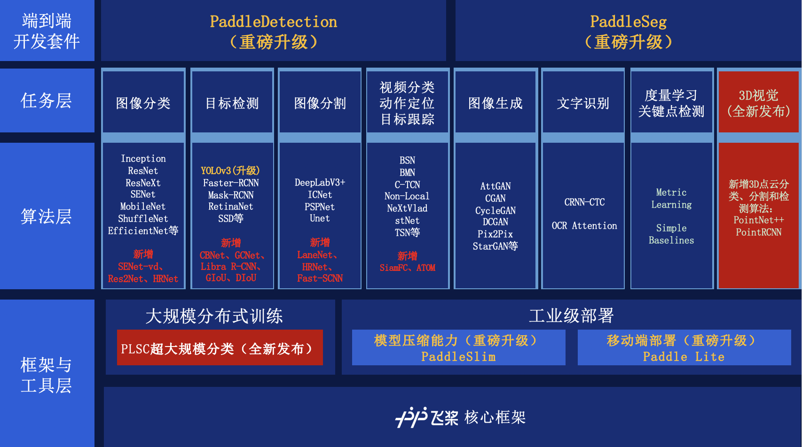

PaddleCV
========

PaddleCV 是基于 PaddlePaddle 深度学习框架开发的智能视觉工具，算法，模型和数据的开源项目。百度在 CV 领域多年的深厚积淀为 PaddleCV 提供了强大的核心动力。PaddleCV集成了丰富的CV模型，涵盖图像分类，目标检测，图像分割，视频分类，动作定位，目标跟踪，图像生成，文字识别，度量学习，关键点检测，3D视觉等 CV 技术。同时，PaddleCV 还提供了实用的工具，[PLSC](https://github.com/paddlepaddle/plsc)支持超大规模分类，[PaddleSlim](https://github.com/PaddlePaddle/PaddleSlim)和[PaddleLite](https://github.com/PaddlePaddle/Paddle-Lite)支持工业级部署，以及 [PaddleDetection](https://github.com/PaddlePaddle/PaddleDetection)、[PaddleSeg](https://github.com/PaddlePaddle/PaddleSeg)面向产业的端到端开发套件，打通了模型开发、压缩、部署全流程。

PaddleCV全景图：

图像分类
--------

> 注意：图像分类内容已迁移至新的github地址：[https://github.com/PaddlePaddle/PaddleClas](https://github.com/PaddlePaddle/PaddleClas)，欢迎大家去新的代码仓库中，查看与阅读更多关于图像分类的详细介绍以及新功能。

图像分类是根据图像的语义信息对不同类别图像进行区分，是计算机视觉中重要的基础问题，是物体检测、图像分割、物体跟踪、行为分析、人脸识别等其他高层视觉任务的基础，在许多领域都有着广泛的应用。如：安防领域的人脸识别和智能视频分析等，交通领域的交通场景识别，互联网领域基于内容的图像检索和相册自动归类，医学领域的图像识别等。

在深度学习时代，图像分类的准确率大幅度提升，在图像分类任务中，我们向大家介绍了如何在经典的数据集ImageNet上，训练常用的模型，包括AlexNet、VGG、ResNet、ResNeXt、Inception、MobileNet、SENet、DarkNet、SqueezeNet、ShuffleNet、Res2Net、DenseNet、DPN、EfficientNet、HRNet、AutoDL、ResNet-ACNet等系列模型，也开源了共117个[预训练模型](https://paddleclas.readthedocs.io/zh_CN/latest/models/index.html)方便用户下载使用。

- [ResNet及其Vd系列](https://paddleclas.readthedocs.io/zh_CN/latest/models/ResNet_and_vd.html)
- [SEResNeXt与Res2Net系列](https://paddleclas.readthedocs.io/zh_CN/latest/models/SEResNext_and_Res2Net.html)
- [Inception系列](https://paddleclas.readthedocs.io/zh_CN/latest/models/Inception.html)
- [HRNet系列](https://paddleclas.readthedocs.io/zh_CN/latest/models/HRNet.html)
- [DPN与DenseNet系列](https://paddleclas.readthedocs.io/zh_CN/latest/models/DPN_DenseNet.html)
- [EfficientNet与ResNeXt101_wsl系列](https://paddleclas.readthedocs.io/zh_CN/latest/models/EfficientNet_and_ResNeXt101_wsl.html)
- [移动端模型](https://paddleclas.readthedocs.io/zh_CN/latest/models/Mobile.html)
- [其他模型](https://paddleclas.readthedocs.io/zh_CN/latest/models/Others.html)

更多分类模型训练技巧和图像增广、知识蒸馏等高阶使用内容可以参考PaddleClas的github地址([https://github.com/PaddlePaddle/PaddleClas](https://github.com/PaddlePaddle/PaddleClas))与文档([https://paddleclas.readthedocs.io/zh_CN/latest/index.html](https://paddleclas.readthedocs.io/zh_CN/latest/index.html))。

目标检测
--------

目标检测任务的目标是给定一张图像或是一个视频帧，让计算机找出其中所有目标的位置，并给出每个目标的具体类别。对于人类来说，目标检测是一个非常简单的任务。然而，计算机能够“看到”的是图像被编码之后的数字，很难解图像或是视频帧中出现了人或是物体这样的高层语义概念，也就更加难以定位目标出现在图像中哪个区域。与此同时，由于目标会出现在图像或是视频帧中的任何位置，目标的形态千变万化，图像或是视频帧的背景千差万别，诸多因素都使得目标检测对计算机来说是一个具有挑战性的问题。

在目标检测任务中，我们介绍了如何基于[PASCAL VOC](http://host.robots.ox.ac.uk/pascal/VOC/) 、[MS COCO](http://cocodataset.org/#home)、[Objects365](http://www.objects365.org/overview.html)、[Open Images](https://storage.googleapis.com/openimages/web/index.html)数据训练通用物体检测模型。包含的算法有SSD (Single Shot MultiBox Detector)、YOLOv3、RetinaNet、Faster-RCNN、Mask-RCNN、CascadeRCNN、Libra-RCNN、CBNet、GCNet、Open Image V5比赛的最佳单模型CascadeClsAware RCNN等。以及基于G-IoU、D-IoU、C-IoU损失函数的模型。

除了通用物体检测，还包括人脸检测。开放环境中的检测人脸，尤其是小的、模糊的和部分遮挡的人脸也是一个具有挑战的任务。我们也介绍了如何基于 [WIDER FACE](http://mmlab.ie.cuhk.edu.hk/projects/WIDERFace) 数据训练百度自研的人脸检测PyramidBox模型，该算法于2018年3月份在WIDER FACE的多项评测中均获得 [第一名](http://mmlab.ie.cuhk.edu.hk/projects/WIDERFace/WiderFace_Results.html)。同时还包括，轻量级的人脸检测模型Faceboxes和BlazeFace。

#### 通用目标检测
-  [Single Shot MultiBox Detector](https://github.com/PaddlePaddle/PaddleDetection)
-  [YOLOv3](https://github.com/PaddlePaddle/PaddleDetection)
-  [RetinaNet](https://github.com/PaddlePaddle/PaddleDetection)
-  [Faster RCNN](https://github.com/PaddlePaddle/PaddleDetection)
-  [Mask RCNN](https://github.com/PaddlePaddle/PaddleDetection)
-  [Two-stage FPN](https://github.com/PaddlePaddle/PaddleDetection)
-  [Cascade-RCNN](https://github.com/PaddlePaddle/PaddleDetection)
-  [Libra-RCNN](https://github.com/PaddlePaddle/PaddleDetection)
-  [CascadeClsAware RCNN](https://github.com/PaddlePaddle/PaddleDetection/blob/release/0.2/docs/featured_model/OIDV5_BASELINE_MODEL.md)

#### 人脸检测
-  [Face Detector: PyramidBox](./face_detection/README_cn.md)
-  [Faceboxes](https://github.com/PaddlePaddle/PaddleDetection)
-  [BalzeFace](https://github.com/PaddlePaddle/PaddleDetection)

在目标检测中，除了模型训练外，还增加目标检测的模型压缩、C++预测部署环节，更全详细的可以参考[PaddleDetection](https://github.com/PaddlePaddle/PaddleDetection)。

图像语义分割
------------

图像语义分割顾名思义是将图像像素按照表达的语义含义的不同进行分组/分割，图像语义是指对图像内容的理解，例如，能够描绘出什么物体在哪里做了什么事情等，分割是指对图片中的每个像素点进行标注，标注属于哪一类别。近年来用在无人车驾驶技术中分割街景来避让行人和车辆、医疗影像分析中辅助诊断等。

在图像语义分割任务中，我们以眼底医疗分割任务为例，介绍了如何应用DeepLabv3+, U-Net, ICNet, PSPNet, HRNet, Fast-SCNN等主流分割模型。通过统一的配置，帮助大家更便捷地完成从训练到部署的全流程图像分割应用。

- [U-Net](https://github.com/PaddlePaddle/PaddleSeg/blob/release/v0.4.0/turtorial/finetune_unet.md)
- [ICNet](https://github.com/PaddlePaddle/PaddleSeg/blob/release/v0.4.0/turtorial/finetune_icnet.md)
- [PSPNet](https://github.com/PaddlePaddle/PaddleSeg/blob/release/v0.4.0/turtorial/finetune_pspnet.md)
- [DeepLabv3+](https://github.com/PaddlePaddle/PaddleSeg/blob/release/v0.4.0/turtorial/finetune_deeplabv3plus.md)
- [HRNet](https://github.com/PaddlePaddle/PaddleSeg/blob/release/v0.4.0/turtorial/finetune_hrnet.md)
- [Fast-SCNN](https://github.com/PaddlePaddle/PaddleSeg/blob/release/v0.4.0/turtorial/finetune_fast_scnn.md)

图像生成
-----------

图像生成是指根据输入向量，生成目标图像。这里的输入向量可以是随机的噪声或用户指定的条件向量。具体的应用场景有：手写体生成、人脸合成、风格迁移、图像修复等。当前的图像生成任务主要是借助生成对抗网络（GAN）来实现。
生成对抗网络（GAN）由两种子网络组成：生成器和识别器。生成器的输入是随机噪声或条件向量，输出是目标图像。识别器是一个分类器，输入是一张图像，输出是该图像是否是真实的图像。在训练过程中，生成器和识别器通过不断的相互博弈提升自己的能力。

在图像生成任务中，我们介绍了如何使用DCGAN和ConditioanlGAN来进行手写数字的生成，用于风格迁移的CycleGAN、Pix2Pix，用于属性变化的StarGAN、AttGAN、STGAN，以及图像翻译的SPADE。

- [DCGAN & ConditionalGAN](./gan/c_gan)
- [CycleGAN](./gan)
- [Pix2Pix](./gan)
- [StarGAN](./gan)
- [AttGAN](./gan)
- [STGAN](./gan)

场景文字识别
------------

许多场景图像中包含着丰富的文本信息，对理解图像信息有着重要作用，能够极大地帮助人们认知和理解场景图像的内容。场景文字识别是在图像背景复杂、分辨率低下、字体多样、分布随意等情况下，将图像信息转化为文字序列的过程，可认为是一种特别的翻译过程：将图像输入翻译为自然语言输出。场景图像文字识别技术的发展也促进了一些新型应用的产生，如通过自动识别路牌中的文字帮助街景应用获取更加准确的地址信息等。

在场景文字识别任务中，我们介绍如何将基于CNN的图像特征提取和基于RNN的序列翻译技术结合，免除人工定义特征，避免字符分割，使用自动学习到的图像特征，完成字符识别。当前，介绍了CRNN-CTC模型和基于注意力机制的序列到序列模型。

-  [CRNN-CTC模型](./ocr_recognition)
-  [Attention模型](./ocr_recognition)

度量学习
-------

度量学习也称作距离度量学习、相似度学习，通过学习对象之间的距离，度量学习能够用于分析对象时间的关联、比较关系，在实际问题中应用较为广泛，可应用于辅助分类、聚类问题，也广泛用于图像检索、人脸识别等领域。以往，针对不同的任务，需要选择合适的特征并手动构建距离函数，而度量学习可根据不同的任务来自主学习出针对特定任务的度量距离函数。度量学习和深度学习的结合，在人脸识别/验证、行人再识别(human Re-ID)、图像检索等领域均取得较好的性能，在这个任务中我们主要介绍了基于Fluid的深度度量学习模型，包含了三元组、四元组等损失函数。

- [Metric Learning](./metric_learning)

视频
-------

PaddleCV全面开源了视频分类、动作定位 和 目标跟踪等视频任务的领先实用算法。视频数据包含语音、图像等多种信息，因此理解视频任务不仅需要处理语音和图像，还需要提取视频帧时间序列中的上下文信息。
视频分类模型提供了提取全局时序特征的方法，主要方式有卷积神经网络 (C3D, I3D, C2D等)，神经网络和传统图像算法结合 (VLAD 等)，循环神经网络等建模方法。
视频动作定位模型需要同时识别视频动作的类别和起止时间点，通常采用类似于图像目标检测中的算法在时间维度上进行建模。
视频摘要生成模型是对视频画面信息进行提取，并产生一段文字描述。视频查找模型则是基于一段文字描述，查找到视频中对应场景片段的起止时间点。这两类模型需要同时对视频图像和文本信息进行建模。
目标跟踪任务是在给定某视频序列中找到目标物体，并将不同帧中的物体一一对应，然后给出不同物体的运动轨迹，目标跟踪的主要应用在视频监控、人机交互等系统中。跟踪又分为单目标跟踪和多目标跟踪，当前在飞桨模型库中增加了单目标跟踪的算法。主要包括Siam系列算法和ATOM算法。

| 模型名称                                                     | 模型简介                                                     | 数据集                     | 评估指标    |
| ------------------------------------------------------------ | ------------------------------------------------------------ | -------------------------- | ----------- |
| [TSN](./video) | ECCV'16 提出的基于 2D-CNN 经典解决方案 | Kinetics-400               | Top-1 = 67% |
| [Non-Local](./video) | 视频非局部关联建模模型 | Kinetics-400               | Top-1 = 74% |
| [StNet](./video) | AAAI'19 提出的视频联合时空建模方法 | Kinetics-400               | Top-1 = 69% |
| [TSM](./video) | 基于时序移位的简单高效视频时空建模方法 | Kinetics-400               | Top-1 = 70% |
| [Attention   LSTM](./video) | 常用模型，速度快精度高 | Youtube-8M                 | GAP   = 86% |
| [Attention   Cluster](./video) | CVPR'18 提出的视频多模态特征注意力聚簇融合方法 | Youtube-8M                 | GAP   = 84% |
| [NeXtVlad](./video) | 2nd-Youtube-8M 比赛第 3 名的模型 | Youtube-8M                 | GAP   = 87% |
| [C-TCN](./video) | 2018 年 ActivityNet 夺冠方案 | ActivityNet1.3 | MAP=31%    |
| [BSN](./video) | 为视频动作定位问题提供高效的 proposal 生成方法 | ActivityNet1.3 | AUC=66.64%    |
| [BMN](./video) | 2019 年 ActivityNet 夺冠方案 | ActivityNet1.3 | AUC=67.19%    |
| [ETS](./video) | 视频摘要生成领域的基准模型 | ActivityNet Captions | METEOR：10.0 |
| [TALL](./video) | 视频Grounding方向的BaseLine模型 | TACoS | R1@IOU5=0.13 |
| [SiamFC](./tracking) | ECCV’16提出的全卷积神经网络视频跟踪模型 | VOT2018 | EAO = 0.211 |
| [ATOM](./tracking) | CVPR’19提出的两阶段目标跟踪模型 | VOT2018 | EAO = 0.399 |

3D视觉
-------

计算机3D视觉技术是解决包含高度、宽度、深度信息的三维立体图像的分类、分割、检测、识别等任务的计算机技术，广泛地应用于如机器人、无人车、AR等领域。3D点云是3D图像数据的主要表达形式之一，基于3D点云的形状分类、语义分割、目标检测模型是3D视觉方向的基础任务。当前飞桨模型库开源了基于3D点云数据的用于分类、分割的PointNet++模型和用于检测的PointRCNN模型。

[PointNet++](./3d_vision/PointNet++)
[PointRCNN](./3d_vision/PointRCNN)
