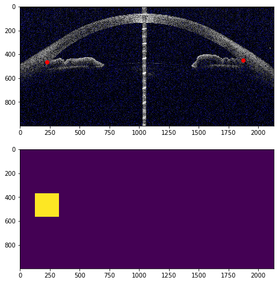
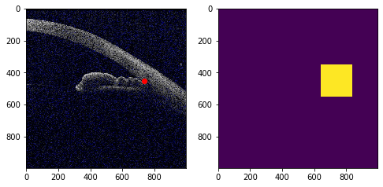
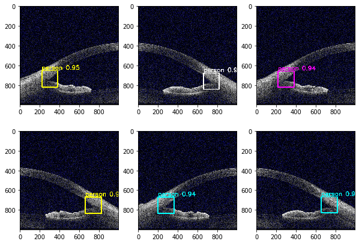
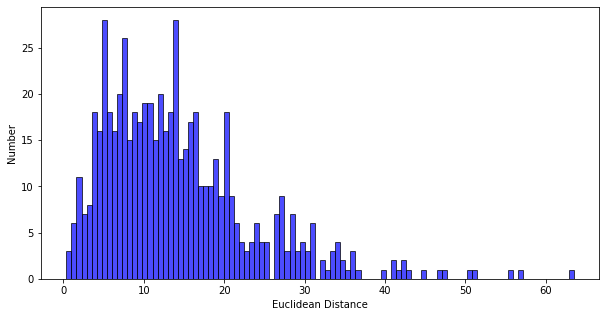

# Angle closure Glaucoma Evaluation Challenge
The goal of the challenge is to evaluate and compare automated algorithms for angle closure classification and localization of scleral spur (SS) points on a common dataset of AS-OCT images. We invite the medical image analysis community to participate by developing and testing existing and novel automated classification and segmentation methods.
More detail [AGE challenge](https://age.grand-challenge.org/Details/).

## Scleral spur localization task (RCNN model)

1. Method

	* A localization task could be transformed to a object detection task.

	

	* Then, a image could be splited into 2 parts, the right part:

	

2. Prepare data

	* We assume that you have downloaded data(two zip files), and stored @ `../datasets/`.
	* (Updated on August 5) Replace update files.
	* We provide a demo about `zip file extract`, `data structure explore`, `format data to coco type` and `Train/Val split`.

3. Train
	
	* We assume that you have downloaded data, extracted compressed files, and stored @ `../datasets/`.
	* You should download or clone [PaddleModels](https://github.com/PaddlePaddle/models) manually.
	* After you download whole repo, use soft link command:

	```
	$ git clone https://github.com/PaddlePaddle/models
	$ cd models/PaddleCV/
	$ ln -sf ./PaddleDetection Research/AGEchallenge/LocalizationRCNN/PaddleDetection
	```

	* Based on [PaddleDetection](https://github.com/PaddlePaddle/models/tree/develop/PaddleCV/PaddleDetection), we provide a guideline to modify config file.
	* You could also simply replace `PaddleDetection/configs/cascade_rcnn_r50_fpn_1x.yml` with `./cascade_rcnn_r50_fpn_1x.yml`
	* `PaddleDetection/tools/train.py` will automatically download pretrain weights, default save to `～/.cache/paddle/weights/`.
	* We provide a demo to call `PaddleDetection/tools/train.py`, which starts training, save checkpoint to `PaddleDetection/output/cascade_rcnn_r50_fpn_1x/`

4. Inference

	* We assume that you have downloaded data, extracted compressed files, and stored @ `../datasets/`.
	* We assume that you stored checkpoint files @ `PaddleDetection/output/cascade_rcnn_r50_fpn_1x/`
	* We provide a demo about `inference` and `visualization`.

	

	