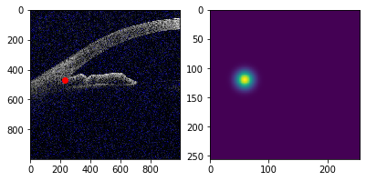
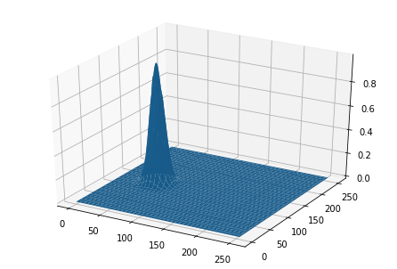
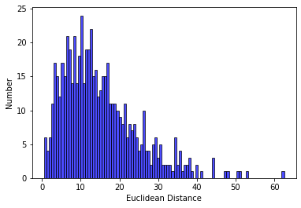
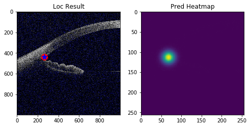

# Angle closure Glaucoma Evaluation Challenge
The goal of the challenge is to evaluate and compare automated algorithms for angle closure classification and localization of scleral spur (SS) points on a common dataset of AS-OCT images. We invite the medical image analysis community to participate by developing and testing existing and novel automated classification and segmentation methods.
More detail [AGE challenge](https://age.grand-challenge.org/Details/).

## Scleral spur localization task (ResNet50+UNet model)

1. Method

    * Inspired by UNet method, a keypoint is equivalent to 2D gaussian heatmap.

    
    

    * Then, a localization task could be transformed to a heatmap regression task.

2. Prepare data

    * We assume that you have downloaded data(two zip files), and store @ `../datasets/`.
    * (Updated on August 5) Replace update files.
    * We provide a demo about `zip file extract`, `data structure explore`, and `Train/Val split`.

3. Train
    
    * We assume that you have download data, extract compressed files, and store @ `../datasets/`.
    * Based on PaddlePaddle and [ResNet50](https://github.com/PaddlePaddle/models/blob/develop/PaddleCV/image_classification/models/resnet.py), we modify the model structure to enable UNet model, which global pooling layer and final fc layer were removed.

4. Inference

    * We assume that you have download data, extract compressed files, and store @ `../datasets/`.
    * We assume that you stored checkpoint files @ `../weights/loc_unet`
    * We provide a baseline about `inference` and `visualization`.

    

    
