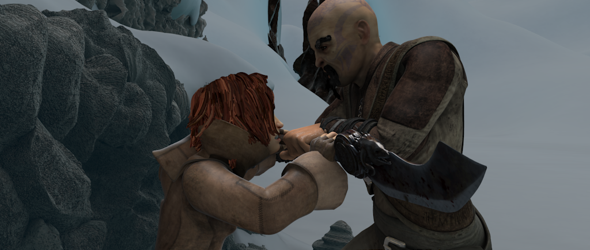
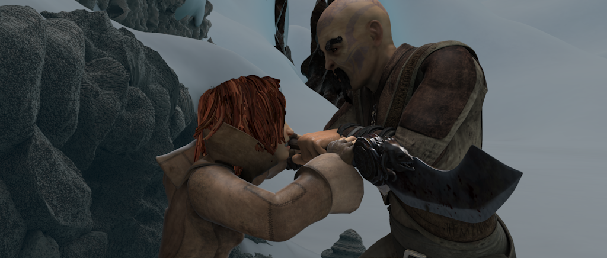

# PWCNet reimplement using paddlepaddle DyGraph
PWC-Net: CNNs for Optical Flow Using Pyramid, Warping, and Cost Volume.
# Environment 
```
cenntos7
paddle develop version (after 20191201) install from source
python3.7
SciPy 1.1.0
```
code will update for paddle v1.7 later.
# Compile correlation op
```
cd correlation_op
sh make.sh
```
# Datasets
1.Please download the `FlyingChairs dataset` and `FlyingChairs_train_val.txt` from https://lmb.informatik.uni-freiburg.de/resources/datasets

Or you can use `./data/download.sh` to download datasets.

We split the data to train and val by using `FlyingChairs_train_val.txt` with `1 for train and 2 for val`.
# Inference
Note that the paddle models `pwc_net_paddle.pdparams` and `pwc_net_chairs_paddle.pdparams` are transferred from the pytorch pth files `pwc_net.pth.tar` and `pwc_net_chairs.pth.tar`.

Run
```
python infer.py
```

| Input img1 | Input img2 |
|-------|------------|
|  |  |

|prediction with pwc_net_paddle.pdparams| prediction with pwc_net_chairs_paddle.pdparams|
|-------------|-------------|
| |  |

# First Train with L2 loss
A single gpu is supported. Multi gpus will be supported later.

You should check parameters in `my_args.py` as you like.

And change them in `train.sh`.
```
--data_root
--train_val_txt
--batch_size
```
Then run
```
./train.sh
```
Some results during training can be seen
```
./img1.png
./img2.png
./hsv_pd.png # ground truth
./hsv_predict.png # output of model
```

# Finetune with L1 loss
finetune from your best pretrain model by adding --pretrained your_best_model_name eg. `--pretrained epoch_7_pwc_net_paddle`

Run
```
./finetune.sh
```
# Note
This code reimplement PWCNet like the code of `https://github.com/NVlabs/PWC-Net`
If you want to want to train like the paper
```
@InProceedings{Sun2018PWC-Net,
  author    = {Deqing Sun and Xiaodong Yang and Ming-Yu Liu and Jan Kautz},
  title     = {{PWC-Net}: CNNs for Optical Flow Using Pyramid, Warping, and Cost Volume},
  booktitle = CVPR,
  year      = {2018},
}
```
Please use all the datasets in `./data/download.sh` if you like. And use the code in `./data/datasets.py`.

Reference works
```
https://github.com/NVlabs/PWC-Net
https://github.com/ClementPinard/FlowNetPytorch
https://github.com/NVIDIA/flownet2-pytorch/blob/master/datasets.py
```