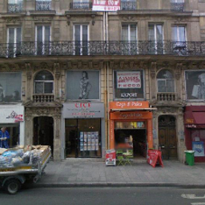
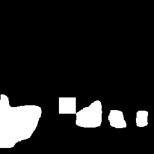
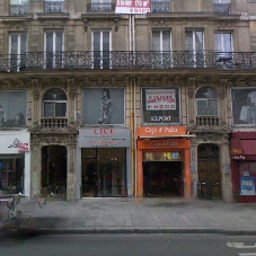

# Image Inpainting with Learnable Bidirectional Attention Maps.
The PaddlePaddle implementation of Image Inpainting with Learnable Bidirectional Attention Maps in ICCV 2019, by Chaohao Xie, Shaohui Liu, Chao Li, Ming-Ming Cheng, Wangmeng Zuo, Xiao Liu, Shilei Wen, Errui Ding.\
<https://arxiv.org/abs/1909.00968>

## 1. Requirements.

PaddlePaddle version == 1.6.\
Python version == 3.6.\
NCCL for multiple GPUs.

## 2. Usage.

Download the pretrained models by <https://pan.baidu.com/s/1Xpgj6pcBTYYYxsAlJrFXgg>, password: apfo.\
Run the test script.
```
sh test.sh
```

```
mkdir -p results/paris

FLAGS_fraction_of_gpu_memory_to_use=0.1 \
CUDA_VISIBLE_DEVICES=0 \
FLAGS_eager_delete_tensor_gb=0.0 \
FLAGS_fast_eager_deletion_mode=1 \
python -u test.py \
--pretrained_model 'pretrained_models/LBAM_ParisStreetView' \  # path to the pretrained model
--imgfn 'imgs/paris/pic.png' \                                 # input picture.
--maskfn 'imgs/paris/mask.png' \                               # mask.
--resultfn 'results/paris'                                     # folder for the result.
```
Input picture:\


Input mask:\


Inpainting result:\

