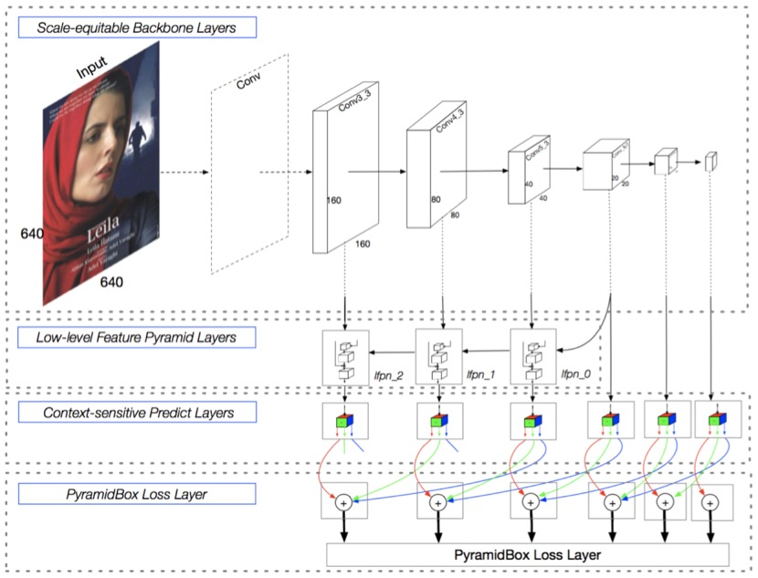
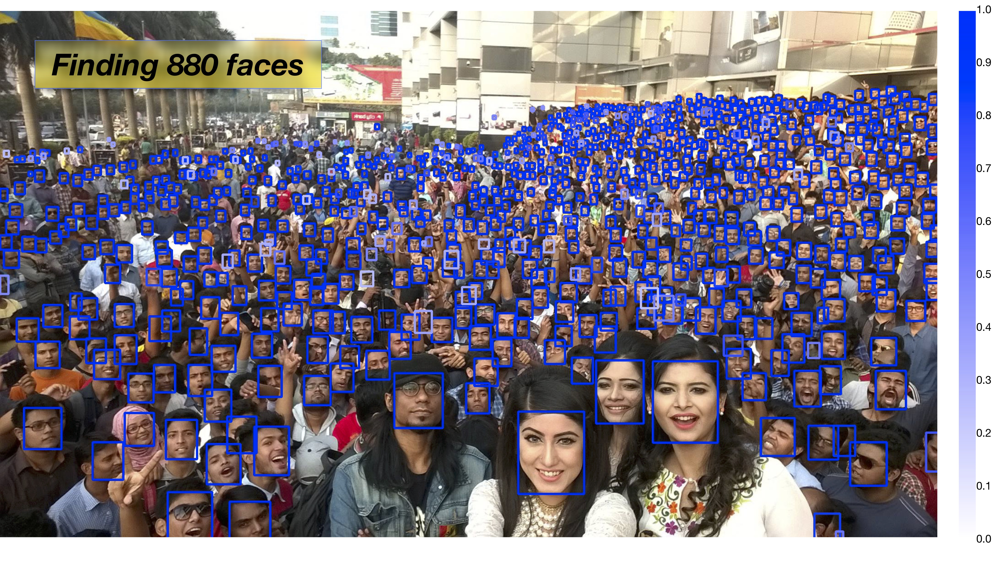
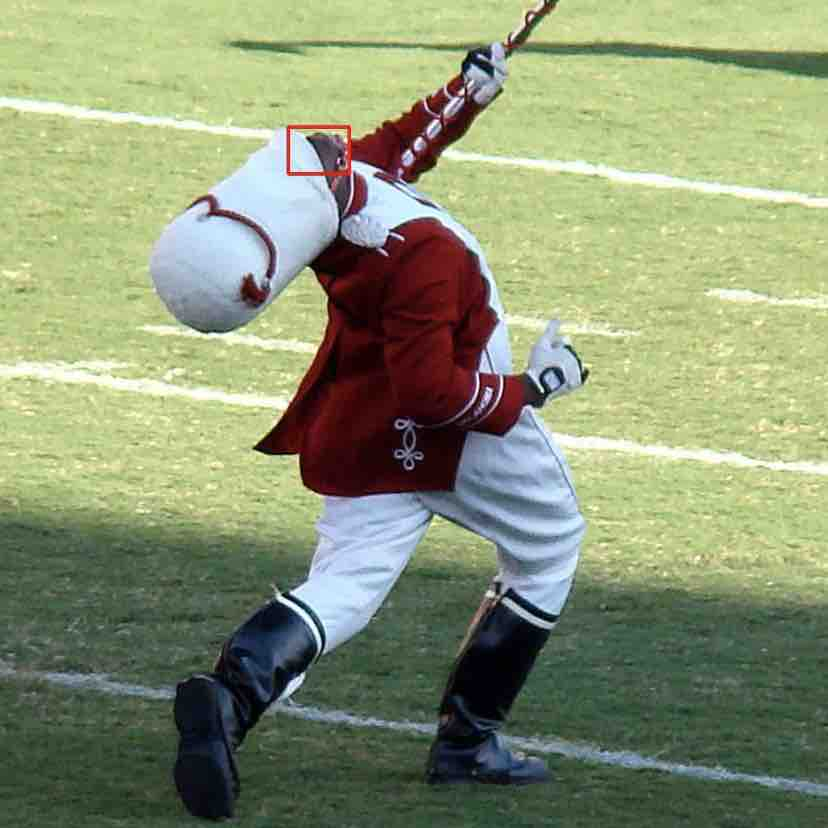
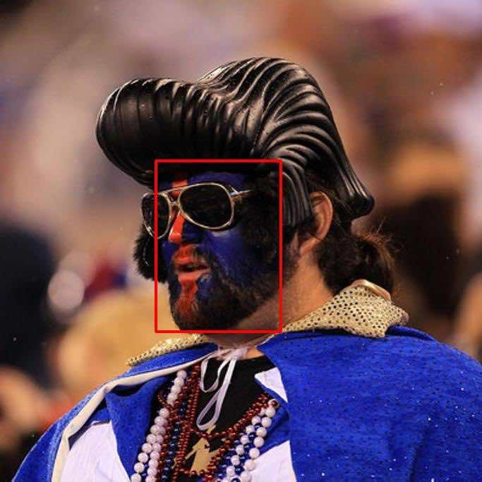
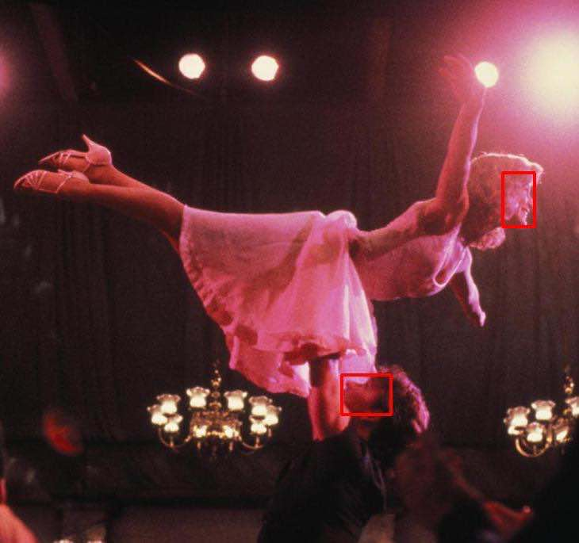
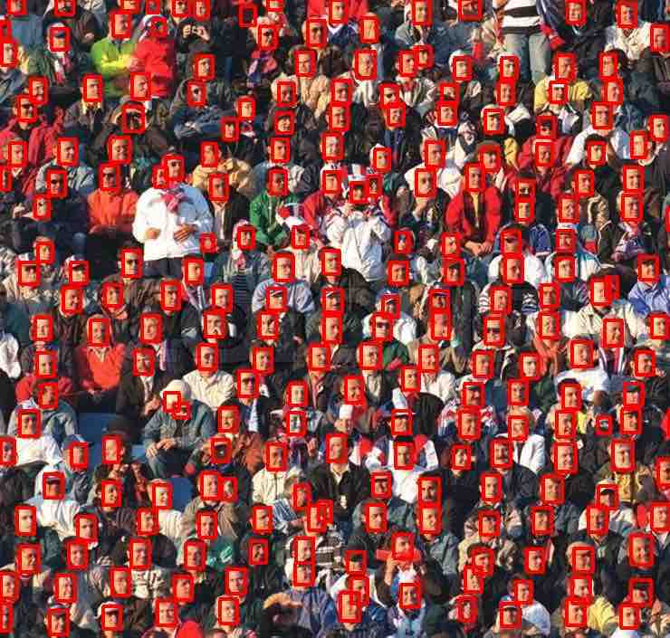
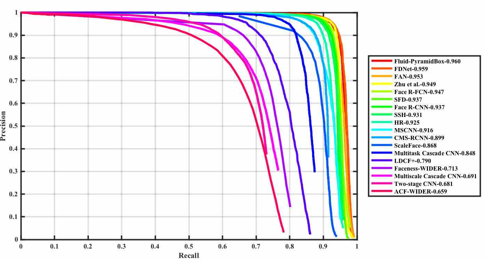
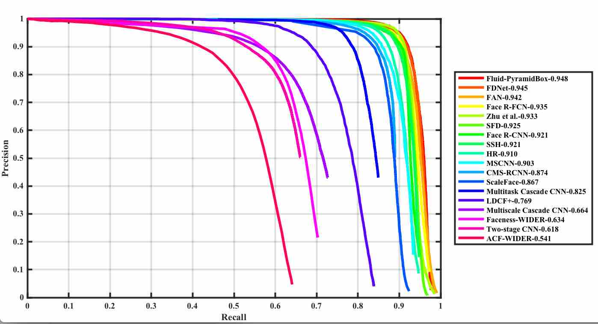
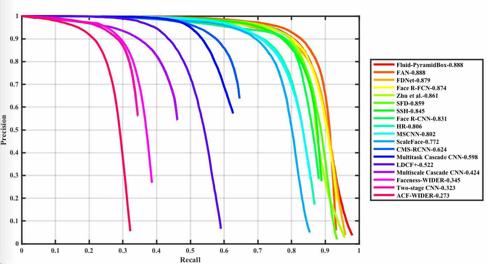

## Pyramidbox 人脸检测

## Table of Contents
- [简介](#简介)
- [数据准备](#数据准备)
- [模型训练](#模型训练)
- [模型评估](#模型评估)
- [模型发布](#模型发布)

### 简介

人脸检测是经典的计算机视觉任务，非受控场景中的小脸、模糊和遮挡的人脸检测是这个方向上最有挑战的问题。[PyramidBox](https://arxiv.org/pdf/1803.07737.pdf) 是一种基于SSD的单阶段人脸检测器，它利用上下文信息解决困难人脸的检测问题。如下图所示，PyramidBox在六个尺度的特征图上进行不同层级的预测。该工作主要包括以下模块：LFPN、Pyramid Anchors、CPM、Data-anchor-sampling。具体可以参考该方法对应的论文 https://arxiv.org/pdf/1803.07737.pdf ，下面进行简要的介绍。

<p align="center">
 <br />
Pyramidbox 人脸检测模型
</p>

**LFPN**: LFPN全称Low-level Feature Pyramid Networks, 在检测任务中，LFPN可以充分结合高层次的包含更多上下文的特征和低层次的包含更多纹理的特征。高层级特征被用于检测尺寸较大的人脸，而低层级特征被用于检测尺寸较小的人脸。为了将高层级特征整合到高分辨率的低层级特征上，我们从中间层开始做自上而下的融合，构建Low-level FPN。

**Pyramid Anchors**: 该算法使用半监督解决方案来生成与人脸检测相关的具有语义的近似标签，提出基于anchor的语境辅助方法，它引入有监督的信息来学习较小的、模糊的和部分遮挡的人脸的语境特征。使用者可以根据标注的人脸标签，按照一定的比例扩充，得到头部的标签（上下左右各扩充1/2）和人体的标签（可自定义扩充比例）。

**CPM**: CPM全称Context-sensitive Predict Module, 本方法设计了一种上下文敏感结构(CPM)来提高预测网络的表达能力。

**Data-anchor-sampling**: 设计了一种新的采样方法，称作Data-anchor-sampling，该方法可以增加训练样本在不同尺度上的多样性。该方法改变训练样本的分布，重点关注较小的人脸。

Pyramidbox模型可以在以下示例图片上展示鲁棒的检测性能，该图有一千张人脸，该模型检测出其中的880张人脸。
<p align="center">
 <br />
Pyramidbox 人脸检测性能展示
</p>


### 数据准备

本教程使用 [WIDER FACE 数据集](http://mmlab.ie.cuhk.edu.hk/projects/WIDERFace/) 来进行模型的训练测试工作，官网给出了详尽的数据介绍。

WIDER FACE数据集包含32,203张图片，其中包含393,703个人脸，数据集的人脸在尺度、姿态、遮挡方面有较大的差异性。另外WIDER FACE数据集是基于61个场景归类的，然后针对每个场景，随机的挑选40%作为训练集，10%作为验证集，50%作为测试集。

首先，从官网训练集和验证集，放在`data`目录，官网提供了谷歌云和百度云下载地址，请依据情况自行下载。Linux用户可通过下面脚本下载训练集和验证集的标注信息:

```bash
./data/download.sh
```

Windows用户请自行到[WIDER FACE 官网](http://mmlab.ie.cuhk.edu.hk/projects/WIDERFace/)下载数据和标注信息。

准备好数据之后，`data`目录如下：

```
data
|-- download.sh
|-- wider_face_split
|   |-- readme.txt
|   |-- wider_face_train_bbx_gt.txt
|   |-- wider_face_val_bbx_gt.txt
|   `-- ...
|-- WIDER_train
|   `-- images
|       |-- 0--Parade
|       ...
|       `-- 9--Press_Conference
`-- WIDER_val
    `-- images
        |-- 0--Parade
        ...
        `-- 9--Press_Conference
```


### 模型训练

#### 下载预训练模型

我们提供了预训练模型，模型是基于VGGNet的主干网络，使用如下命令下载：


```bash
wget http://paddlemodels.bj.bcebos.com/vgg_ilsvrc_16_fc_reduced.tar.gz
tar -xf vgg_ilsvrc_16_fc_reduced.tar.gz && rm -f vgg_ilsvrc_16_fc_reduced.tar.gz
```

声明：该预训练模型转换自[Caffe](http://cs.unc.edu/~wliu/projects/ParseNet/VGG_ILSVRC_16_layers_fc_reduced.caffemodel)。不久，我们会发布自己预训练的模型。


#### 开始训练


`train.py` 是训练模块的主要执行程序，调用示例如下：

```bash
python -u train.py --batch_size=16 --pretrained_model=vgg_ilsvrc_16_fc_reduced
```
  - 可以通过设置 `export CUDA_VISIBLE_DEVICES=0,1,2,3` 指定想要使用的GPU数量，`batch_size`默认设置为12或16，如果GPU显存较小，请适当调低`batch_size`。
  - **注意**: 在**Windows**机器上训练或者训练环境内存较小时，需要设置 `--use_multiprocess=False`，因为在Windows上使用Python多进程加速训练时有错误，内存不足时程序会崩溃。
  - 更多的可选参数见:
    ```bash
    python train.py --help
    ```
  - 模型训练150轮以上可以收敛。用Nvidia Tesla P40 GPU 4卡并行，`batch_size=16`的配置，每轮训练大约40分钟，总共训练时长大约100小时

模型训练所采用的数据增强：

**数据增强**：数据的读取行为定义在 `reader.py` 中，所有的图片都会被缩放到640x640。在训练时还会对图片进行数据增强，包括随机扰动、翻转、裁剪等，和[物体检测SSD算法](https://github.com/PaddlePaddle/models/blob/develop/fluid/PaddleCV/object_detection/README.md)中数据增强类似，除此之外，增加了上面提到的Data-anchor-sampling:

  **尺度变换(Data-anchor-sampling)**：随机将图片尺度变换到一定范围的尺度，大大增强人脸的尺度变化。具体操作为根据随机选择的人脸高(height)和宽(width)，得到$v=\\sqrt{width * height}$，判断$v$的值位于缩放区间$[16，32，64，128，256，512]$中的的哪一个。假设$v=45$，则选定$32<v<64$，以均匀分布的概率选取$[16，32，64]$中的任意一个值。若选中$64$，则该人脸的缩放区间在 $[64 / 2，min(v * 2, 64 * 2)]$中选定。


**注意**：
  - 本次开源模型中CPM模块与论文中有些许不同，相比论文中CPM模块训练和测试速度更快。
  - Pyramid Anchors模块的body部分可以针对不同情况，进行相应的长宽设置来调参。同时face、head、body部分的loss对应的系数也可以通过调参优化。
  - 针对GPU资源有限时，可采取显存优化策略，`train.py` 与 `derface_eval.py` 已经加入部分显存优化FLAGS，详情更多内容请参考[API文档](https://www.paddlepaddle.org.cn/documentation/docs/zh/develop/flags/memory_cn.html#flags-fraction-of-gpu-memory-to-use)


### 模型评估

验证集的评估需要两个步骤：先预测出验证集的检测框和置信度，再利用WIDER FACE官方提供的评估脚本得到评估结果。

- 预测检测结果

  ```bash
  python -u widerface_eval.py --model_dir=output/159 --pred_dir=pred
  ```
  更多的可选参数:

  ```bash
  python -u widerface_eval.py --help
  ```
  **注意**： `widerface_eval.py`中`multi_scale_test_pyramid`可用可不用，由于Data-anchor-sampling的作用，更加密集的anchors对性能有更大的提升。

- 评估AP指标

  下载官方评估脚本，评估average precision(AP)指标：

  ```bash
  wget http://mmlab.ie.cuhk.edu.hk/projects/WIDERFace/support/eval_script/eval_tools.zip
  unzip eval_tools.zip && rm -f eval_tools.zip
  ```

  修改`eval_tools/wider_eval.m`中检测结果保存的路径和将要画出的曲线名称：

  ```txt
  # 此处修改存放结果的文件夹名字
  pred_dir = './pred';  
  # 此处修改将要画出的曲线名称
  legend_name = 'Fluid-PyramidBox';
  ```

  `wider_eval.m`是评估模块的主要执行程序，命令行式的运行命令如下：

  ```bash
  matlab -nodesktop -nosplash -nojvm -r "run wider_eval.m;quit;"

  ```

### 模型预测以及可视化
`widerface_eval.py`也可以用来做预测及可视化，调用示例如下：

```bash
python widerface_eval.py --infer=True --confs_threshold=0.15
 --model_dir=output/159/ --image_path=data/WIDER_train/images/0--Parade/0_Parade_marchingband_1_219.jpg
```
下图可视化了模型的预测结果：
<p align="center">



  <br />
Pyramidbox 预测可视化
</p>


### 模型发布


| 模型                    | 预训练模型  | 训练数据    | 测试数据    | mAP |
|:------------------------:|:------------------:|:----------------:|:------------:|:----:|
|[Pyramidbox-v1-SSD 640x640](http://paddlemodels.bj.bcebos.com/PyramidBox_WiderFace.tar.gz) | [VGGNet](http://paddlemodels.bj.bcebos.com/vgg_ilsvrc_16_fc_reduced.tar.gz) | WIDER FACE train | WIDER FACE Val   | 96.0%/ 94.8%/ 88.8% |

#### 性能曲线
<p align="center">
    
    
    </br>
WIDER FACE Easy/Medium/Hard set
</p>
