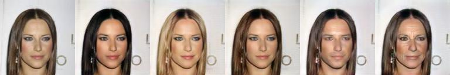

# 图像生成模型库

生成对抗网络(Generative Adversarial Network\[[1](#参考文献)\], 简称GAN) 是一种非监督学习的方式，通过让两个神经网络相互博弈的方法进行学习，该方法由lan Goodfellow等人在2014年提出。生成对抗网络由一个生成网络和一个判别网络组成，生成网络从潜在的空间(latent space)中随机采样作为输入，其输出结果需要尽量模仿训练集中的真实样本。判别网络的输入为真实样本或生成网络的输出，其目的是将生成网络的输出从真实样本中尽可能的分辨出来。而生成网络则尽可能的欺骗判别网络，两个网络相互对抗，不断调整参数。
生成对抗网络常用于生成以假乱真的图片。此外，该方法还被用于生成影片，三维物体模型等。\[[2](#参考文献)\]

---
## 内容

- [模型简介](#模型简介)
- [快速开始](#快速开始)
- [进阶使用](#进阶使用)
- [FAQ](#faq)
- [参考论文](#参考论文)
- [版本更新](#版本更新)

## 模型简介

本图像生成模型库包含CGAN\[[3](#参考文献)\], DCGAN\[[4](#参考文献)\], Pix2Pix\[[5](#参考文献)\], CycleGAN\[[6](#参考文献)\], StarGAN\[[7](#参考文献)\], AttGAN\[[8](#参考文献)\], STGAN\[[9](#参考文献)\], SPADE\[[13](#参考文献)\]。

注意：
1. GAN模型目前仅仅验证了单机单卡训练和预测结果。
2. CGAN和DCGAN两个模型训练使用的数据集为MNIST数据集；StarGAN，AttGAN和STGAN的数据集为CelebA数据集。Pix2Pix和CycleGAN支持的数据集可以参考download.py中的cycle_pix_dataset。cityscapes数据集需要从[官方](https://www.cityscapes-dataset.com)下载数据，下载完之后使用`scripts/prepare_cityscapes_dataset.py`处理，处理后的文件夹命名为cityscapes并放入data目录下即可。
3. PaddlePaddle1.5.1及之前的版本不支持在AttGAN和STGAN模型里的判别器加上的instance norm。如果要在判别器中加上instance norm，请源码编译develop分支并安装。
4. 中间效果图保存在${output_dir}/test文件夹中。对于Pix2Pix来说，inputA 和inputB 代表输入的两种风格的图片，fakeB表示生成图片；对于CycleGAN来说，inputA表示输入图片，fakeB表示inputA根据生成的图片，cycA表示fakeB经过生成器重构出来的对应于inputA的重构图片；对于StarGAN，AttGAN和STGAN来说，第一行表示原图，之后的每一行都代表一种属性变换。
5. infer过程使用的test_list文件和训练过程中使用的train_list具有相同格式，第一行为样本数量，第二行为属性，之后的行中第一个表示图片名称，之后的-1和1表示该图片是否拥有该属性(1为有该属性，-1为没有该属性)。
6. metric中的fid评价指标需要先下载inceptionV3模型参数，模型参数下载链接：[inceptionV3](https://paddle-gan-models.bj.bcebos.com/params_inceptionV3.tar.gz)

图像生成模型库库的目录结构如下：
```
├── download.py 下载数据
│  
├── data_reader.py 数据预处理
│  
├── train.py 模型的训练入口
│  
├── infer.py 模型的预测入口
│  
├── trainer 不同模型的训练脚本
│   ├── CGAN.py Conditional GAN的训练脚本
│   ├── ...
│   ├── STGAN.py STGAN的训练脚本
│  
├── network 不同模型的网络结构
│   ├── base_network.py GAN模型需要的公共基础网络结构
│   ├── ...
│   ├── STGAN_network.py STGAN的网络结构
│  
├── util 网络的基础配置和公共模块
│   ├── config.py 网络公用的基础配置
│   ├── utility.py 保存模型等网络公用的模块
│  
├── scripts 多个模型的训练启动和测试启动示例
│   ├── run_....py 训练启动示例
│   ├── infer_....py 测试启动示例
│   ├── make_pair_data.py pix2pix GAN的数据list的生成脚本
│
├── data 下载的数据集存放的位置
│   ├── celeba
│       ├── ${image_dir} 存放实际图片
│       ├── list 文件
│
├── metric 评价指标
│   ├── compute_fid.py 计算fid_score的文件
│   ├── inception.py 计算fid_score所需要的inceptionV3网络结构

```

同时推荐用户参考[ IPython Notebook demo](https://aistudio.baidu.com/aistudio/projectDetail/122272)

## 快速开始

### 安装说明
**安装[PaddlePaddle](https://github.com/PaddlePaddle/Paddle)：**

在当前目录下运行样例代码需要PadddlePaddle Fluid的v.1.7.1或以上的版本。如果你的运行环境中的PaddlePaddle低于此版本，请根据[安装文档](https://www.paddlepaddle.org.cn/documentation/docs/zh/1.5/beginners_guide/install/index_cn.html)中的说明来更新PaddlePaddle。

其他依赖包：
1. `pip install -r requirements.txt` 安装imageio包（保存图片代码中所依赖的包）

### 任务简介

Pix2Pix和CycleGAN采用cityscapes\[[10](#参考文献)\]数据集进行风格转换。
StarGAN，AttGAN和STGAN采用celeba\[[11](#参考文献)\]数据集进行属性迁移。

### 数据准备

模型库中提供了download.py数据下载脚本，该脚本支持下载MNIST数据集，CycleGAN和Pix2Pix所需要的数据集。使用以下命令下载数据：
    python download.py --dataset=mnist
通过指定dataset参数来下载相应的数据集。

StarGAN, AttGAN和STGAN所需要的[Celeba](http://mmlab.ie.cuhk.edu.hk/projects/CelebA.html)数据集可以自行下载。
SPADE使用的[cityscapes](https://www.cityscapes-dataset.com)数据集可以自行下载。下载完成后新建一个目录data/cityscapes/，并在目录下准备3个子目录，分别是真实图片、分割图、实例图。准备一个train_list和test_list，每一行的顺序是分割图\t真实图\t实例图。

**自定义数据集：**
如果您要使用自定义的数据集，只要设置成对应的生成模型所需要的数据格式，并放在data文件夹下，然后把`--dataset`参数设置成您自定义数据集的名称，data_reader.py文件就会自动去data文件夹中寻找数据。

注意: pix2pix模型数据集准备中的list文件需要通过scripts文件夹里的make_pair_data.py来生成，可以使用以下命令来生成：
  python scripts/make_pair_data.py \
    --direction=A2B
用户可以通过设置`--direction`参数生成list文件，从而确保图像风格转变的方向。

### 模型训练

**开始训练：** 数据准备完毕后，可以通过以下方式启动训练：

    python train.py \
      --model_net=$(name_of_model) \
      --dataset=$(name_of_dataset) \
      --data_dir=$(path_to_data) \
      --train_list=$(path_to_train_data_list) \
      --test_list=$(path_to_test_data_list) \
      --batch_size=$(batch_size)

- 可选参数见：

    python train.py --help

- 每个GAN都给出了一份运行示例，放在scripts文件夹内，用户可以直接运行训练脚本快速开始训练。
- 用户可以通过设置`--model_net`参数来选择想要训练的模型，通过设置`--dataset`参数来选择训练所需要的数据集。
- SPADE模型的训练需要在主目录下新建一个VGG19_pretrained目录，从[该链接](https://paddle-gan-models.bj.bcebos.com/vgg19_spade.tar.gz)下载并解压在ImageNet上预训练好的VGG19模型，该模型是从分类模型页面下载的VGG19的预训练模型并为参数添加`vgg19_`的前缀用来区分和生成网络中的参数。

### 模型测试
模型测试是利用训练完成的生成模型进行图像生成。infer.py是主要的执行程序，调用示例如下：

执行以下命令得到CyleGAN的预测结果：

    python infer.py \
      --model_net=CycleGAN \
      --init_model=$(path_to_init_model) \
      --image_size=256 \
      --dataset_dir=$(path_to_data) \
      --input_style=$(A_or_B) \
      --net_G=$(generator_network) \
      --g_base_dims=$(base_dim_of_generator)

执行以下命令得到Pix2Pix的预测结果：

    python infer.py \
      --model_net=Pix2pix \
      --init_model=$(path_to_init_model) \
      --image_size=256 \
      --dataset_dir=$(path_to_data) \
      --net_G=$(generator_network)

执行以下命令得到StarGAN，AttGAN或者STGAN的预测结果：

    python infer.py \
      --model_net=$(StarGAN_or_AttGAN_or_STGAN) \
      --init_model=$(path_to_init_model)\
      --test_list=$(path_to_test_list)\
      --dataset_dir=$(path_to_data)

Pix2Pix和CycleGAN的效果如图所示：

<p align="center">
<br />
Pix2Pix和CycleGAN的效果图
</p>


StarGAN，AttGAN和STGAN的效果如图所示：

<p align="center">
<br />
StarGAN的效果图(图片属性分别为：origial image, Black hair, Blond Hair, Brown Hair, Male, Young)  
</p>

<p align="center">
<br />
AttGAN的效果图(图片属性分别为：original image, Bald, Bangs, Black Hair, Blond Hair, Brown Hair, Bushy Eyebrows, Eyeglasses, Male, Mouth Slightly Open, Mustache, No Beard, Pale Skin, Young)
</p>

<p align="center">
<br />
STGAN的效果图(图片属性分别为：original image, Bald, Bangs, Black Hair, Blond Hair, Brown Hair, Bushy Eyebrows, Eyeglasses, Male, Mouth Slightly Open, Mustache, No Beard, Pale Skin, Young)
</p>

- 每个GAN都给出了一份测试示例，放在scripts文件夹内，用户可以直接运行测试脚本得到测试结果。

**下载预训练模型:**

本示例提供以下预训练模型:

| Model| Pretrained model |
|:---|:---|
| Pix2Pix  | [Pix2Pix的预训练模型](https://paddle-gan-models.bj.bcebos.com/pix2pix_G.tar.gz)  |
| CycleGAN | [CycleGAN的预训练模型](https://paddle-gan-models.bj.bcebos.com/cyclegan_9blocks_G.tar.gz) |
| StarGAN  | [StarGAN的预训练模型](https://paddle-gan-models.bj.bcebos.com/stargan_G.tar.gz)  |
| AttGAN   | [AttGAN的预训练模型](https://paddle-gan-models.bj.bcebos.com/attgan_G.tar.gz)   |
| STGAN    | [STGAN的预训练模型](https://paddle-gan-models.bj.bcebos.com/stgan_G.tar.gz)    |
| SPADE    | [SPADE的预训练模型](https://paddle-gan-models.bj.bcebos.com/spade_G.tar.gz)  ([SPADE需要的vgg19预训练模型](https://paddle-gan-models.bj.bcebos.com/vgg19_spade.tar.gz))


## 进阶使用
### 背景介绍

CGAN，条件生成对抗网络，一种带条件约束的GAN，使用额外信息对模型增加条件，可以指导数据生成过程。

DCGAN，深度卷积生成对抗网络，将GAN和卷积网络结合起来，以解决GAN训练不稳定的问题，利用卷积神经网络作为网络结构进行图像生成，可以得到更加丰富的层次表达。

Pix2Pix利用成对的图片进行图像翻译，即输入为同一张图片的两种不同风格，可用于进行风格迁移。

CycleGAN可以利用非成对的图片进行图像翻译，即输入为两种不同风格的不同图片，自动进行风格转换。

StarGAN多领域属性迁移，引入辅助分类帮助单个判别器判断多个属性，可用于人脸属性转换。

AttGAN利用分类损失和重构损失来保证改变特定的属性，可用于人脸特定属性转换。

STGAN只输入有变化的标签，引入GRU结构，更好的选择变化的属性，可用于人脸特定属性转换。

SPADE提出一种考虑空间语义信息的归一化方法，从而更好的保留语义信息，生成更为逼真的图像，可用于图像翻译。

### 模型概览

- Pix2Pix由一个生成网络和一个判别网络组成。生成网络中编码部分的网络结构都是采用`convolution-batch norm-ReLU`作为基础结构，解码部分的网络结构由`transpose convolution-batch norm-ReLU`组成，判别网络基本是由`convolution-norm-leaky_ReLU`作为基础结构，详细的网络结构可以查看`network/Pix2pix_network.py`文件。生成网络提供两种可选的网络结构：Unet网络结构和普通的encoder-decoder网络结构。网络利用损失函数学习从输入图像到输出图像的映射，生成网络损失函数由GAN的损失函数和L1损失函数组成，判别网络损失函数由GAN的损失函数组成。生成器的网络结构如下图所示：

<p align="center">
<br />
Pix2Pix生成网络结构图[5]
</p>


- CycleGAN由两个生成网络和两个判别网络组成，生成网络A是输入A类风格的图片输出B类风格的图片，生成网络B是输入B类风格的图片输出A类风格的图片。生成网络中编码部分的网络结构都是采用`convolution-norm-ReLU`作为基础结构，解码部分的网络结构由`transpose convolution-norm-ReLU`组成，判别网络基本是由`convolution-norm-leaky_ReLU`作为基础结构，详细的网络结构可以查看`network/CycleGAN_network.py`文件。生成网络提供两种可选的网络结构：Unet网络结构和普通的encoder-decoder网络结构。生成网络损失函数由LSGAN的损失函数，重构损失和自身损失组成，判别网络的损失函数由LSGAN的损失函数组成。

<p align="center">
<br />
CycleGAN生成网络结构图[5]
</p>


- StarGAN中生成网络的编码部分主要由`convolution-instance norm-ReLU`组成，解码部分主要由`transpose convolution-norm-ReLU`组成，判别网络主要由`convolution-leaky_ReLU`组成，详细网络结构可以查看`network/StarGAN_network.py`文件。生成网络的损失函数是由WGAN的损失函数，重构损失和分类损失组成，判别网络的损失函数由预测损失，分类损失和梯度惩罚损失组成。

<p align="center">

 <br />
StarGAN的生成网络结构[左]和判别网络结构[右] [7]
</p>


- AttGAN中生成网络的编码部分主要由`convolution-instance norm-ReLU`组成，解码部分由`transpose convolution-norm-ReLU`组成，判别网络主要由`convolution-leaky_ReLU`组成，详细网络结构可以查看`network/AttGAN_network.py`文件。生成网络的损失函数是由WGAN的损失函数，重构损失和分类损失组成，判别网络的损失函数由预测损失，分类损失和梯度惩罚损失组成。

<p align="center">
 <br />
AttGAN的网络结构[8]
</p>


- STGAN中生成网络再编码器和解码器之间加入Selective Transfer Units\(STU\)，有选择的转换编码网络，从而更好的适配解码网络。生成网络中的编码网络主要由`convolution-instance norm-ReLU`组成，解码网络主要由`transpose convolution-norm-leaky_ReLU`组成，判别网络主要由`convolution-leaky_ReLU`组成，详细网络结构可以查看`network/STGAN_network.py`文件。生成网络的损失函数是由WGAN的损失函数，重构损失和分类损失组成，判别网络的损失函数由预测损失，分类损失和梯度惩罚损失组成。

<p align="center">
 <br />
STGAN的网络结构[9]
</p>

- SPADE中整体网络结构如下图所示。SPADE在网络中的卷积层使用了[谱归一化](\[[12](#参考文献)\])，把输入图像的语义mask图像作为生成网络输入，拼接了语义mask和生成器的输出为判别网络的输入。SPADE提出了一种基于空间信息的归一化方法\(SPatially-Adaptive \(DE\)normalization\)，在进行归一化的时候可以更好的利用语义信息，从而生成更为逼真的图像。更为具体的网络结构可以参考network/SPADE_network.py文件或者论文中的附录部分。

<p align="center">
 <br />
SPADE整体的网络结构[10]
</p>


注意：网络结构中的norm指的是用户可以选用batch norm或者instance norm来搭建自己的网络。


## FAQ

**Q:** StarGAN/AttGAN/STGAN中属性没有变化，为什么?  
**A:** 查看是否所有的标签都转换对了。

**Q:** 预测结果不正常，是怎么回事？  
**A:** 某些GAN预测的时候batch_norm的设置需要和训练的时候行为一致，查看模型库中相应的GAN中预测时batch_norm的行为和自己模型中的预测时batch_norm的行为是否一致。

**Q:** 为什么STGAN和ATTGAN中变男性得到的预测结果是变女性呢？  
**A:** 这是由于预测时标签的设置，目标标签是基于原本的标签进行改变，比如原本图片是男生，预测代码对标签进行转变的时候会自动变成相对立的标签，即女
性，所以得到的结果是女生。如果想要原本是男生，转变之后还是男生，保持要转变的标签不变即可。

**Q:** 如何使用自己的数据集进行训练？  
**A:** 对于Pix2Pix来说，只要准备好类似于Cityscapes数据集的不同风格的成对的数据即可。对于CycleGAN来说，只要准备类似于Cityscapes数据集的不同风格的数据即可。对于StarGAN，AttGAN和STGAN来说，除了需要准备类似于CelebA数据集中图片，包含图片数量、名称和标签信息的list文件外，还需要把模型中的selected_attrs参数设置为想要改变的目标属性，c_dim参数设置为目标属性的个数。

**Q:** 如何从模型库中拿出单独的一个模型？  
**A:** 由于trainer文件夹中的__init__.py文件默认导入了所有网络结构，所以需要删掉__init__.py文件中导入的当前模型之外的包，然后把trainer和network中不需要的模型文件删掉即可。


## 参考论文
[1] [Goodfellow, Ian J.; Pouget-Abadie, Jean; Mirza, Mehdi; Xu, Bing; Warde-Farley, David; Ozair, Sherjil; Courville, Aaron; Bengio, Yoshua. Generative Adversarial Networks. 2014. arXiv:1406.2661 [stat.ML].](https://arxiv.org/abs/1406.2661)

[2] [生成对抗网络](https://zh.wikipedia.org/wiki/生成对抗网络)

[3] [Conditional Generative Adversarial Nets](https://arxiv.org/abs/1411.1784)

[4] [Unsupervised Representation Learning with Deep Convolutional Generative Adversarial Networks](https://arxiv.org/abs/1511.06434)

[5] [Image-to-Image Translation with Conditional Adversarial Networks](https://arxiv.org/abs/1611.07004)

[6] [Unpaired Image-to-Image Translation using Cycle-Consistent Adversarial Networks](https://arxiv.org/abs/1703.10593)

[7] [StarGAN: Unified Generative Adversarial Networks for Multi-Domain Image-to-Image Translation](https://arxiv.org/abs/1711.09020)

[8] [AttGAN: Facial Attribute Editing by Only Changing What You Want](https://arxiv.org/abs/1711.10678)

[9] [STGAN: A Unified Selective Transfer Network for Arbitrary Image Attribute Editing](https://arxiv.org/abs/1904.09709)

[10] [The Cityscapes Dataset for Semantic Urban Scene Understanding](https://arxiv.org/abs/1604.01685)

[11] [Deep Learning Face Attributes in the Wild](https://arxiv.org/abs/1411.7766)

[12] [Spectral Normalization for Generative Adversarial Networks](https://arxiv.org/abs/1802.05957)

[13] [Semantic Image Synthesis with Spatially-Adaptive Normalization](https://arxiv.org/abs/1903.07291)


## 版本更新

- 6/2019 新增CGAN, DCGAN, Pix2Pix, CycleGAN,StarGAN, AttGAN, STGAN

## 如何贡献代码
如果你可以修复某个issue或者增加一个新功能，欢迎给我们提交PR。如果对应的PR被接受了，我们将根据贡献的质量和难度进行打分（0-5分，越高越好）。如果你累计获得了10分，可以联系我们获得面试机会或者为你写推荐信。
