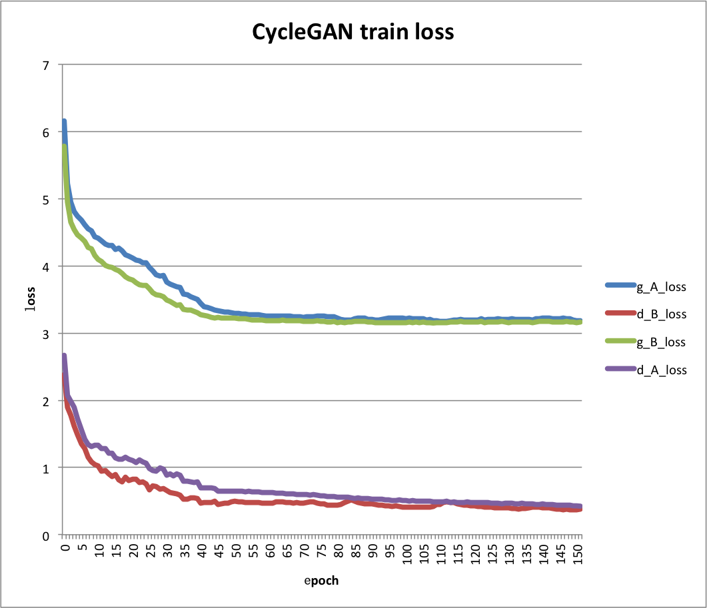
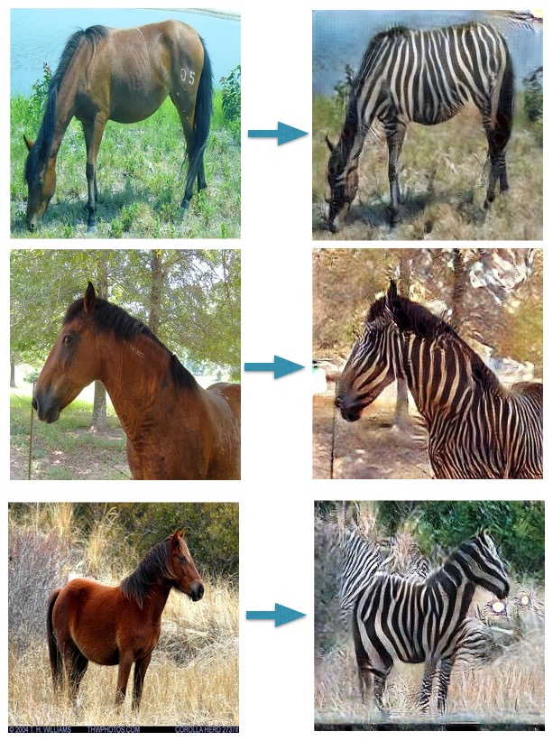
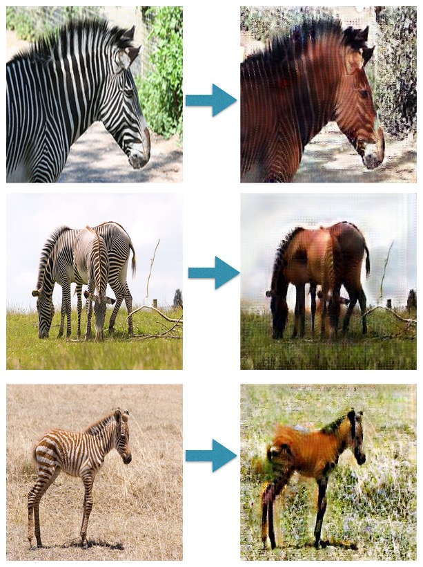

运行本目录下的程序示例需要使用PaddlePaddle develop最新版本。如果您的PaddlePaddle安装版本低于此要求，请按照[安装文档](http://www.paddlepaddle.org/docs/develop/documentation/zh/build_and_install/pip_install_cn.html)中的说明更新PaddlePaddle安装版本。

## 代码结构
```
├── data_reader.py  # 读取、处理数据。
├── layers.py   # 封装定义基础的layers。
├── model.py   # 定义基础生成网络和判别网络。
├── trainer.py   # 构造loss和训练网络。
├── train.py     # 训练脚本。
└── infer.py    # 预测脚本。
```

## 简介
TODO

## 数据准备

本教程使用 horse2zebra 数据集 来进行模型的训练测试工作，该数据集是用关键字'wild horse'和'zebra'过滤[ImageNet](http://www.image-net.org/)数据集并下载得到的。

horse2zebra训练集包含1069张野马图片，1336张斑马图片。测试集包含121张野马图片和141张斑马图片。

数据下载处理完毕后，并组织为以下路径结构：

```
data
|-- horse2zebra
|   |-- testA
|   |-- testA.txt
|   |-- testB
|   |-- testB.txt
|   |-- trainA
|   |-- trainA.txt
|   |-- trainB
|   `-- trainB.txt

```

以上数据文件中，`data`文件夹需要放在训练脚本`train.py`同级目录下。`testA`为存放野马测试图片的文件夹，`testB`为存放斑马测试图片的文件夹，`testA.txt`和`testB.txt`分别为野马和斑马测试图片路径列表文件，格式如下：

```
testA/n02381460_9243.jpg
testA/n02381460_9244.jpg
testA/n02381460_9245.jpg
```

训练数据组织方式与测试数据相同。


## 模型训练与预测

### 训练

在GPU单卡上训练:

```
env CUDA_VISIBLE_DEVICES=0 python train.py
```

执行`python train.py --help`可查看更多使用方式和参数详细说明。

图1为训练152轮的训练损失示意图，其中横坐标轴为训练轮数，纵轴为在训练集上的损失。其中，'g_A_loss','g_B_loss','d_A_loss'和'd_B_loss'分别为生成器A、生成器B、判别器A和判别器B的训练损失。

<p align="center">
 <br/>
<strong>图 1</strong>
</p>


### 预测

执行以下命令读取多张图片进行预测：

```
env CUDA_VISIBLE_DEVICES=0 python infer.py \
    --init_model="output/checkpoints/1" --input="./data/horse2zebra/trainA/*" \
    --input_style A --output="./output"
```

训练150轮的模型预测效果如图2和图3所示：

<p align="center">
 <br/>
<strong>图 2</strong>
</p>

<p align="center">
 <br/>
<strong>图 3</strong>
</p>

>在本文示例中，均可通过修改`CUDA_VISIBLE_DEVICES`改变使用的显卡号。
