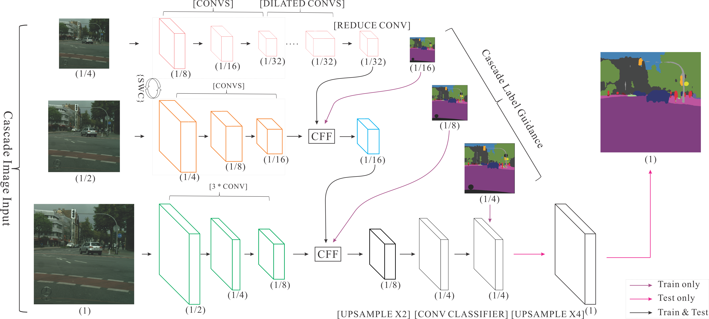
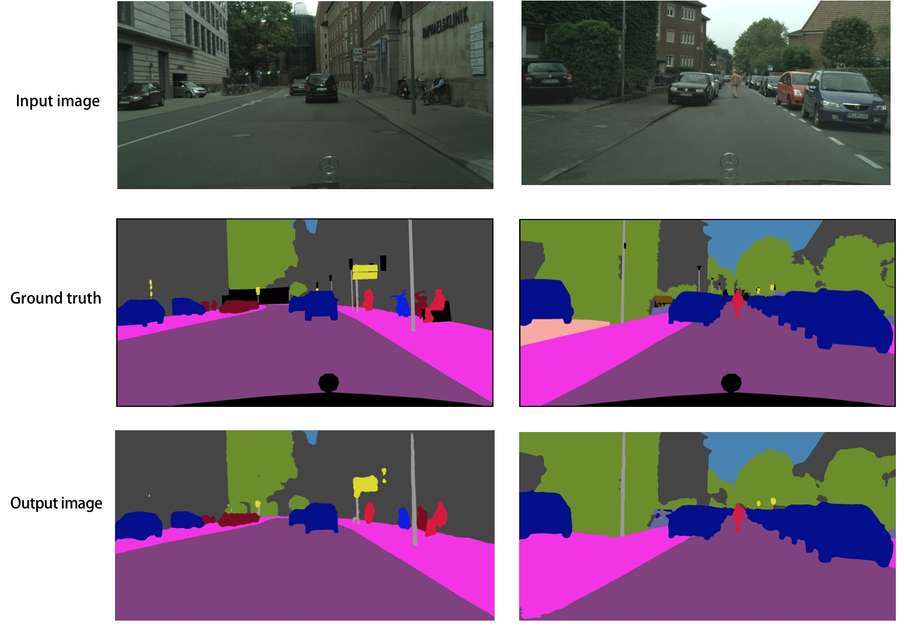

## 代码结构
```
├── network.py # 网络结构定义脚本
├── train.py   # 训练任务脚本
├── eval.py    # 评估脚本
├── infer.py   # 预测脚本
├── cityscape.py    # 数据预处理脚本
└── utils.py    # 定义通用的函数
```

## 简介

Image Cascade Network（ICNet)主要用于图像实时语义分割。相较于其它压缩计算的方法，ICNet即考虑了速度，也考虑了准确性。
ICNet的主要思想是将输入图像变换为不同的分辨率，然后用不同计算复杂度的子网络计算不同分辨率的输入，然后将结果合并。ICNet由三个子网络组成，计算复杂度高的网络处理低分辨率输入，计算复杂度低的网络处理分辨率高的网络，通过这种方式在高分辨率图像的准确性和低复杂度网络的效率之间获得平衡。

整个网络结构如下：

<p align="center">
 <br/>
<strong>图 1</strong>
</p>


## 数据准备


本文采用Cityscape数据集，请前往[Cityscape官网](https://www.cityscapes-dataset.com)注册下载。下载数据之后，按照[这里](https://github.com/mcordts/cityscapesScripts/blob/master/cityscapesscripts/preparation/createTrainIdLabelImgs.py#L3)的说明和工具处理数据。
处理之后的数据
```
data/cityscape/
|-- gtFine
|   |-- test
|   |-- train
|   `-- val
|-- leftImg8bit
|   |-- test
|   |-- train
|   `-- val
|-- train.list
`-- val.list
```
其中，train.list和val.list分别是用于训练和测试的列表文件，第一列为输入图像数据，第二列为标注数据，两列用空格分开。示例如下：
```
leftImg8bit/train/stuttgart/stuttgart_000021_000019_leftImg8bit.png gtFine/train/stuttgart/stuttgart_000021_000019_gtFine_labelTrainIds.png
leftImg8bit/train/stuttgart/stuttgart_000072_000019_leftImg8bit.png gtFine/train/stuttgart/stuttgart_000072_000019_gtFine_labelTrainIds.png
```
完成数据下载和准备后，需要修改`cityscape.py`脚本中对应的数据地址。

## 模型训练与预测

### 训练
执行以下命令进行训练，同时指定checkpoint保存路径:
```
python train.py --batch_size=16 --use_gpu=True --checkpoint_path="./chkpnt/"
```
使用以下命令获得更多使用说明：
```
python train.py --help
```
训练过程中会根据用户的设置，输出训练集上每个网络分支的`loss`， 示例如下：
```
Iter[0]; train loss: 2.338; sub4_loss: 3.367; sub24_loss: 4.120; sub124_loss: 0.151
```
### 测试
执行以下命令在`Cityscape`测试数据集上进行测试：
```
python eval.py --model_path="./cnkpnt/100" --use_gpu=True
```
需要通过选项`--model_path`指定模型文件。
测试脚本的输出的评估指标为[mean IoU]()。

### 预测
执行以下命令对指定的数据进行预测：
```
python infer.py \
--model_path="./cnkpnt/100" \
--images_path="./data/cityscape/" \
--images_list="./data/cityscape/infer.list"
```
通过选项`--images_list`指定列表文件，列表文件中每一行为一个要预测的图片的路径。
预测结果默认保存到当前路径下的`output`文件夹下。

## 实验结果
图2为在`CityScape`训练集上的训练的Loss曲线：

<p align="center">
 <br/>
<strong>图 2</strong>
</p>

在训练集上训练，在validation数据集上验证的结果为：mean_IoU=67.0%(论文67.7%)

图3是使用`infer.py`脚本预测产生的结果示例，其中，第一行为输入的原始图片，第二行为人工的标注，第三行为我们模型计算的结果。
<p align="center">
 <br/>
<strong>图 3</strong>
</p>

## 其他信息
|数据集 | pretrained model |
|---|---|
|CityScape | [pretrained_model](https://paddle-icnet-models.bj.bcebos.com/model_1000.tar.gz) |

## 参考

- [ICNet for Real-Time Semantic Segmentation on High-Resolution Images](https://arxiv.org/abs/1704.08545)
