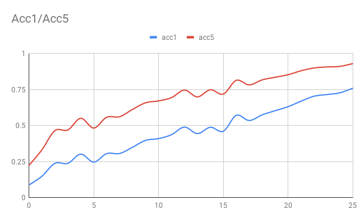

# PaddlePaddle Fast ImageNet Training

PaddlePaddle Fast ImageNet can train ImageNet dataset with fewer epochs. We implemented the it according to the blog 
[Now anyone can train Imagenet in 18 minutes](https://www.fast.ai/2018/08/10/fastai-diu-imagenet/) which published on the [fast.ai] website.
PaddlePaddle Fast ImageNet using the dynmiac batch size, dynamic image size, rectangular images validation and etc... so that the Fast ImageNet can achieve the baseline
(acc1: 75.9%, acc5: 93.0%) at 26 epochs on 8 * V100 GPUs.

## Experiment

1. Prepare the training data, resize the images to 160 and 352 using `resize.py`, the prepared data folder should look like:
    ``` text
    `-ImageNet
      |-train
      |-validation
      |-160
        |-train
        `-validation
      `-352
        |-train
        `-validation
    ```
1. Install the requirements by `pip install -r requirements.txt`.
1. Launch the training job: `python train.py --data_dir /data/imagenet`
1. Learning curve, we launch the training job on V100 GPU card:
<p align="center">
 <br />
</p>

