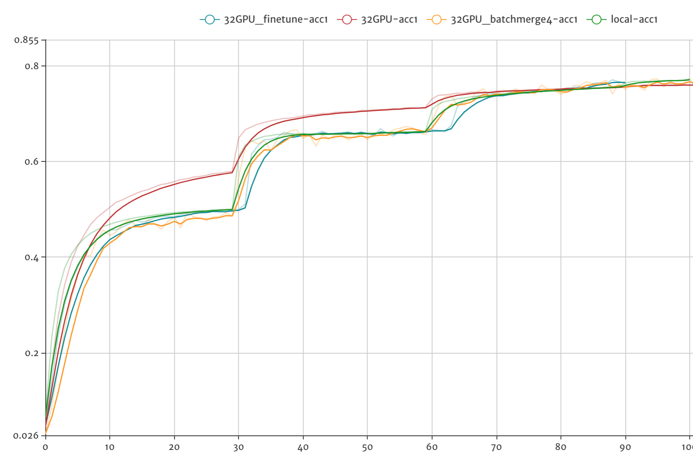
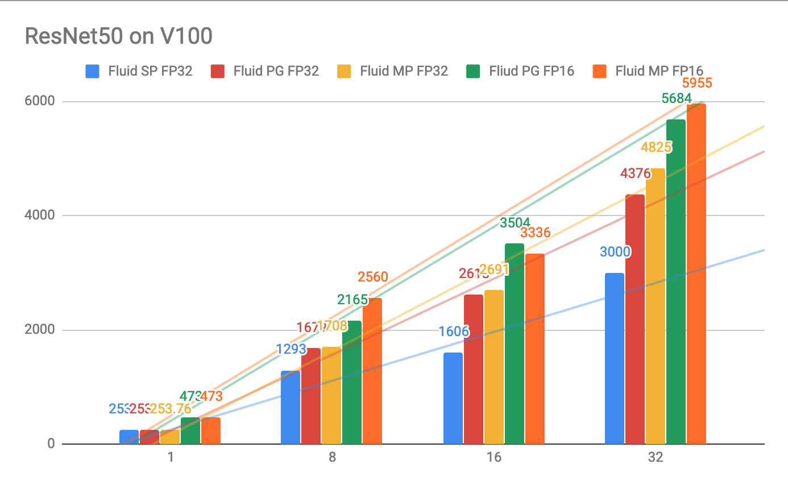
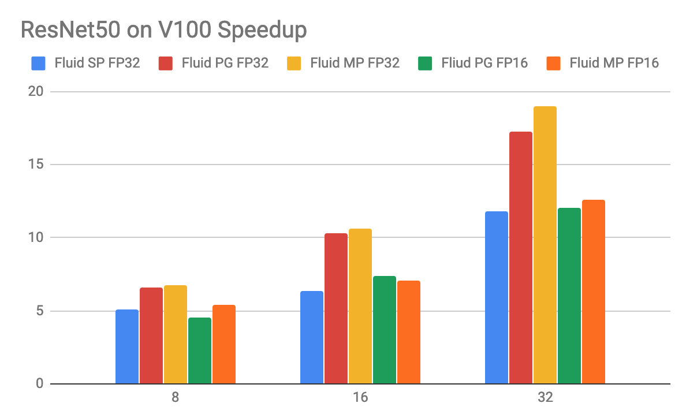

# Distributed Image Classification Models Training

This folder contains implementations of **Image Classification Models**, they are designed to support
large-scaled distributed training with two distributed mode: parameter server mode and NCCL2(Nvidia NCCL2 communication library) collective mode.

## Getting Started

Before getting started, please make sure you have go throught the imagenet [Data Preparation](../README.md#data-preparation).

1. The entrypoint file is `dist_train.py`, the commandline arguments are almost the same as the original `train.py`, with the following arguments specific to distributed training.

    - `update_method`, specify the update method, can choose from local, pserver or nccl2.
    - `multi_batch_repeat`, set this greater than 1 to merge batches before pushing gradients to pservers.
    - `start_test_pass`, when to start running tests.
    - `num_threads`, how many threads will be used for ParallelExecutor.
    - `split_var`, in pserver mode, whether to split one parameter to several pservers, default True.
    - `async_mode`, do async training, defalt False.
    - `reduce_strategy`, choose from "reduce", "allreduce".

    you can check out more details of the flags by `python dist_train.py --help`.

1. Runtime configurations

    We use the environment variable to distinguish the different training role of a distributed training job.

    - General envs:
        - `PADDLE_TRAINER_ID`, the unique trainer ID of a job, the ranging is [0, PADDLE_TRAINERS).
        - `PADDLE_TRAINERS_NUM`, the trainer count of a distributed job.
        - `PADDLE_CURRENT_ENDPOINT`, current process endpoint.
    - Pserver mode:
        - `PADDLE_TRAINING_ROLE`, the current training role, should be in [PSERVER, TRAINER].
        - `PADDLE_PSERVER_ENDPOINTS`, the parameter server endpoint list, separated by ",".
    - NCCL2 mode:
        - `PADDLE_TRAINER_ENDPOINTS`, endpoint list for each worker, separated by ",".

### Try Out Different Distributed Training Modes

You can test if distributed training works on a single node before deploying to the "real" cluster.

***NOTE: for best performance, we recommend using multi-process mode, see No.3. And together with fp16.***

***NOTE: for nccl2 distributed mode, you must ensure each node train same number of samples, or set skip_unbalanced_data to 1 to do sync training.***

1. simply run `python dist_train.py` to start local training with default configuratioins.
2. for pserver mode, run `bash run_ps_mode.sh` to start 2 pservers and 2 trainers, these 2 trainers
   will use GPU 0 and 1 to simulate 2 workers.
3. for nccl2 mode, run `bash run_nccl2_mode.sh` to start 2 workers.
4. for local/distributed multi-process mode, run `run_mp_mode.sh` (this test use 4 GPUs).

### Visualize the Training Process

It's easy to draw the learning curve accroding to the training logs, for example,
the logs of ResNet50 is as follows:

``` text
Pass 0, batch 30, loss 7.569439, acc1: 0.0125, acc5: 0.0125, avg batch time 0.1720
Pass 0, batch 60, loss 7.027379, acc1: 0.0, acc5: 0.0, avg batch time 0.1551
Pass 0, batch 90, loss 6.819984, acc1: 0.0, acc5: 0.0125, avg batch time 0.1492
Pass 0, batch 120, loss 6.9076853, acc1: 0.0, acc5: 0.0125, avg batch time 0.1464
```

The below figure shows top 1 train accuracy for local training with 8 GPUs and distributed training
with 32 GPUs, and also distributed training with batch merge feature turned on. Note that the
red curve is trained with origin model configuration, which does not have the warmup and some detailed
modifications.

For distributed training with 32GPUs using `--model DistResnet` we can achieve test accuracy 75.5% after
90 passes of training (the test accuracy is not shown in below figure). We can also achieve this result
using "batch merge" feature by setting `--multi_batch_repeat 4` and with higher throughput.

<p align="center">
 <br/>
Training top-1 accuracy curves
</p>

### Finetuning for Distributed Training

The default resnet50 distributed training config is based on this paper: https://arxiv.org/pdf/1706.02677.pdf

- use `--model DistResnet`
- we use 32 P40 GPUs with 4 Nodes, each has 8 GPUs
- we set `batch_size=32` for each GPU, in `batch_merge=on` case, we repeat 4 times before communicating with pserver.
- learning rate starts from 0.1 and warm up to 0.4 in 5 passes(because we already have gradient merging,
  so we only need to linear scale up to trainer count) using 4 nodes.
- using batch_merge (`--multi_batch_repeat 4`) can make better use of GPU computing power and increase the
  total training throughput. Because in the fine-tune configuration, we have to use `batch_size=32` per GPU,
  and recent GPU is so fast that the communication between nodes may delay the total speed. In batch_merge mode
  we run several batches forward and backward computation, then merge the gradients and send to pserver for
  optimization, we use different batch norm mean and variance variable in each repeat so that adding repeats
  behaves the same as adding more GPUs.


### Performance

The below figure shows fluid distributed training performances. We did these on a 4-node V100 GPU cluster,
each has 8 V100 GPU card, with total of 32 GPUs. All modes can reach the "state of the art (choose loss scale carefully when using fp16 mode)" of ResNet50 model with imagenet dataset. The Y axis in the figure shows
the images/s while the X-axis shows the number of GPUs.

<p align="center">
 <br />
Performance of Multiple-GPU Training of Resnet50 on Imagenet
</p>

The second figure shows speed-ups when using multiple GPUs according to the above figure.

<p align="center">
 <br />
Speed-ups of Multiple-GPU Training of Resnet50 on Imagenet
</p>

## Deep Gradient Compression([arXiv:1712.01887](https://arxiv.org/abs/1712.01887)) for resnet

#### Environment

  - GPU: NVIDIA® Tesla® V100
  - Machine number * Card number: 4 * 4
  - System: Centos 6u3
  - Cuda/Cudnn: 9.0/7.1
  - Dataset: ImageNet
  - Date: 2017.04
  - PaddleVersion: 1.4
  - Batch size: 32

#### Performance

<p align="center">
 <br />
Performance using DGC for resnet-fp32 under different bandwidth
</p>
