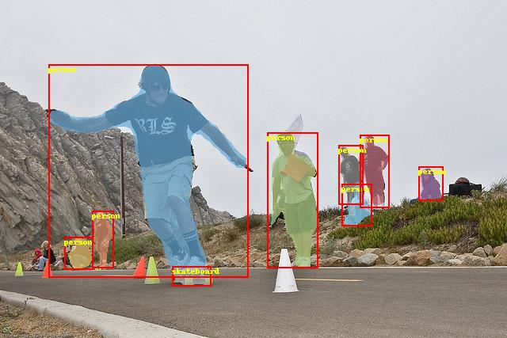

# PaddlePaddle Object Detection

This object detection framework is based on PaddlePaddle. We want to provide classically and state of the art detection algorithms in generic object detection and specific target detection for users. And we aimed to make this framework easy to extend, train, and deploy. We aimed to make it easy to use in research and products.


<div align="center">
  
</div>


## Introduction

Major features:

- Easy to Deploy:
  All the operations related to inference are implemented by C++ and CUDA, it makes the detection model easy to deploy in products on the server without Python based on the high efficient inference engine of PaddlePaddle.
  We release detection models based on ResNet-D backbone, for example, the accuracy of Faster-RCNN model with FPN based on ResNet50 VD is close to model based on ResNet 101. But the former is smaller and faster.

- Easy to Customize:
   All components are modular encapsulated, including the data transforms. It's easy to plug in and pull out any module. For example, users can switch backbone easily or add mixup data augmentation for models.

- High Efficiency:
  Based on the high efficient PaddlePaddle framework, less memory is required. For example, the batch size of Mask-RCNN based on ResNet50 can be 5 per Tesla V100 (16G). The training speed of Yolo v3 is faster than other frameworks.  

The supported architectures are as follows:

|                    | ResNet |ResNet vd| ResNeXt  | SENet    | MobileNet | DarkNet|
|--------------------|:------:|--------:|:--------:|:--------:|:---------:|:------:|
| Faster R-CNN       | ✓      | ✓      | ✓        |  ✓       | ✗        | ✗      |
| Faster R-CNN + FPN | ✓      | ✓      | ✓        |  ✓       | ✗        | ✗      |
| Mask R-CNN         | ✓      | ✓      | ✓        |  ✓       | ✗        | ✗      |
| Mask R-CNN + FPN   | ✓      | ✓      | ✓        |  ✓       | ✗        | ✗      |
| Cascade R-CNN      | ✓      | ✓      | ✓        |  ✓       | ✗        | ✗      |
| RetinaNet          | ✓      | ✓      | ✓        |  ✓       | ✗        | ✗      |
| Yolov3             | ✓      | ✗      | ✗         |  ✗       | ✓        | ✓     |
| SSD                | ✗      | ✗      | ✗         |  ✗       | ✓        | ✗      |

The extensive capabilities:

- [x] **Synchronized batch norm**:  used in Yolo v3.
- [x] **Group Norm**: supported this operation, the related model will be added later.
- [x] **Modulated deformable convolution**: supported this operation, the related model will be added later.
- [x] **Deformable PSRoI Pooling**: supported this operation, the related model will be added later.


#### Work in Progress and to Do

- About Framework:
   - Mixed precision training and distributed training.
   - 8-bit deployment.
   - Easy to customize the user-defined function.

- About Algorithms:
   - More SOTA models.
   - More easy-to-deployed models.

We are glad to receive your feedback.

## Model zoo

The trained models can be available in PaddlePaddle [detection model zoo](docs/MODEL_ZOO.md).

## Installation

Please follow the [installation instructions](docs/INSTALL.md) to install  and prepare environment.

## Get Started

For quickly start, infer an image:

```bash
export PYTHONPATH=`pwd`:$PYTHONPATH
python tools/infer.py -c configs/mask_rcnn_r50_1x.yml \
    -o weights=http://
    -infer_img=demo/000000523957.jpg
```

The predicted  and visualized results are saved in `output/1.jpg`.

For more detailed training and evaluating pipeline, please refer [GETTING_STARTED.md](docs/GETTING_STARTED.md).


More documentation:

- [How to config an object detection pipeline.](docs/CONFIG.md)
- [How to use customized dataset and add data preprocessing.](docs/DATA.md)


## Deploy

The example of how to use PaddlePaddle to deploy detection model will be added later.

## Updates

The major updates are as follows:

#### 2019-07-03
- Release the unified detection framework.
- Supported algorithms: Faster R-CNN, Mask R-CNN, Faster R-CNN + FPN, Mask R-CNN + FPN, Cascade-Faster-RCNN + FPN, RetinaNet, Yolo v3, and SSD.
- Release the first version of Model Zoo.


## Contributing

We appreciate everyone's contributions!
