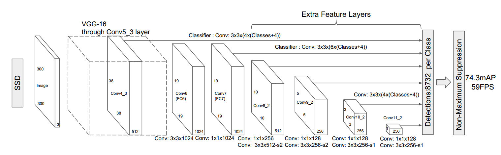

## SSD 目标检测

## Table of Contents
- [简介](#简介)
- [数据准备](#数据准备)
- [模型训练](#模型训练)
- [模型评估](#模型评估)
- [模型预测以及可视化](#模型预测以及可视化)
- [模型发布](#模型发布)

### 简介

[Single Shot MultiBox Detector (SSD)](https://arxiv.org/abs/1512.02325) 是一种单阶段的目标检测器。与两阶段的检测方法不同，单阶段目标检测并不进行区域推荐，而是直接从特征图回归出目标的边界框和分类概率。SSD 运用了这种单阶段检测的思想，并且对其进行改进：在不同尺度的特征图上检测对应尺度的目标。如下图所示，SSD 在六个尺度的特征图上进行了不同层级的预测。每个层级由两个3x3卷积分别对目标类别和边界框偏移进行回归。因此对于每个类别，SSD 的六个层级一共会产生 38x38x4 + 19x19x6 + 10x10x6 + 5x5x6 + 3x3x4 + 1x1x4 = 8732 个检测结果。
<p align="center">
 <br />
SSD 目标检测模型
</p>

SSD 可以方便地插入到任何一种标准卷积网络中，比如 VGG、ResNet 或者 MobileNet，这些网络被称作检测器的基网络。在这个示例中我们使用 [MobileNet](https://arxiv.org/abs/1704.04861)。


### 数据准备


请先使用下面的命令下载 [PASCAL VOC 数据集](http://host.robots.ox.ac.uk/pascal/VOC/)：

```bash
cd data/pascalvoc
./download.sh
```

`download.sh` 命令会自动创建训练和测试用的列表文件。


### 模型训练

#### 下载预训练模型

我们提供了两个预训练模型。第一个模型是在 COCO 数据集上预训练的 MobileNet-v1 SSD，我们将它的预测头移除了以便在 COCO 以外的数据集上进行训练。第二个模型是在 ImageNet 2012 数据集上预训练的 MobileNet-v1，我们也将最后的全连接层移除以便进行目标检测训练。下载 MobileNet-v1 SSD:

    ```bash
    ./pretrained/download_coco.sh
    ```

声明：MobileNet-v1 SSD 模型转换自[TensorFlow model](https://github.com/tensorflow/models/blob/f87a58cd96d45de73c9a8330a06b2ab56749a7fa/research/object_detection/g3doc/detection_model_zoo.md)。MobileNet-v1 模型转换自[Caffe](https://github.com/shicai/MobileNet-Caffe)。


#### 训练

`train.py` 是训练模块的主要执行程序，调用示例如下：
  ```bash
  python -u train.py --batch_size=64 --dataset='pascalvoc' --pretrained_model='pretrained/ssd_mobilenet_v1_coco/'
  ```
   - 可以通过设置 ```export CUDA_VISIBLE_DEVICES=0,1``` 指定想要使用的GPU数量。
   - 更多的可选参数见:

  ```bash
  python train.py --help
  ```

数据的读取行为定义在 `reader.py` 中，所有的图片都会被缩放到300x300。在训练时还会对图片进行数据增强，包括随机扰动、扩张、翻转和裁剪:
   - 扰动: 扰动图片亮度、对比度、饱和度和色相。
   - 扩张: 将原始图片放进一张使用像素均值填充(随后会在减均值操作中减掉)的扩张图中，再对此图进行裁剪、缩放和翻转。
   - 翻转: 水平翻转。
   - 裁剪: 根据缩放比例、长宽比例两个参数生成若干候选框，再依据这些候选框和标注框的面积交并比(IoU)挑选出符合要求的裁剪结果。

我们使用了 RMSProp 优化算法来训练 MobileNet-SSD，batch大小为64，权重衰减系数为0.00005，初始学习率为 0.001，并且在第40、60、80、100 轮时使用 0.5, 0.25, 0.1, 0.01乘子进行学习率衰减。在120轮训练后，11point评价标准下的mAP为73.32%。

### 模型评估

你可以使用11point、integral等指标在PASCAL VOC 数据集上评估训练好的模型。不失一般性，我们采用相应数据集的测试列表作为样例代码的默认列表，你也可以通过设置```--test_list```来指定自己的测试样本列表。

`eval.py`是评估模块的主要执行程序，调用示例如下：
```bash
python eval.py --dataset='pascalvoc' --model_dir='train_pascal_model/best_model' --data_dir='data/pascalvoc' --test_list='test.txt' --ap_version='11point' --nms_threshold=0.45
```

### 模型预测以及可视化

`infer.py`是预测及可视化模块的主要执行程序，调用示例如下：
```bash
python infer.py --dataset='pascalvoc' --nms_threshold=0.45 --model_dir='train_pascal_model/best_model' --image_path='./data/pascalvoc/VOCdevkit/VOC2007/JPEGImages/009963.jpg'
```
下图可视化了模型的预测结果：
<p align="center">


 <br />
MobileNet-v1-SSD 300x300 预测可视化
</p>


### 模型发布


| 模型                    | 预训练模型  | 训练数据    | 测试数据    | mAP |
|:------------------------:|:------------------:|:----------------:|:------------:|:----:|
|[MobileNet-v1-SSD 300x300](http://paddlemodels.bj.bcebos.com/ssd_mobilenet_v1_pascalvoc.tar.gz) | COCO MobileNet SSD | VOC07+12 trainval| VOC07 test   | 73.32%  |
