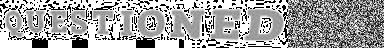
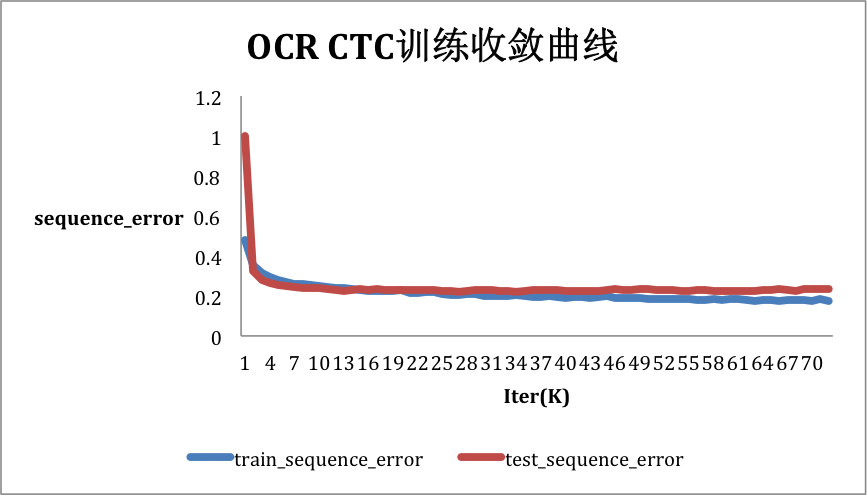
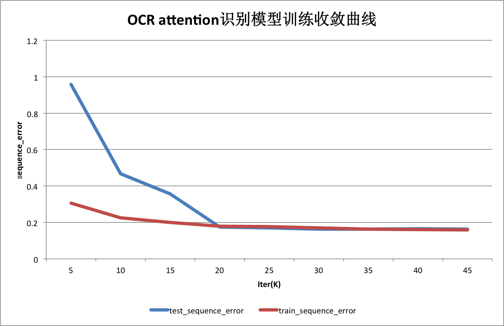

## 注意
注意：该OCR库已迁移至新的github地址：https://github.com/PaddlePaddle/PaddleOCR
该新库包含总模型仅8.6M的超轻量级中文OCR，单模型支持中英文数字组合识别、竖排文本识别、长文本识别。同时支持多种文本检测、文本识别的训练算法。欢迎大家去新的代码仓库中，查看与阅读更多关于OCR的详细介绍以及新功能。

## 代码结构
```
├── data_reader.py  # 下载、读取、处理数据。
├── crnn_ctc_model.py   # 定义了OCR CTC model的网络结构。
├── attention_model.py   # 定义了OCR attention model的网络结构。
├── train.py   # 用于模型的训练。
├── infer.py   # 加载训练好的模型文件，对新数据进行预测。
├── eval.py     # 评估模型在指定数据集上的效果。
├─ utils.py    # 定义通用的函数。
├── run_crnn_ctc.sh     # 执行crnn_ctc模型训练任务
└── run_attention.sh    # 执行attention模型训练任务
```


## 简介

本章的任务是识别图片中单行英文字符，这里我们分别使用CTC model和attention model两种不同的模型来完成该任务。

这两种模型的有相同的编码部分，首先采用卷积将图片转为特征图, 然后使用`im2sequence op`将特征图转为序列，通过`双向GRU`学习到序列特征。

两种模型的解码部分和使用的损失函数区别如下：

- CTC model: 训练过程选用的损失函数为CTC(Connectionist Temporal Classification) loss, 预测阶段采用的是贪婪策略和CTC解码策略。
- Attention model: 训练过程选用的是带注意力机制的解码策略和交叉信息熵损失函数，预测阶段采用的是柱搜索策略。

训练以上两种模型的评估指标为样本级别的错误率。

## 数据

数据的下载和简单预处理都在`data_reader.py`中实现。

### 数据示例

我们使用的训练和测试数据如`图1`所示，每张图片包含单行不定长的英文字符串，这些图片都是经过检测算法进行预框选处理的。

<p align="center">
 <br/>
<strong>图 1</strong>
</p>

在训练集中，每张图片对应的label是汉字在词典中的索引。 `图1` 对应的label如下所示：
```
80,84,68,82,83,72,78,77,68,67
```
在上边这个label中，`80` 表示字符`Q`的索引，`67` 表示英文字符`D`的索引。


### 数据准备

**A. 训练集**

我们需要把所有参与训练的图片放入同一个文件夹，暂且记为`train_images`。然后用一个list文件存放每张图片的信息，包括图片大小、图片名称和对应的label，这里暂记该list文件为`train_list`，其格式如下所示：

```
185 48 00508_0215.jpg 7740,5332,2369,3201,4162
48 48 00197_1893.jpg 6569
338 48 00007_0219.jpg 4590,4788,3015,1994,3402,999,4553
150 48 00107_4517.jpg 5936,3382,1437,3382
...
157 48 00387_0622.jpg 2397,1707,5919,1278
```

<center>文件train_list</center>

上述文件中的每一行表示一张图片，每行被空格分为四列，前两列分别表示图片的宽和高，第三列表示图片的名称，第四列表示该图片对应的sequence label。
最终我们应有以下类似文件结构：

```
|-train_data
    |- train_list
    |- train_imags
        |- 00508_0215.jpg
        |- 00197_1893.jpg
        |- 00007_0219.jpg
        | ...
```

在训练时，我们通过选项`--train_images` 和 `--train_list` 分别设置准备好的`train_images` 和`train_list`。

在`data_reader.py`中，会按照用户设置的`DATA_SHAPE`调整训练数据的高度。用户可以根据自己准备的训练数据，设置合适的`DATA_SHAPE`。如果使用默认的示例数据，则使用默认的`DATA_SHAPE`即可。

>**注：** 如果`--train_images` 和 `--train_list`都未设置或设置为None， data_reader.py会自动下载使用[示例数据](http://paddle-ocr-data.bj.bcebos.com/data.tar.gz)，并将其缓存到`$HOME/.cache/paddle/dataset/ctc_data/data/` 路径下。

**B. 测试集和评估集**

测试集、评估集的准备方式与训练集相同。
在训练阶段，测试集的路径通过train.py的选项`--test_images` 和 `--test_list` 来设置。
在评估时，评估集的路径通过eval.py的选项`--input_images_dir` 和`--input_images_list` 来设置。

在`data_reader.py`中，会按照用户设置的`DATA_SHAPE`调整测试图像的高度，所以测试图像可以有不同高度。但是，`DATA_SHAPE`需要和训练模型时保持严格一致。

**C. 待预测数据集**

预测支持三种形式的输入：

第一种：设置`--input_images_dir`和`--input_images_list`, 与训练集类似, 只不过list文件中的最后一列可以放任意占位字符或字符串，如下所示：

```
185 48 00508_0215.jpg s
48 48 00197_1893.jpg s
338 48 00007_0219.jpg s
...
```

第二种：仅设置`--input_images_list`, 其中list文件中只需放图片的完整路径，如下所示：

```
data/test_images/00000.jpg
data/test_images/00001.jpg
data/test_images/00003.jpg
```

第三种：从stdin读入一张图片的path，然后进行一次inference.

在`data_reader.py`中，会按照用户设置的`DATA_SHAPE`调整预测图像的高度，所以预测图像可以有不同高度。但是，`DATA_SHAPE`需要和训练模型时保持严格一致。

## 模型训练与预测

### 训练

使用默认数据在GPU单卡上训练:

```
env CUDA_VISIBLE_DEVICES=0 python train.py
```
使用默认数据在CPU上训练:
```
env OMP_NUM_THREADS=<num_of_physical_cores> python train.py --use_gpu False --parallel=False
```

使用默认数据在GPU多卡上训练:

```
env CUDA_VISIBLE_DEVICES=0,1,2,3 python train.py --parallel=True
```

默认使用的是`CTC model`, 可以通过选项`--model="attention"`切换为`attention model`。

执行`python train.py --help`可查看更多使用方式和参数详细说明。

图2为执行脚本`run_crnn_ctc.sh`在默认数据集上训练`CTC model`的收敛曲线，其中横坐标轴为训练迭代次数，纵轴为样本级错误率。其中，蓝线为训练集上的样本错误率，红线为测试集上的样本错误率。测试集上最低错误率为22.0%.

<p align="center">
 <br/>
<strong>图 2</strong>
</p>

图3为执行脚本`run_attention.sh`在默认数据集上训练`attention model`的收敛曲线，其中横坐标轴为训练迭代次数，纵轴为样本级错误率。其中，蓝线为训练集上的样本错误率，红线为测试集上的样本错误率。测试集上最低错误率为16.25%.

<p align="center">
 <br/>
<strong>图 3</strong>
</p>


## 测试

通过以下命令调用评估脚本用指定数据集对模型进行评估：

```
env CUDA_VISIBLE_DEVICES=0 python eval.py \
    --model_path="./models/model_0" \
    --input_images_dir="./eval_data/images/" \
    --input_images_list="./eval_data/eval_list"
```


执行`python train.py --help`可查看参数详细说明。


### 预测

从标准输入读取一张图片的路径，并对齐进行预测：

```
env CUDA_VISIBLE_DEVICES=0 python infer.py \
    --model_path="models/model_00044_15000"
```

执行上述命令进行预测的效果如下：

```
-----------  Configuration Arguments -----------
use_gpu: True
input_images_dir: None
input_images_list: None
model_path: /home/work/models/fluid/ocr_recognition/models/model_00052_15000
------------------------------------------------
Init model from: ./models/model_00052_15000.
Please input the path of image: ./test_images/00001_0060.jpg
result: [3298 2371 4233 6514 2378 3298 2363]
Please input the path of image: ./test_images/00001_0429.jpg
result: [2067 2067 8187 8477 5027 7191 2431 1462]
```

从文件中批量读取图片路径，并对其进行预测：

```
env CUDA_VISIBLE_DEVICES=0 python infer.py \
    --model_path="models/model_00044_15000" \
    --input_images_list="data/test.list"
```

## 预训练模型

|模型| 错误率|
|- |:-: |
|[ocr_ctc_params](https://paddle-ocr-models.bj.bcebos.com/ocr_ctc.zip) | 22.3% |
|[ocr_attention_params](https://paddle-ocr-models.bj.bcebos.com/ocr_attention.zip) | 15.8%|

>在本文示例中，均可通过修改`CUDA_VISIBLE_DEVICES`改变当前任务使用的显卡号。
