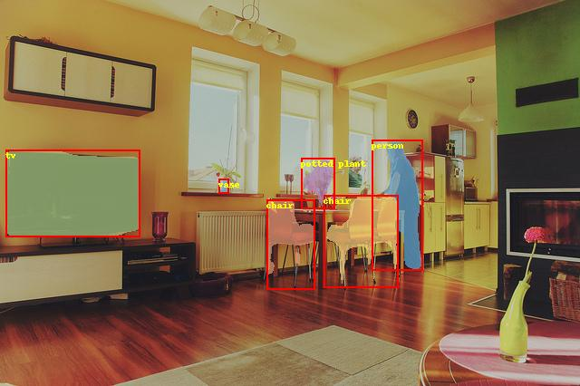
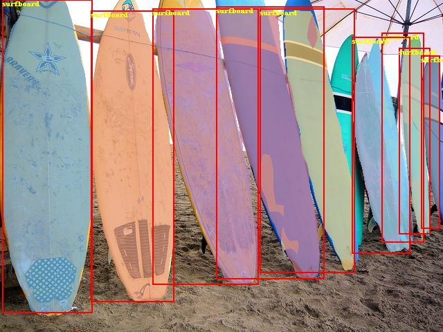

# RCNN Objective Detection

---
## Table of Contents

- [Installation](#installation)
- [Introduction](#introduction)
- [Data preparation](#data-preparation)
- [Training](#training)
- [Evaluation](#evaluation)
- [Inference and Visualization](#inference-and-visualization)

## Installation

Running sample code in this directory requires PaddelPaddle Fluid v.1.3.0 and later. If the PaddlePaddle on your device is lower than this version, please follow the instructions in [installation document](http://paddlepaddle.org/documentation/docs/en/1.3/beginners_guide/install/index_en.html) and make an update.

We also recommend users to take a look at: 
[MaskRCNN](https://aistudio.baidu.com/aistudio/projectDetail/122273)
[Faster RCNN](https://aistudio.baidu.com/aistudio/projectDetail/122275)

## Introduction

Region Convolutional Neural Network (RCNN) models are two stages detector. According to proposals and feature extraction, obtain class and more precise proposals.
Now RCNN model contains two typical models: Faster RCNN and Mask RCNN.

[Faster RCNN](https://arxiv.org/abs/1506.01497), The total framework of network can be divided into four parts:

1. Base conv layer. As a CNN objective dection, Faster RCNN extract feature maps using a basic convolutional network. The feature maps then can be shared by RPN and fc layers. This sampel uses [ResNet-50](https://arxiv.org/abs/1512.03385) as base conv layer.
2. Region Proposal Network (RPN). RPN generates proposals for detection。This block generates anchors by a set of size and ratio and classifies anchors into fore-ground and back-ground by softmax. Then refine anchors to obtain more precise proposals using box regression.
3. RoI Align. This layer takes feature maps and proposals as input. The proposals are mapped to feature maps and pooled to the same size. The output are sent to fc layers for classification and regression. RoIPool and RoIAlign are used separately to this layer and it can be set in roi\_func in config.py.
4. Detection layer. Using the output of roi pooling to compute the class and locatoin of each proposal in two fc layers.

[Mask RCNN](https://arxiv.org/abs/1703.06870) is a classical instance segmentation model and an extension of Faster RCNN

Mask RCNN is a two stage model as well. At the first stage, it generates proposals from input images. At the second stage, it obtains class result, bbox and mask which is the result from segmentation branch on original Faster RCNN model. It decouples the relation between mask and classification.  

## Data preparation

Train the model on [MS-COCO dataset](http://cocodataset.org/#download), download dataset as below:

```bash
python dataset/coco/download.py
```

The data catalog structure is as follows:

  ```
  data/coco/
  ├── annotations
  │   ├── instances_train2014.json
  │   ├── instances_train2017.json
  │   ├── instances_val2014.json
  │   ├── instances_val2017.json
  |   ...
  ├── train2017
  │   ├── 000000000009.jpg
  │   ├── 000000580008.jpg
  |   ...
  ├── val2017
  │   ├── 000000000139.jpg
  │   ├── 000000000285.jpg
  |   ...
  ```

## Training

**download the pre-trained model:** This sample provides Resnet-50 pre-trained model which is converted from Caffe. The model fuses the parameters in batch normalization layer. One can download pre-trained model as:

    sh ./pretrained/download.sh

**NOTE:** Windows users can download weights from links in `./pretrained/download.sh`.

Set `pretrained_model` to load pre-trained model. In addition, this parameter is used to load trained model when finetuning as well.
Please make sure that pretrained_model is downloaded and loaded correctly, otherwise, the loss may be NAN during training.

**Install the [cocoapi](https://github.com/cocodataset/cocoapi):**

To train the model, [cocoapi](https://github.com/cocodataset/cocoapi) is needed. Install the cocoapi:

    git clone https://github.com/cocodataset/cocoapi.git
    cd cocoapi/PythonAPI
    # if cython is not installed
    pip install Cython
    # Install into global site-packages
    make install
    # Alternatively, if you do not have permissions or prefer
    # not to install the COCO API into global site-packages
    python2 setup.py install --user

After data preparation, one can start the training step by:

- Faster RCNN

    ```
    python train.py \
       --model_save_dir=output/ \
       --pretrained_model=${path_to_pretrain_model} \
       --data_dir=${path_to_data} \
       --MASK_ON=False
    ```

- Mask RCNN

    ```
    python train.py \
       --model_save_dir=output/ \
       --pretrained_model=${path_to_pretrain_model} \
       --data_dir=${path_to_data} \
       --MASK_ON=True
    ```

    - Set ```export CUDA_VISIBLE_DEVICES=0,1,2,3,4,5,6,7``` to specifiy 8 GPU to train.
    - Set ```MASK_ON``` to choose Faster RCNN or Mask RCNN model.
    - Set ```parallel``` to False to replace [fluid.ParallelExecutor](http://paddlepaddle.org/documentation/docs/zh/1.4/api_cn/fluid_cn.html#parallelexecutor) to [fluid.Executor](http://paddlepaddle.org/documentation/docs/zh/1.4/api_cn/fluid_cn.html#executor) when running the program in the Windows & GPU environment.
    - For more help on arguments:

        python train.py --help

**data reader introduction:**

* Data reader is defined in `reader.py`.
* Scaling the short side of all images to `scales`. If the long side is larger than `max_size`, then scaling the long side to `max_size`.
* In training stage, images are horizontally flipped.
* Images in the same batch can be padding to the same size.

**model configuration:**

* Use RoIAlign and RoIPool separately.
* NMS threshold=0.7. During training, pre\_nms=12000, post\_nms=2000; during test, pre\_nms=6000, post\_nms=1000.
* In generating proposal lables, fg\_fraction=0.25, fg\_thresh=0.5, bg\_thresh_hi=0.5, bg\_thresh\_lo=0.0.
* In rpn target assignment, rpn\_fg\_fraction=0.5, rpn\_positive\_overlap=0.7, rpn\_negative\_overlap=0.3.

**training strategy:**

*  Use momentum optimizer with momentum=0.9.
*  Weight decay is 0.0001.
*  In first 500 iteration, the learning rate increases linearly from 0.00333 to 0.01. Then lr is decayed at 120000, 160000 iteration with multiplier 0.1, 0.01. The maximum iteration is 180000. Also, we released a 2x model which has 360000 iterations and lr is decayed at 240000, 320000. These configuration can be set by max_iter and lr_steps in config.py.
*  Set the learning rate of bias to two times as global lr in non basic convolutional layers.
*  In basic convolutional layers, parameters of affine layers and res body do not update.

## Evaluation

Evaluation is to evaluate the performance of a trained model. This sample provides `eval_coco_map.py` which uses a COCO-specific mAP metric defined by [COCO committee](http://cocodataset.org/#detections-eval).

`eval_coco_map.py` is the main executor for evalution, one can start evalution step by:

- Faster RCNN

    ```
    python eval_coco_map.py \
        --dataset=coco2017 \
        --pretrained_model=${path_to_trained_model} \
        --MASK_ON=False
    ```

- Mask RCNN

    ```
    python eval_coco_map.py \
        --dataset=coco2017 \
        --pretrained_model=${path_to_trainde_model} \
        --MASK_ON=True
    ```

    - Set ```--pretrained_model=${path_to_trained_model}``` to specifiy the trained model, not the initialized model.
    - Set ```export CUDA_VISIBLE_DEVICES=0``` to specifiy one GPU to eval.
    - Set ```MASK_ON``` to choose Faster RCNN or Mask RCNN model.

Evalutaion result is shown as below:

Faster RCNN:

| Model              | RoI function    | Batch size     | Max iteration    | mAP  |
| :--------------- | :--------: | :------------:    | :------------------:    |------: |
| [Fluid RoIPool minibatch padding](http://paddlemodels.bj.bcebos.com/faster_rcnn/model_pool_minibatch_padding.tar.gz) | RoIPool | 8   |    180000        | 0.316 |
| [Fluid RoIPool no padding](http://paddlemodels.bj.bcebos.com/faster_rcnn/model_pool_no_padding.tar.gz)  | RoIPool | 8   |    180000        | 0.318 |
| [Fluid RoIAlign no padding](http://paddlemodels.bj.bcebos.com/faster_rcnn/model_align_no_padding.tar.gz)  | RoIAlign | 8   |    180000        | 0.348 |
| [Fluid RoIAlign no padding 2x](http://paddlemodels.bj.bcebos.com/faster_rcnn/model_align_no_padding_2x.tar.gz)  | RoIAlign | 8   |    360000        | 0.367 |

* Fluid RoIPool minibatch padding: Use RoIPool. Images in one batch padding to the same size. This method is same as detectron.
* Fluid RoIPool no padding: Images without padding.
* Fluid RoIAlign no padding: Images without padding.
* Fluid RoIAlign no padding 2x: Images without padding, train for 360000 iterations, learning rate is decayed at 240000, 320000.

Mask RCNN:

| Model              | Batch size     | Max iteration | box mAP | mask mAP |
| :--------------- | :--------: | :------------:    | :--------:    |------: |
| [Fluid mask no padding](https://paddlemodels.bj.bcebos.com/faster_rcnn/Fluid_mask_no_padding.tar.gz) | 8 | 180000 | 0.359 | 0.314 |

* Fluid mask no padding: Use RoIAlign. Images without padding.

## Inference and Visualization

Inference is used to get prediction score or image features based on trained models. `infer.py`  is the main executor for inference, one can start infer step by:

```
python infer.py \
    --pretrained_model=${path_to_trained_model}  \
    --image_path=dataset/coco/val2017/000000000139.jpg  \
    --draw_threshold=0.6
```

Please set the model path and image path correctly. GPU device is used by default, you can set `--use_gpu=False` to switch to CPU device. And you can set `draw_threshold` to tune score threshold to control the number of output detection boxes.

Visualization of infer result is shown as below:
<p align="center">

 <br />
Faster RCNN Visualization Examples
</p>

<p align="center">

 <br />
Mask RCNN Visualization Examples
</p>
