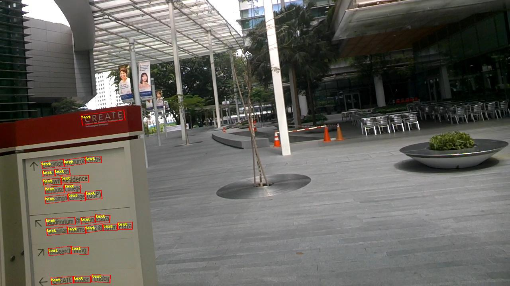
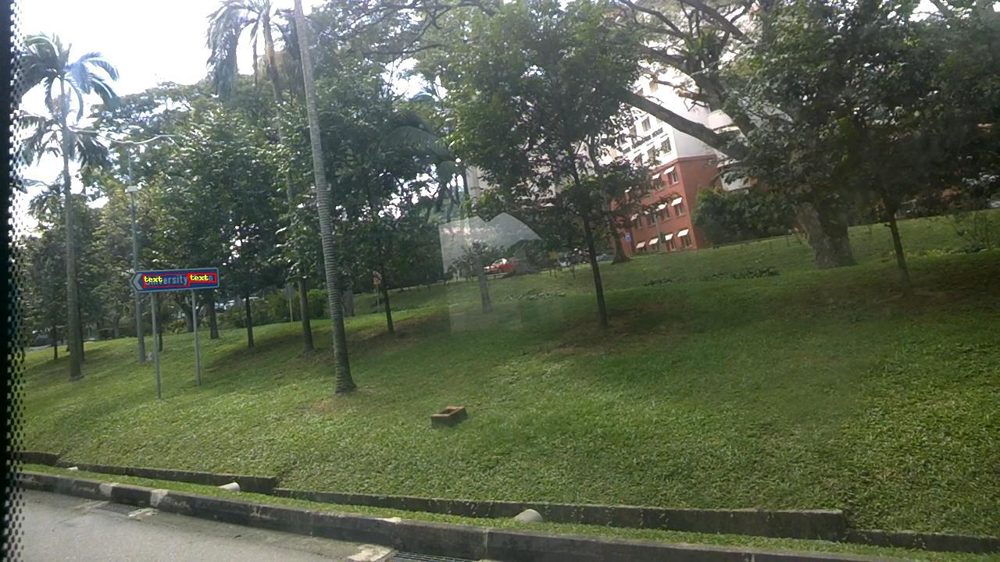

# RRPN 旋转物体检测

---
## 内容

- [安装](#安装)
- [简介](#简介)
- [数据准备](#数据准备)
- [模型训练](#模型训练)
- [模型评估](#模型评估)
- [模型推断及可视化](#模型推断及可视化)

## 安装

在当前目录下运行样例代码需要PadddlePaddle Fluid的develop或以上的版本。如果你的运行环境中的PaddlePaddle低于此版本，请根据[安装文档](http://www.paddlepaddle.org/)中的说明来更新PaddlePaddle。


## 简介
RRPN是在Faster RCNN基础上拓展出的两阶段目标检测器，可用于文字检测和旋转物体检测。通过对图像生成候选区域，提取特征，判别特征类别并修正候选框位置。

[RRPN](https://arxiv.org/abs/1703.01086) 整体网络可以分为4个主要内容：

1. 基础卷积层。作为一种卷积神经网络目标检测方法，RRPN首先使用一组基础的卷积网络提取图像的特征图。特征图被后续RPN层和全连接层共享。本示例采用[ResNet-50](https://arxiv.org/abs/1512.03385)作为基础卷积层。
2. 区域生成网络(RPN)。RPN网络用于生成候选区域(proposals)。该层通过一组固定的尺寸、比例和角度得到一组带方向锚点(anchors), 通过softmax判断旋转的锚点属于前景或者背景，再利用区域回归修正锚点从而获得精确的候选区域。
3. Rotated RoI Align。该层收集输入的特征图和带方向的候选区域，将带方向的候选区域映射到特征图中进行并池化为统一大小的区域特征图，送入全连接层判定目标类别。
4. 检测层。利用区域特征图计算候选区域的类别，同时再次通过区域回归获得检测框最终的精确位置。

### 编译自定义OP

自定义OP编译方式如下：

    进入 `models/ext_op/src` 目录，执行编译脚本
    ```
    cd models/ext_op/src
    sh make.sh  ${cuda_path} ${cudnn_path} ${nccl_path}
    '''
    其中${cuda_path}、$cudnn_path}和{nccl_path}分别为cuda、cudnn、nccl的安装路径，需通过命令行进行指定
    成功编译后，`ext_op/src` 目录下将会生成 `rrpn_lib.so` 
    
## 数据准备
### 公开数据集
在[ICDAR2015数据集](https://rrc.cvc.uab.es/?ch=4&com=downloads)上进行训练，数据集需进入官网进行注册后方可下载。

数据目录结构如下：

```
dataset/icdar2015/
├── ch4_training_images
│   ├── img_143.jpg
│   ├── img_144.jpg
|   ...
├── ch4_training_localization_transcription_gt
│   ├── gt_img_143.txt
│   ├── gt_img_144.txt
|   ...
├── ch4_test_images
│   ├── img_111.jpg
│   ├── img_112.jpg
|   ...
├── ch4_test_localization_transcription_gt
│   ├── img_111.jpg
│   ├── img_112.jpg
|   ...
```
### 自定义数据
原始的RRPN只提供了二分类，若要使用自己数据进行训练多分类，需在utility.py中将dataset改为icdar2017，然后将class_num改为需求类别数，其中0为背景类。

训练自定义数据时，数据目录结构和ICDAR2015一致，标注数据格式如下：
```
x1, y1, x2, y2, x3, y3, x4, y4, class_name
x1, y1, x2, y2, x3, y3, x4, y4, class_name
```

## 模型训练

**下载预训练模型：** 本示例提供Resnet-50预训练模型，采用如下命令下载预训练模型：

    sh ./pretrained/download.sh


通过初始化`pretrained_model` 加载预训练模型。同时在参数微调时也采用该设置加载已训练模型。
请在训练前确认预训练模型下载与加载正确，否则训练过程中损失可能会出现NAN。


- RRPN

    ```
    python train.py \
       --model_save_dir=output/ \
       --pretrained_model=${path_to_pretrain_model} \
       --data_dir=${path_to_data} \
    ```


    - 通过设置export CUDA_VISIBLE_DEVICES=0,1,2,3,4,5,6,7指定8卡GPU训练。

    - 可选参数见：

        python train.py --help

**数据读取器说明：** 数据读取器定义在reader.py中。所有图像将短边等比例缩放至`scales`，若长边大于`max_size`, 则再次将长边等比例缩放至`max_size`。在训练阶段，对图像采用随机旋转。

**模型设置：**

* 使用RotatedRoIAlign方法。
* 训练过程pre\_nms=12000, post\_nms=2000，测试过程pre\_nms=6000, post\_nms=1000。nms阈值为0.7。
* RPN网络得到labels的过程中，fg\_fraction=0.25，fg\_thresh=0.5，bg\_thresh_hi=0.5，bg\_thresh\_lo=0.0
* RPN选择anchor时，rpn\_fg\_fraction=0.5，rpn\_positive\_overlap=0.7，rpn\_negative\_overlap=0.3


**训练策略：**
*  默认配置采用8卡，每卡batch size=1
*  采用momentum优化算法训练，momentum=0.9。
*  权重衰减系数为0.02，前500轮学习率从0.00333线性增加至0.01。在6250，12500轮时使用0.1,0.01乘子进行学习率衰减，最大训练17500轮。训练最大轮数和学习率策略可以在config.py中对max_iter和lr_steps进行设置。
*  非基础卷积层卷积bias学习率为整体学习率2倍。
*  基础卷积层中，affine_layers参数不更新，res2层参数不更新。

## 模型评估

模型评估是指对训练完毕的模型评估各类性能指标。本示例采用[ICDAR2015官方评估](https://rrc.cvc.uab.es/?com=contestant)

`eval.py`是评估模块的主要执行程序，调用示例如下：

- RRPN

    ```
    python eval.py \
        --dataset=icdar2015 \
        --pretrained_model=${path_to_trained_model}
    ```

    - 通过设置`--pretrained_model=${path_to_trained_model}`指定训练好的模型，注意不是初始化的模型。
    - 通过设置`export CUDA\_VISIBLE\_DEVICES=0`指定单卡GPU评估。


下表为模型评估结果：

RRPN

| 模型                   | 批量大小   | 迭代次数   | F1  |
| :--------------- | :------------:    | :------------------:    |------: |
| [RRPN](https://paddleseg.bj.bcebos.com/deploy/temp/model_final.tar) |8   |    17500       | 0.8048 |


## 模型推断及可视化

模型推断可以获取图像中的物体及其对应的类别，`infer.py`是主要执行程序，调用示例如下：

```
python infer.py \
    --pretrained_model=${path_to_trained_model}  \
    --image_path=dataset/icdar2015 \
    --draw_threshold=0.6
```

注意，请正确设置模型路径`${path_to_trained_model}`和预测图片路径。默认使用GPU设备，也可通过设置`--use_gpu=False`使用CPU设备。可通过设置`draw_threshold`调节得分阈值控制检测框的个数。

下图为模型可视化预测结果：
<p align="center">

 <br />
RRPN 预测可视化
</p>
