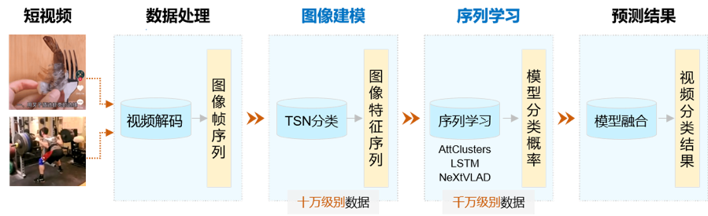

# VideoTag 飞桨大规模视频分类模型

---
## 内容

- [模型简介](#模型简介)
- [数据准备](#数据准备)
- [模型推断](#模型推断)
- [模型微调](#模型微调)
- [参考论文](#参考论文)


## 模型简介

飞桨大规模视频分类模型VideoTag基于百度短视频业务千万级数据，支持3000个源于产业实践的实用标签，具有良好的泛化能力，非常适用于国内大规模（千万/亿/十亿级别）短视频分类场景的应用。VideoTag采用两阶段建模方式，即图像建模和序列学习。第一阶段，使用少量视频样本（十万级别）训练大规模视频特征提取模型(Extractor)；第二阶段，使用千万级数据训练预测器(Predictor)，最终实现在超大规模（千万/亿/十亿级别）短视频上产业应用，其原理示意如下图所示。

<p align="center">
 <br />
Temporal shift module
</p>

- 数据处理：视频是按特定顺序排列的一组图像的集合，这些图像也称为帧。视频分类任务需要先对短视频进行解码，然后再将输出的图像帧序列灌入到VideoTag中进行训练和预测。

- 图像建模：先从训练数据中，对每个类别均匀采样少量样本数据，构成十万量级的训练视频。然后使用TSN网络进行训练，提取所有视频帧的TSN模型分类层前一层的特征数据。在这个过程中，每一帧都被转化成相应的特征向量，一段视频被转化成一个特征序列。

- 序列学习：采用Attention clusters、LSTM和Nextvlad对特征序列进行建模，学习各个特征之间的组合方式，进一步提高模型准确率。由于序列学习相比于图像建模耗时更短，因此可以融合多个具有互补性的序列模型。示例代码仅使用Attention\_LSTM网络进行序列特征预测。

- 预测结果：融合多个模型结果实现视频分类，进一步提高分类准确率。


## 数据准备

- 预训练权重下载：我们提供了[TSN](https://videotag.bj.bcebos.com/video_tag_tsn.tar)和[AttentionLSTM](https://videotag.bj.bcebos.com/video_tag_lstm.tar)预训练权重，请下载后解压，并将参数文件放在weights目录下，目录结构如下：

```
video_tag
  ├──weights
    ├── attention_lstm.pdmodel
    ├── attention_lstm.pdopt  
    ├── attention_lstm.pdparams
    ├── tsn.pdmodel
    ├── tsn.pdopt
    └── tsn.pdparams
```

- 示例视频下载：我们提供了[样例视频](https://videotag.bj.bcebos.com/mp4.tar)方便用户测试，请下载后解压，并将视频文件放置在video\_tag/data/mp4目录下，目录结构如下：

```
video_tag
  ├──data
    ├── mp4
      ├── 1.mp4
      └── 2.mp4
```

- 目前支持的视频文件输入格式为：mp4、mkv和webm格式；

- 模型会从输入的视频文件中均匀抽取300帧用于预测。对于较长的视频文件，建议先截取有效部分输入模型以提高预测速度。


## 模型推断

模型推断的启动方式如下：

    bash run_TSN_LSTM.sh

- 可修改video\_tag/data/tsn.list文件内容，指定待推断的文件路径列表；

- 通过--filelist可指定输入list文件路径，默认为video\_tag/data/tsn.list；

- 通过--extractor\_weights可指定特征提取器参数的存储路径，默认为video\_tag/weights/tsn；

- 通过--predictor\_weights可指定预测器参数的存储路径，默认为video\_tag/weights/attention\_lstm；

- 通过--save\_dir可指定预测结果存储路径，默认为video\_tag/data/results，结果保存在json文件中，其格式为：

```
    [file_path,
     {"class_name": class_name1, "probability": probability1, "class_id": class_id1},
     {"class_name": class_name2, "probability": probability2, "class_id": class_id2},
     ...
    ]
```

- 通过--label\_file可指定标签文件存储路径，默认为video\_tag/label\_3396.txt；

- 模型相关配置写在video\_tag/configs目录下的yaml文件中。


## 模型微调

- VideoTag中的TSN模型只输出视频特征，无需输出最终分类结果，fine-tune请参考PaddleCV视频库[TSN视频分类模型](../../models/tsn/README.md)请对应修改模型文件。

- VideoTag中的attention\_lstm模型只需要输入视频特征，无需音频特征输入，fine-tune请参考PaddleCV视频库[AttentionLSTM视频分类模型](../../models/attention_lstm/README.md)对应修改模型文件。

## 参考论文

- [Temporal Segment Networks: Towards Good Practices for Deep Action Recognition](https://arxiv.org/abs/1608.00859), Limin Wang, Yuanjun Xiong, Zhe Wang, Yu Qiao, Dahua Lin, Xiaoou Tang, Luc Van Gool

- [Beyond Short Snippets: Deep Networks for Video Classification](https://arxiv.org/abs/1503.08909) Joe Yue-Hei Ng, Matthew Hausknecht, Sudheendra Vijayanarasimhan, Oriol Vinyals, Rajat Monga, George Toderici
