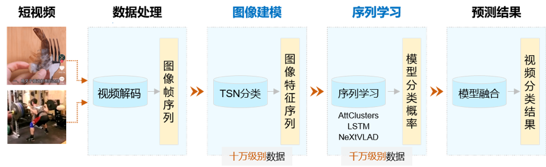

# VideoTag 飞桨大规模视频分类模型

---
## 内容

- [模型简介](#模型简介)
- [使用方法](#使用方法)

## 模型简介

飞桨大规模视频分类模型VideoTag基于百度短视频业务千万级数据，支持3000个源于产业实践的实用标签，具有良好的泛化能力，非常适用于国内大规模（千万/亿/十亿级别）短视频分类场景的应用。VideoTag采用两阶段建模方式，即图像建模和序列学习。第一阶段，使用少量视频样本（十万级别）训练大规模视频特征提取模型(Extractor)；第二阶段，使用千万级数据训练预测器(Predictor)，最终实现在超大规模（千万/亿/十亿级别）短视频上产业应用，其原理示意如下图所示。

  
Temporal shift module

- 数据处理：视频是按特定顺序排列的一组图像的集合，这些图像也称为帧。视频分类任务需要先对短视频进行解码，然后再将输出的图像帧序列灌入到VideoTag中进行训练和预测。

- 图像建模：先从训练数据中，对每个类别均匀采样少量样本数据，构成十万量级的训练视频。然后使用TSN网络进行训练，提取所有视频帧的TSN模型分类层前一层的特征数据。在这个过程中，每一帧都被转化成相应的特征向量，一段视频被转化成一个特征序列。

- 序列学习：采用Attention clusters、LSTM和Nextvlad对特征序列进行建模，学习各个特征之间的组合方式，进一步提高模型准确率。由于序列学习相比于图像建模耗时更短，因此可以融合多个具有互补性的序列模型。示例代码仅使用Attention\_LSTM网络进行序列特征预测。

- 预测结果：融合多个模型结果实现视频分类，进一步提高分类准确率。

## 使用方法
- [1. 如何运行样例代码](./Run.md)
- [2. 如何使用自己的数据进行测试](./Test.md)
- [3. 如何进行模型fine-tune](./FineTune.md)
