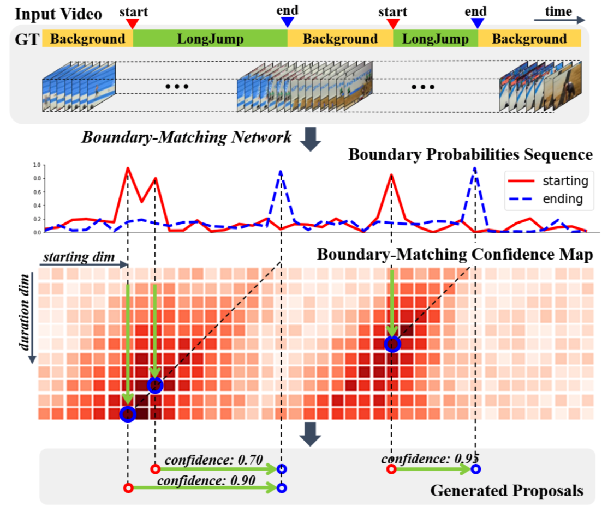

# BMN 视频动作定位模型

---
## 内容

- [模型简介](#模型简介)
- [数据准备](#数据准备)
- [模型训练](#模型训练)
- [模型评估](#模型评估)
- [模型推断](#模型推断)
- [参考论文](#参考论文)

## 模型简介

BMN模型是百度自研，2019年ActivityNet夺冠方案，为视频动作定位问题中proposal的生成提供高效的解决方案，在PaddlePaddle上首次开源。此模型引入边界匹配(Boundary-Matching, BM)机制来评估proposal的置信度，按照proposal开始边界的位置及其长度将所有可能存在的proposal组合成一个二维的BM置信度图，图中每个点的数值代表其所对应的proposal的置信度分数。网络由三个模块组成，基础模块作为主干网络处理输入的特征序列，TEM模块预测每一个时序位置属于动作开始、动作结束的概率，PEM模块生成BM置信度图。

  
BMN Overview

## 数据准备

BMN的训练数据采用ActivityNet1.3提供的数据集，数据下载及准备请参考[数据说明](../../data/dataset/bmn/README.md)

## 模型训练

数据准备完毕后，可以通过如下两种方式启动训练：

    export CUDA_VISIBLE_DEVICES=0,1,2,3
    export FLAGS_eager_delete_tensor_gb=0.0
    export FLAGS_fraction_of_gpu_memory_to_use=0.98
    export FLAGS_fast_eager_deletion_mode=1
    python train.py --model_name=BMN \
                    --config=./configs/bmn.yaml \
                    --log_interval=10 \
                    --valid_interval=1 \
                    --use_gpu=True \
                    --save_dir=./data/checkpoints

    bash run.sh train BMN ./configs/bmn.yaml

- 代码运行需要先安装pandas

- 从头开始训练，使用上述启动命令行或者脚本程序即可启动训练，不需要用到预训练模型

- 若使用第二种方式，请在run.sh脚本文件中设置4卡训练：
    export CUDA_VISIBLE_DEVICES=0,1,2,3

**训练策略：**

*  采用Adam优化器，初始learning\_rate=0.001
*  权重衰减系数为1e-4
*  学习率在迭代次数达到4200的时候做一次衰减，衰减系数为0.1

## 模型评估

可通过如下两种方式进行模型评估:

    python eval.py --model_name=BMN \
                   --config=./configs/bmn.yaml \
                   --log_interval=1 \
                   --weights=$PATH_TO_WEIGHTS \
                   --use_gpu=True

    bash run.sh eval BMN ./configs/bmn.yaml

- 使用`run.sh`进行评估时，需要修改脚本中的`weights`参数指定需要评估的权重。

- 若未指定`--weights`参数，脚本会下载已发布模型[model](https://paddlemodels.bj.bcebos.com/video_detection/BMN.pdparams)进行评估。

- 上述程序会将运行结果保存在data/output/EVAL\BMN\_results文件夹下，测试结果保存在data/evaluate\_results/bmn\_results\_validation.json文件中。使用ActivityNet官方提供的测试脚本，即可计算AR@AN和AUC。具体计算过程请参考[指标计算](../../metrics/bmn_metrics/README.md)。

- 使用CPU进行评估时，请将上面的命令行或者run.sh脚本中的`use_gpu`设置为False。

- 注：评估时可能会出现loss为nan的情况。这是由于评估时用的是单个样本，可能存在没有iou>0.6的样本，所以为nan，对最终的评估结果没有影响。

在ActivityNet1.3数据集下评估精度如下:

| AR@1 | AR@5 | AR@10 | AR@100 | AUC |
| :---: | :---: | :---: | :---: | :---: |
| 33.06 | 49.13 | 56.27 | 75.32 | 67.19% |

## 模型推断

可通过如下两种方式启动模型推断：

    python predict.py --model_name=BMN \
                      --config=./configs/bmn.yaml \
                      --log_interval=1 \
                      --weights=$PATH_TO_WEIGHTS \
                      --filelist=$FILELIST \
                      --use_gpu=True

    bash run.sh predict BMN ./configs/bmn.yaml

- 使用python命令行启动程序时，`--filelist`参数指定待推断的文件列表，如果不设置，默认为data/dataset/bmn/infer.list。`--weights`参数为训练好的权重参数，如果不设置，程序会自动下载已训练好的权重。

- 使用`run.sh`进行评估时，需要修改脚本中的`weights`参数指定需要用到的权重。

- 若未指定`--weights`参数，脚本会下载已发布模型[model](https://paddlemodels.bj.bcebos.com/video_detection/BMN.pdparams)进行推断。

- 上述程序会将运行结果保存在data/output/INFER/BMN\_results文件夹下，测试结果保存在data/predict\_results/bmn\_results\_test.json文件中。

- 使用CPU进行推断时，请将命令行或者run.sh脚本中的`use_gpu`设置为False

## 参考论文

- [BMN: Boundary-Matching Network for Temporal Action Proposal Generation](https://arxiv.org/abs/1907.09702), Tianwei Lin, Xiao Liu, Xin Li, Errui Ding, Shilei Wen.
