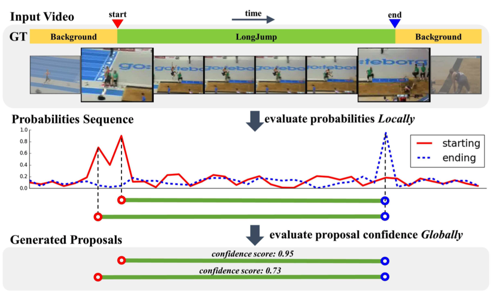

# BSN 视频动作定位模型

---
## 内容

- [模型简介](#模型简介)
- [数据准备](#数据准备)
- [模型训练](#模型训练)
- [模型评估](#模型评估)
- [模型推断](#模型推断)
- [参考论文](#参考论文)

## 模型简介

BSN模型为视频动作定位问题中proposal的生成提供高效的解决方案。此模型采用自底向上的方法生成proposal，首先对每一个时序位置分别生成动作开始、动作结束及动作类别的概率，然后组合其中概率高的位置生成候选proposal，最后利用Boundary-Sensitive Proposal特征判别该proposal是否包含的动作。网络由TEM、PGM和PEM三个模块组成，分别用于时序概率预测、BSP特征生成及proposal置信度评估。

  
BSN Overview

## 数据准备

BSN的训练数据采用ActivityNet1.3提供的数据集，数据下载及准备请参考[数据说明](../../data/dataset/bmn/README.md)

## 模型训练

TEM模块以snippet-level的特征序列作为输入，预测每一个时序位置属于动作开始、动作结束及动作行为的概率。
数据准备完毕后，可以通过如下两种方式启动训练：

    export CUDA_VISIBLE_DEVICES=0
    export FLAGS_eager_delete_tensor_gb=0.0
    export FLAGS_fraction_of_gpu_memory_to_use=0.98
    export FLAGS_fast_eager_deletion_mode=1
    python train.py --model_name=BsnTem \
                    --config=./configs/bsn_tem.yaml \
                    --log_interval=10 \
                    --valid_interval=1 \
                    --use_gpu=True \
                    --save_dir=./data/checkpoints \
                    --fix_random_seed=False

    bash run.sh train BsnTem ./configs/bsn_tem.yaml

- 代码运行需要先安装pandas

- 从头开始训练，使用上述启动命令行或者脚本程序即可启动训练，不需要用到预训练模型

- 若使用第二种方式，请在run.sh脚本文件中设置单卡训练：
    export CUDA_VISIBLE_DEVICES=0

**训练策略：**

*  采用Adam优化器，初始learning\_rate=0.001
*  权重衰减系数为1e-4
*  学习率在迭代次数达到4200的时候做一次衰减，衰减系数为0.1

PEM模块以PGM模块输出的BSP特征作为输入，输出proposal包含动作类别的置信度。
数据准备完毕后，可以通过如下两种方式启动训练：

    export CUDA_VISIBLE_DEVICES=0
    export FLAGS_eager_delete_tensor_gb=0.0
    export FLAGS_fraction_of_gpu_memory_to_use=0.98
    export FLAGS_fast_eager_deletion_mode=1
    python train.py --model_name=BsnPem \
                    --config=./configs/bsn_pem.yaml \
                    --log_interval=10 \
                    --valid_interval=1 \
                    --use_gpu=True \
                    --save_dir=./data/checkpoints \
                    --fix_random_seed=False

    bash run.sh train BsnPem ./configs/bsn_pem.yaml

- 请先运行[TEM模块评估代码](#模型评估)，该代码会自动调用PGM模块生成PEM模块运行所需的BSP特征，特征的默认存储路径为data/output/EVAL/PGM\_feature。

- 从头开始训练，使用上述启动命令行或者脚本程序即可启动训练，不需要用到预训练模型

- 若使用第二种方式，请在run.sh脚本文件中设置单卡训练：
    export CUDA_VISIBLE_DEVICES=0

**训练策略：**

*  采用Adam优化器，初始learning\_rate=0.01
*  权重衰减系数为1e-5
*  学习率在迭代次数达到6000的时候做一次衰减，衰减系数为0.1

## 模型评估

TEM模块可通过如下两种方式进行模型评估:

    python eval.py --model_name=BsnTem \
                   --config=./configs/bsn_tem.yaml \
                   --log_interval=1 \
                   --weights=$PATH_TO_WEIGHTS \
                   --use_gpu=True

    bash run.sh eval BsnTem ./configs/bsn_tem.yaml

- 使用`run.sh`进行评估时，需要修改脚本中的`weights`参数指定需要评估的权重。

- 若未指定`--weights`参数，脚本会下载已发布模型[model](https://paddlemodels.bj.bcebos.com/video_detection/BsnTem.pdparams)进行评估

- 上述程序会将运行结果保存在data/output/EVAL/TEM\_results文件夹下，同时调用PGM模块生成proposal和BSP特征，分别保存在data/output/EVAL/PGM\_proposals和data/output/EVAL/PGM\_feature路径下。

- 使用CPU进行评估时，请将上面的命令行或者run.sh脚本中的`use_gpu`设置为False

TEM评估模块完成后，PEM模块可通过如下两种方式进行模型评估:

    python eval.py --model_name=BsnPem \
                   --config=./configs/bsn_pem.yaml \
                   --log_interval=1 \
                   --weights=$PATH_TO_WEIGHTS \
                   --use_gpu=True

    bash run.sh eval BsnPem ./configs/bsn_pem.yaml

- 使用`run.sh`进行评估时，需要修改脚本中的`weights`参数指定需要评估的权重。

- 若未指定`--weights`参数，脚本会下载已发布模型[model](https://paddlemodels.bj.bcebos.com/video_detection/BsnPem.pdparams)进行评估。

- 上述程序会将运行结果保存在data/output/EVAL/PEM\_results文件夹下，测试结果保存在data/evaluate\_results/bsn\_results\_validation.json文件中。使用ActivityNet官方提供的测试脚本，即可计算AR@AN、AUC。具体计算过程请参考[指标计算](../../metrics/bmn_metrics/README.md)

- 使用CPU进行评估时，请将上面的命令行或者run.sh脚本中的`use_gpu`设置为False

在ActivityNet1.3数据集下评估精度如下:

| AR@1 | AR@5 | AR@10 | AR@100 | AUC |
| :---: | :---: | :---: | :---: | :---: |
| 32.54 | 47.97 | 55.17 | 75.01 | 66.64% |

## 模型推断

TEM模块可通过如下两种方式启动模型推断：

    python predict.py --model_name=BsnTem \
                      --config=./configs/bsn_tem.yaml \
                      --log_interval=1 \
                      --weights=$PATH_TO_WEIGHTS \
                      --filelist=$FILELIST \
                      --use_gpu=True

    bash run.sh predict BsnTem ./configs/bsn_tem.yaml

- 使用python命令行启动程序时，`--filelist`参数指定待推断的文件列表，如果不设置，默认为data/dataset/bmn/infer.list。`--weights`参数为训练好的权重参数，如果不设置，程序会自动下载已训练好的权重。这两个参数如果不设置，请不要写在命令行，将会自动使用默认值。

- 使用`run.sh`进行评估时，需要修改脚本中的`weights`参数指定需要用到的权重。

- 若未指定`--weights`参数，脚本会下载已发布模型[model](https://paddlemodels.bj.bcebos.com/video_detection/BsnTem.pdparams)进行推断。

- 上述程序会将运行结果保存在data/output/INFER的子目录TEM\_results、PGM\_proposals、PGM\_feature中。

- 使用CPU进行推断时，请将命令行或者run.sh脚本中的`use_gpu`设置为False

PEM模块可通过如下两种方式启动模型推断：

    python predict.py --model_name=BsnPem \
                      --config=./configs/bsn_pem.yaml \
                      --log_interval=1 \
                      --weights=$PATH_TO_WEIGHTS \
                      --filelist=$FILELIST \
                      --use_gpu=True

    bash run.sh predict BsnPem ./configs/bsn_pem.yaml

- 使用python命令行启动程序时，`--filelist`参数指定待推断的文件列表，如果不设置，默认为data/dataset/bmn/infer.list。`--weights`参数为训练好的权重参数，如果不设置，程序会自动下载已训练好的权重。这两个参数如果不设置，请不要写在命令行，将会自动使用默认值。

- 使用`run.sh`进行评估时，需要修改脚本中的`weights`参数指定需要用到的权重。

- 若未指定`--weights`参数，脚本会下载已发布模型[model](https://paddlemodels.bj.bcebos.com/video_detection/BsnPem.pdparams)进行推断。

- 上述程序会将运行结果保存在data/output/INFER/PEM\_results文件夹下，测试结果保存在data/predict\_results/bsn\_results\_test.json文件中。

- 使用CPU进行推断时，请将命令行或者run.sh脚本中的`use_gpu`设置为False

## 参考论文

- [Bsn: Boundary sensitive network for temporal action proposal generation](http://arxiv.org/abs/1806.02964), Tianwei Lin, Xu Zhao, Haisheng Su, Chongjing Wang, Ming Yang.
