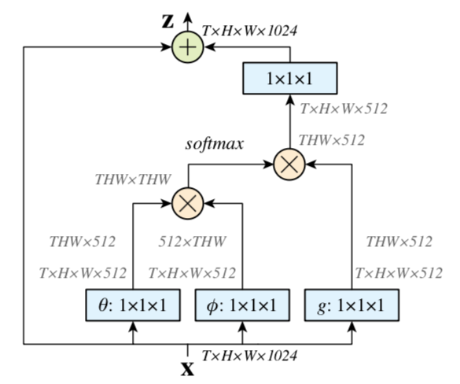

# Non-local Neural Networks视频分类模型

---
## 目录

- [模型简介](#模型简介)
- [数据准备](#数据准备)
- [模型训练](#模型训练)
- [模型评估](#模型评估)
- [模型推断](#模型推断)
- [参考论文](#参考论文)

## 模型简介

Non-local Neural Networks是由Xiaolong Wang等研究者在2017年提出的模型，主要特点是通过引入Non-local操作来描述距离较远的像素点之间的关联关系。提取大范围内数据点之间的关联关系，一直是一个比较重要的问题。对于序列化数据，比如语音、视频等，比较主流的做法是使用循环神经网络(RNN)；对于图片来说，通常使用卷积神经网络(CNN)来提取像素之间的依赖关系。然而，CNN和RNN都只是在其空间或者时间的很小的邻域内进行特征提取，很难捕捉到距离更远位置的数据的依赖关系。借助于传统计算机视觉中的Non-local mean的思想，并将其扩展到神经网络中，通过定义输出位置和所有输入位置之间的关联函数，建立起了一种具有全局关联特性的操作，输出feature map上的每个位置，都会受到输入feature map上所有位置的数据的影响。在CNN中，经过一次卷积操作，输出feature map上的像素点，只能获取其相应的感受野之内的信息，为了获得更多的上下文信息，就需要做多次卷积操作。然而在Non-local操作中，每个输出点的感受野都相当于整个输入feature map区域，能比CNN和RNN提取到更加全局的信息。

详细信息请参考论文[Non-local Neural Networks](https://arxiv.org/abs/1711.07971v1)

### Non-local操作

Non-local 关联函数的定义如下

在上面的公式中，x表示输入feature map， y表示输出feature map，i是输出feature map的位置，j是输入feature map的位置，f(xi, xj)描述了输出点i跟所有输入点j之间的关联，C是根据f(xi, xj)选取的归一化函数。g(xj)是对输入feature map做一个变换操作，通常可以选取比较简单的线性变换形式；f(xi, xj)可以选取不同的形式，通常可以使用如下几种形式

#### Gaussian

#### Embedded Gaussian

#### Dot product

#### Concatenation

其中

上述函数形式中的参数可以使用随机初始化的方式进行赋值，在训练过程中通过End-2-End的方式不断迭代求解。

### Non-local block

采用类似Resnet的结构，定义如下的Non-local block

Non-local操作引入的部分与Resnet中的残差项类似，通过使用Non-local block，可以方便的在网络中的任何地方添加Non-local操作，而其他地方照样可以使用原始的预训练模型进行初始化。如果将Wz初始化为0，则跟不使用Non-local block的初始情形等价。

### 具体实现

下图描述了Non-local block使用内嵌高斯形式关联函数的具体实现过程，

  
使用Eembedded Gaussian关联函数的Non-local block

g(Xj)是对输入feature map做一个线性变换，使用1x1x1的卷积；theta和phi也是线性变化，同样使用1x1x1的卷积来实现。从上图中可以看到，Non-local操作只需用到通常的卷积、矩阵相乘、加法、softmax等比较常用的算子，不需要额外添加新的算子，用户可以非常方便的实现组网以构建模型。

### 模型效果

原作者的论文中指出，Non-local模型在视频分类问题上取得了较好的效果，在Resnet-50基础网络上添加Non-local block，能取得比Resnet-101更好的分类效果，TOP-1准确率要高出1～2个百分点。在图像分类和目标检测问题上，也有比较明显的提升效果。

## 数据准备

Non-local模型的训练数据采用由DeepMind公布的Kinetics-400动作识别数据集。数据下载及准备请参考Non-local模型的[数据说明](../../dataset/nonlocal/README.md)

## 模型训练

数据准备完毕后，可以通过如下两种方式启动训练：

    python train.py --model_name=NONLOCAL
            --config=./configs/nonlocal.txt
            --save_dir=checkpoints
            --log_interval=10
            --valid_interval=1

    bash scripts/train/train_nonlocal.sh

- 可下载已发布模型[model](https://paddlemodels.bj.bcebos.com/video_classification/nonlocal_kinetics.tar.gz)通过`--resume`指定权重存放路径进行finetune等开发

**数据读取器说明：** 模型读取Kinetics-400数据集中的`mp4`数据，根据视频长度和采样频率随机选取起始帧的位置，每个视频抽取`video_length`帧图像，对每帧图像做随机增强，短边缩放至[256, 320]之间的某个随机数，长边根据长宽比计算出来，然后再截取出224x224的区域作为训练数据输入网络。

**训练策略：**

*  采用Momentum优化算法训练，momentum=0.9
*  采用L2正则化，卷积和fc层weight decay系数为1e-4；bn层则设置weight decay系数为0
*  初始学习率base\_learning\_rate=0.01，在150,000和300,000次迭代的时候分别降一次学习率，衰减系数为0.1

## 模型评估

测试时数据预处理的方式跟训练时不一样，crop区域的大小为256x256，不同于训练时的224x224，所以需要将训练中预测输出时使用的全连接操作改为1x1x1的卷积。每个视频抽取图像帧数据的时候，会选取10个不同的位置作为时间起始点，做crop的时候会选取三个不同的空间起始点。在每个视频上会进行10x3次采样，将这30个样本的预测结果进行求和，选取概率最大的类别作为最终的预测结果。

可通过如下两种方式进行模型评估:

    python test.py --model_name=NONLOCAL
            --config=configs/nonlocal.txt
            --log_interval=1
            --weights=$PATH_TO_WEIGHTS

    bash scripts/test/test_nonlocal.sh

- 使用`scripts/test/test_nonlocal.sh`进行评估时，需要修改脚本中的`--weights`参数指定需要评估的权重。

- 若未指定`--weights`参数，脚本会下载已发布模型[model](https://paddlemodels.bj.bcebos.com/video_classification/nonlocal_kinetics.tar.gz)进行评估

当取如下参数时:

| 参数 | 取值 |
| :---------: | :----: |
| back bone | Resnet-50 |
| 卷积形式 | c2d |
| 采样频率 | 8 |
| 视频长度 | 8 |

在Kinetics400的validation数据集下评估精度如下:

| 精度指标 | 模型精度 |
| :---------: | :----: |
| TOP\_1 | 0.739 |

### 备注

由于Youtube上部分数据已删除，只下载到了kinetics400数据集中的234619条，而原始数据集包含246535条视频，可能会导致精度略微下降。

## 模型推断

可通过如下命令进行模型推断：

    python infer.py --model_name=NONLOCAL
            --config=configs/nonlocal.txt
            --log_interval=1
            --weights=$PATH_TO_WEIGHTS
            --filelist=$FILELIST

- 模型推断结果存储于`NONLOCAL_infer_result`中，通过`pickle`格式存储。

- 若未指定`--weights`参数，脚本会下载已发布模型[model](https://paddlemodels.bj.bcebos.com/video_classification/nonlocal_kinetics.tar.gz)进行推断

## 参考论文

- [Non-local Neural Networks](https://arxiv.org/abs/1711.07971v1), Xiaolong Wang, Ross Girshick, Abhinav Gupta, Kaiming He

