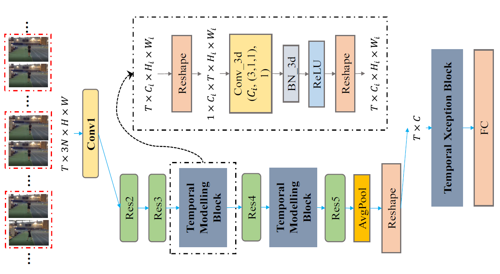

# StNet 视频分类模型

---
## 目录

- [模型简介](#模型简介)
- [数据准备](#数据准备)
- [模型训练](#模型训练)
- [模型评估](#模型评估)
- [模型推断](#模型推断)
- [参考论文](#参考论文)

## 模型简介

StNet模型框架为ActivityNet Kinetics Challenge 2018中夺冠的基础网络框架，本次开源的是基于ResNet50实现的StNet模型，基于其他backbone网络的框架用户可以依样配置。该模型提出“super-image"的概念，在super-image上进行2D卷积，建模视频中局部时空相关性。另外通过temporal modeling block建模视频的全局时空依赖，最后用一个temporal Xception block对抽取的特征序列进行长时序建模。StNet主体网络结构如下图所示：

  
StNet Framework Overview

详细内容请参考AAAI'2019年论文[StNet:Local and Global Spatial-Temporal Modeling for Human Action Recognition](https://arxiv.org/abs/1811.01549)

## 数据准备

StNet的训练数据采用由DeepMind公布的Kinetics-400动作识别数据集。数据下载及准备请参考[数据说明](../../dataset/README.md)

## 模型训练

数据准备完毕后，可以通过如下两种方式启动训练：

    python train.py --model_name=STNET
            --config=./configs/stnet.txt
            --save_dir=checkpoints
            --log_interval=10
            --valid_interval=1

    bash scripts/train/train_stnet.sh

- 可下载已发布模型[model](https://paddlemodels.bj.bcebos.com/video_classification/stnet_kinetics.tar.gz)通过`--resume`指定权重存放路径进行finetune等开发

**数据读取器说明：** 模型读取Kinetics-400数据集中的`mp4`数据，每条数据抽取`seg_num`段，每段抽取`seg_len`帧图像，对每帧图像做随机增强后，缩放至`target_size`。

**训练策略：**

*  采用Momentum优化算法训练，momentum=0.9
*  权重衰减系数为1e-4
*  学习率在训练的总epoch数的1/3和2/3时分别做0.1的衰减

**备注：**

* 在训练StNet模型时使用PaddlePaddle Fluid 1.3 + cudnn5.1。使用cudnn7.0以上版本时batchnorm计算moving mean和moving average会出现异常，此问题还在修复中。建议用户安装PaddlePaddle时指定cudnn版本,

     pip install paddlepaddle\_gpu==1.3.0.post85

或者在PaddlePaddle的whl包[下载页面](http://paddlepaddle.org/documentation/docs/zh/1.3/beginners_guide/install/Tables.html/#permalink-4--whl-release)选择下载cuda8.0\_cudnn5\_avx\_mkl对应的whl包安装。
关于安装PaddlePaddle的详细操作请参考[安装文档](http://www.paddlepaddle.org/documentation/docs/zh/1.3/beginners_guide/install/index_cn.html)。

## 模型评估

可通过如下两种方式进行模型评估:

    python test.py --model_name=STNET
            --config=configs/stnet.txt
            --log_interval=1
            --weights=$PATH_TO_WEIGHTS

    bash scripts/test/test__stnet.sh

- 使用`scripts/test/test_stnet.sh`进行评估时，需要修改脚本中的`--weights`参数指定需要评估的权重。

- 若未指定`--weights`参数，脚本会下载已发布模型[model](https://paddlemodels.bj.bcebos.com/video_classification/stnet_kinetics.tar.gz)进行评估

当取如下参数时:

| 参数 | 取值 |
| :---------: | :----: |
| seg\_num | 25 |
| seglen | 5 |
| target\_size | 256 |

在Kinetics400的validation数据集下评估精度如下:

| 精度指标 | 模型精度 |
| :---------: | :----: |
| TOP\_1 | 0.69 |

## 模型推断

可通过如下命令进行模型推断：

    python infer.py --model_name=stnet
            --config=configs/stnet.txt
            --log_interval=1
            --weights=$PATH_TO_WEIGHTS
            --filelist=$FILELIST

- 模型推断结果存储于`STNET_infer_result`中，通过`pickle`格式存储。

- 若未指定`--weights`参数，脚本会下载已发布模型[model](https://paddlemodels.bj.bcebos.com/video_classification/stnet_kinetics.tar.gz)进行推断

## 参考论文

- [StNet:Local and Global Spatial-Temporal Modeling for Human Action Recognition](https://arxiv.org/abs/1811.01549), Dongliang He, Zhichao Zhou, Chuang Gan, Fu Li, Xiao Liu, Yandong Li, Limin Wang, Shilei Wen

