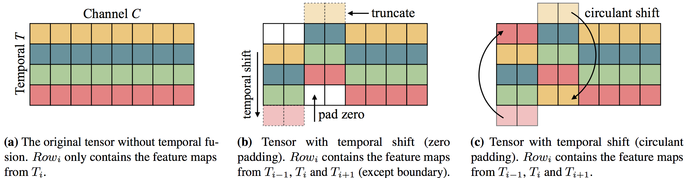

# TSM 视频分类模型

---
## 内容

- [模型简介](#模型简介)
- [数据准备](#数据准备)
- [模型训练](#模型训练)
- [模型评估](#模型评估)
- [模型推断](#模型推断)
- [参考论文](#参考论文)

## 模型简介

Temporal Shift Module是由MIT和IBM Watson AI Lab的Ji Lin，Chuang Gan和Song Han等人提出的通过时间位移来提高网络视频理解能力的模块，其位移操作原理如下图所示。

  
Temporal shift module

上图中矩阵表示特征图中的temporal和channel维度，通过将一部分的channel在temporal维度上向前位移一步，一部分的channel在temporal维度上向后位移一步，位移后的空缺补零。通过这种方式在特征图中引入temporal维度上的上下文交互，提高在时间维度上的视频理解能力。

TSM模型是将Temporal Shift Module插入到ResNet网络中构建的视频分类模型，本模型库实现版本为以ResNet-50作为主干网络的TSM模型。

详细内容请参考论文[Temporal Shift Module for Efficient Video Understanding](https://arxiv.org/abs/1811.08383v1)

## 数据准备

TSM的训练数据采用由DeepMind公布的Kinetics-400动作识别数据集。数据下载及准备请参考[数据说明](../../data/dataset/README.md)

## 模型训练

数据准备完毕后，可以通过如下两种方式启动训练：

    export CUDA_VISIBLE_DEVICES=0,1,2,3,4,5,6,7
    export FLAGS_fast_eager_deletion_mode=1
    export FLAGS_eager_delete_tensor_gb=0.0
    export FLAGS_fraction_of_gpu_memory_to_use=0.98
    python train.py --model_name=TSM \
                    --config=./configs/tsm.yaml \
                    --log_interval=10 \
                    --valid_interval=1 \
                    --use_gpu=True \
                    --save_dir=./data/checkpoints \
                    --fix_random_seed=False \
                    --pretrain=$PATH_TO_PRETRAIN_MODEL

    bash run.sh train TSM ./configs/tsm.yaml

- 从头开始训练，需要加载在ImageNet上训练的ResNet50权重作为初始化参数，请下载此[模型参数](https://paddlemodels.bj.bcebos.com/video_classification/ResNet50_pretrained.tar.gz)并解压，将上面启动命令行或者run.sh脚本中的`pretrain`参数设置为解压之后的模型参数存放路径。如果没有手动下载并设置`pretrain`参数，则程序会自动下载并将参数保存在~/.paddle/weights/ResNet50\_pretrained目录下面

- 可下载已发布模型[model](https://paddlemodels.bj.bcebos.com/video_classification/TSM.pdparams)通过`--resume`指定权重存放路径进行finetune等开发

**数据读取器说明：** 模型读取Kinetics-400数据集中的`mp4`数据，每条数据抽取`seg_num`段，每段抽取1帧图像，对每帧图像做随机增强后，缩放至`target_size`。

**训练策略：**

*  采用Momentum优化算法训练，momentum=0.9
*  权重衰减系数为1e-4

## 模型评估

可通过如下两种方式进行模型评估:

    python eval.py --model_name=TSM \
                   --config=./configs/tsm.yaml \
                   --log_interval=1 \
                   --weights=$PATH_TO_WEIGHTS \
                   --use_gpu=True

    bash run.sh eval TSM ./configs/tsm.yaml

- 使用`run.sh`进行评估时，需要修改脚本中的`weights`参数指定需要评估的权重。

- 若未指定`--weights`参数，脚本会下载已发布模型[model](https://paddlemodels.bj.bcebos.com/video_classification/TSM.pdparams)进行评估

- 评估结果以log的形式直接打印输出TOP1\_ACC、TOP5\_ACC等精度指标

- 使用CPU进行评估时，请将上面的命令行或者run.sh脚本中的`use_gpu`设置为False

当取如下参数时，在Kinetics400的validation数据集下评估精度如下:

| seg\_num | target\_size | Top-1 |
| :------: | :----------: | :----: |
| 8 | 224 | 0.70 |

## 模型推断

可通过如下两种方式启动模型推断：

    python predict.py --model_name=TSM \
                      --config=./configs/tsm.yaml \
                      --log_interval=1 \
                      --weights=$PATH_TO_WEIGHTS \
                      --filelist=$FILELIST \
                      --use_gpu=True \
                      --video_path=$VIDEO_PATH

    bash run.sh predict TSM ./configs/tsm.yaml

- 使用`run.sh`进行评估时，需要修改脚本中的`weights`参数指定需要用到的权重。

- 如果video\_path为'', 则忽略掉此参数。如果video\_path != ''，则程序会对video\_path指定的视频文件进行预测，而忽略掉filelist的值，预测结果为此视频的分类概率。

- 若未指定`--weights`参数，脚本会下载已发布模型[model](https://paddlemodels.bj.bcebos.com/video_classification/TSM.pdparams)进行推断

- 模型推断结果以log的形式直接打印输出，可以看到测试样本的分类预测概率。

- 使用CPU进行推断时，请将命令行或者run.sh脚本中的`use_gpu`设置为False

## 参考论文

- [Temporal Shift Module for Efficient Video Understanding](https://arxiv.org/abs/1811.08383v1), Ji Lin, Chuang Gan, Song Han
