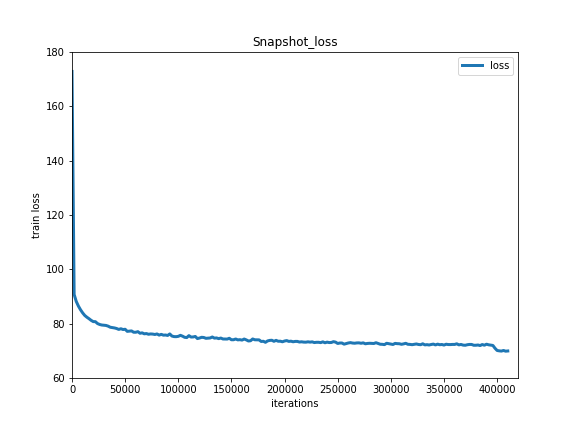
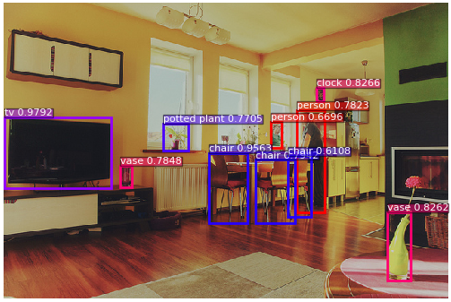
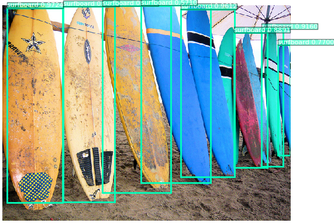
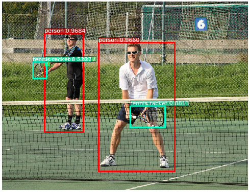
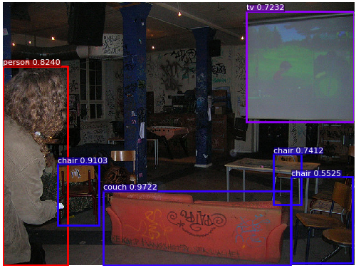
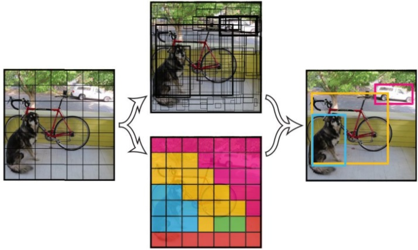
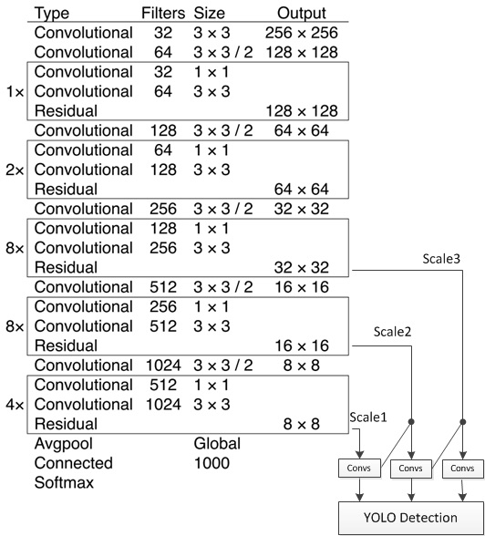

# YOLOv3 Objective Detection

---
## Table of Contents

- [Introduction](#introduction)
- [Quick Start](#quick-start)
- [Advanced Usage](#advanced-usage)
- [FAQ](#faq)
- [Reference](#reference)
- [Update](#update)
- [Contribute](#contribute)
- [Author](#author)

## Introduction

[YOLOv3](https://arxiv.org/abs/1804.02767) is an one-stage object detector proposed by [Joseph Redmon](https://arxiv.org/search/cs?searchtype=author&query=Redmon%2C+J) and [Ali Farhadi](https://arxiv.org/search/cs?searchtype=author&query=Farhadi%2C+A), which can be nearly twice faster in inference than the SOTA detector with same performance.

We use many image augment and label smooth tricks from [Bag of Freebies for Training Object Detection Neural Networks](https://arxiv.org/abs/1902.04103v3) in our implement and produce a higher performance than darknet framework. We got `mAP(0.50:0.95)= 38.9` in COCO-2017 dataset, which is 5.9 higher than darknet(33.0) implement.

With execution acceleration method in Paddle framework prediction library, inference speed of YOLOv3 in our impliment can be 30% faster than darknet framework.

We also recommend users to take a look at the  [IPython Notebook demo](https://aistudio.baidu.com/aistudio/projectDetail/122277)

## Quick Start

### Installation

**Install [PaddlePaddle](https://github.com/PaddlePaddle/Paddle):**

Running sample code in this directory requires PaddelPaddle Fluid v.1.5 and later. If the PaddlePaddle on your device is lower than this version, please follow the instructions in [installation document](http://www.paddlepaddle.org/documentation/docs/en/1.5/beginners_guide/install/index_en.html) and make an update.

**Install the [COCO-API](https://github.com/cocodataset/cocoapi):**

To train the model, COCO-API is needed. Installation is as follows:

    git clone https://github.com/cocodataset/cocoapi.git
    cd cocoapi/PythonAPI
    # if cython is not installed
    pip install Cython
    # Install into global site-packages
    make install
    # Alternatively, if you do not have permissions or prefer
    # not to install the COCO API into global site-packages
    python2 setup.py install --user

### Data preparation

**COCO dataset:**

Train the model on [MS-COCO dataset](http://cocodataset.org/#download), we also provide download script as follows:

```bash
python dataset/coco/download.py
```

The data catalog structure is as follows:

```
  dataset/coco/
  ├── annotations
  │   ├── instances_train2014.json
  │   ├── instances_train2017.json
  │   ├── instances_val2014.json
  │   ├── instances_val2017.json
  |   ...
  ├── train2017
  │   ├── 000000000009.jpg
  │   ├── 000000580008.jpg
  |   ...
  ├── val2017
  │   ├── 000000000139.jpg
  │   ├── 000000000285.jpg
  |   ...

```

**User defined dataset:**

You can defined datasets by yourself, we recommend using annotations in COCO format, and you can set dataset directory by `--data_dir` or in [reader.py](./reader.py#L39). When using annotations in COCO format, you can reference the directory structure in COCO dataset above.

### Training

**download the pre-trained model:** This sample provides DarkNet-53 pre-trained [model](https://paddlemodels.bj.bcebos.com/yolo/darknet53.tar.gz), which is converted from [pjreddie/darknet](https://pjreddie.com/media/files/darknet53.conv.74). You can download pre-trained model as:

    sh ./weights/download.sh

**NOTE:** Windows users can download weights from links in `./weights/download.sh`.

Set `--pretrain` to load pre-trained model. In addition, this parameter is used to load trained model when finetuning as well.
Please make sure that pre-trained model is downloaded and loaded correctly, otherwise, the loss may be NAN during training.


**training:** After data preparation, one can start the training step by:

    python train.py \
       --model_save_dir=output/ \
       --pretrain=${path_to_pretrain_model} \
       --data_dir=${path_to_data} \
       --class_num=${category_num}

- Set `export CUDA_VISIBLE_DEVICES=0,1,2,3,4,5,6,7` to specifiy 8 GPUs to train.
- It is recommended to set `--use_multiprocess_reader=False` when training on Windows.
- Set `--worker_num=` to specifiy multiprocess reader worker number, which is default 8, if the number of CPU cores in the training environment is small, it is recommended to set worker number to a small value.
- For more help on arguments:

    python train.py --help

**NOTE:** The total batch size for YOLOv3 is 64, we use 8 GPUs with batch size as 8 in each GPU for training.

**model configuration:**

* The model uses 9 anchors generated based on the COCO dataset, which are `10x13`, `16x30`, `33x23`, `30x61`, `62x45`, `59x119`, `116x90`, `156x198`, `373x326`.
* In YOLOv3, prediction anchor boxes which is not the best but overlap a ground truth boxes over `ignore_thresh=0.7`, objectness loss will be ignored.

**training strategy:**

*  Use momentum optimizer with momentum=0.9.
*  In first 4000 iteration, the learning rate increases linearly from 0.0 to 0.001. Then lr is decayed at 400000, 450000 iteration with multiplier 0.1, 0.01. The maximum iteration is 500200.
*  Synchronized batch normalization can be set by `--syncbn=True`, which can produce a higher performance.

**NOTE:** Synchronized batch normalization can only be used on multiple GPU devices, can not be used on CPU devices or single GPU device.

Training losses is shown as below：
<p align="center">
<br />
Train Loss
</p>

### Evaluation

Evaluation is to evaluate the performance of a trained model. This sample provides `eval.py` which uses a COCO-specific mAP metric defined by [COCO committee](http://cocodataset.org/#detections-eval). You can also download Paddle released YOLOv3 [model](https://paddlemodels.bj.bcebos.com/yolo/yolov3.tar.gz) as:

    sh ./weights/download.sh

`eval.py` is the main executor for evalution, you can start evalution step by:

    python eval.py \
        --dataset=coco2017 \
        --weights=${path_to_weights} \
        --class_num=${category_num}

- Set `export CUDA_VISIBLE_DEVICES=0` to specifiy one GPU to eval.

If train with `--syncbn=False`, Evalutaion result is shown as below:

|   input size  | mAP(IoU=0.50:0.95) | mAP(IoU=0.50) | mAP(IoU=0.75) |
| :------: | :------: | :------: | :------: |
| 608x608 | 37.7 | 59.8 | 40.8 |
| 416x416 | 36.5 | 58.2 | 39.1 |
| 320x320 | 34.1 | 55.4 | 36.3 |

If train with `--syncbn=True`, Evalutaion result is shown as below:

|   input size  | mAP(IoU=0.50:0.95) | mAP(IoU=0.50) | mAP(IoU=0.75) |
| :------: | :------: | :------: | :------: |
| 608x608 | 38.9 | 61.1 | 42.0 |
| 416x416 | 37.5 | 59.6 | 40.2 |
| 320x320 | 34.8 | 56.4 | 36.9 |

- **NOTE:** Evaluations based on `pycocotools` evaluator with score threshold as 0.01, which is same as darknet. Some frameworks evaluates with score threshold as 0.05 will cause a decrease in performance.

### Inference and Visualization

Inference is used to get prediction score or image features based on trained models. `infer.py`  is the main executor for inference, you can start inference step by:

    python infer.py \
       --dataset=coco2017 \
        --weights=${path_to_weights}  \
        --class_num=${category_num} \
        --image_path=data/COCO17/val2017/  \
        --image_name=000000000139.jpg \
        --draw_thresh=0.5

- Set `export CUDA_VISIBLE_DEVICES=0` to specifiy one GPU to infer.
- Inference results will be shown as follows, and images with detection boxes will be saved under `./output`.

```
Image person.jpg detect:
   person          at [190, 101, 273, 372]      score: 0.98832
   dog             at [63, 263, 200, 346]       score: 0.97049
   horse           at [404, 137, 598, 366]      score: 0.97305
Detect result save at ./output/person.png
```

Visualization of inference result examples are shown as below:
<p align="center">



 <br />
YOLOv3 Visualization Examples
</p>

### Benchmark

Training benchmark:

| dataset | GPU | CUDA | cuDNN | batch size | train speed (1 GPU) | train speed (8 GPU) | memory (1 GPU) | memory (8 GPU) |
| :-----: | :-: | :--: | :---: | :--------: | :-----------------: | :-----------------: | :------------: | :------------: |
| COCO | Tesla P40 | 8.0 | 7.1 | 8 (per GPU) | 30.2 images/s | 59.3 images/s | 10642 MB/GPU | 10782 MB/GPU |

Inference speed on single GPU:

| GPU | CUDA | cuDNN | batch size | infer speed(608x608) | infer speed(416x416) | infer speed(320x320) |
| :-: | :--: | :---: | :--------: | :-----: | :-----: | :-----: |
| Tesla P40 | 8.0 | 7.1 | 1 | 48 ms/frame | 29 ms/frame |24 ms/frame |

### Inference deployment

For YOLOv3 inference deployment, you can save YOLOv3 inference model in [eval.py](./eval.py#L54) or [infer.py](./infer.py#L47), inference model can be loaded and deployed by Paddle prediction library, see [Paddle Inference Lib](http://www.paddlepaddle.org/documentation/docs/en/1.4/advanced_usage/deploy/index_en.html).

## Advanced Usage

### Background introduction

Traditional object detection method works with two stages, it generates potential bounding boxes in the first stage and then run classifier on these proposed boxes in the second stage. YOLO reframes object detection as a single regression problem, detect bounding box coordinates and class probabilities in one stage, which can make YOLO networks inference faster than two-stage networks. YOLOv3 uses multi-scale prediction layers, which improves small target detection performance.

### Model overview

[YOLOv3](https://arxiv.org/abs/1804.02767) is a one stage end to end detector。The detection principle of YOLOv3 is as follow:
<p align="center">
 <br />
YOLOv3 detection principle
</p>

### Model structure

YOLOv3 divides the input image in to S\*S grids and predict B bounding boxes in each grid, predictions of boxes include Location(x, y, w, h), Confidence Score and probabilities of C classes, therefore YOLOv3 output layer has B\*(5 + C) channels. YOLOv3 loss consists of three parts: location loss, confidence loss and classification loss.
The bone network of YOLOv3 is darknet53, the structure of YOLOv3 is as follow:
<p align="center">
 <br />
YOLOv3 structure
</p>

YOLOv3 networks are composed of base feature extraction network, multi-scale feature fusion layers, and output layers.

1. Feature extraction network: YOLOv3 uses [DarkNet53](https://arxiv.org/abs/1612.08242) for feature extracion. Darknet53 uses a full convolution structure, replacing the pooling layer with a convolution operation with step size as 2, and adding residual block to avoid gradient dispersion when the number of network layers is too deep.

2. Feature fusion layer. In order to solve the problem that the previous YOLO version is not sensitive to small objects, YOLOv3 uses three different scale feature maps for target detection, which are 13\*13, 26\*26, 52\*52, respectively, for detecting large, medium and small objects. The feature fusion layer selects the three scale feature maps produced by DarkNet as input, and draws on the idea of FPN (feature pyramid networks) to fuse the feature maps of each scale through a series of convolutional layers and upsampling.

3. Output layer: The output layer also uses a full convolution structure. The number of convolution kernels in the last convolutional layer is 255:3\*(80+4+1)=255, and 3 indicates that a grid cell contains 3 bounding boxes. 4 represents the four coordinate information of the box, 1 represents the Confidence Score, and 80 represents the probability of 80 categories in the COCO dataset.

### Model fine-tune

For YOLOv3 fine-tuning, you should set `--pretrain` as YOLOv3 [model](https://paddlemodels.bj.bcebos.com/yolo/yolov3.tar.gz) you download, set `--class_num` as category number in your dataset.

In fine-tuning, weights of `yolo_output` layers should not be loaded when your `--class_num` is not equal to 80 as in COCO dataset, you can load pre-trained weights in [train.py](./train.py#L76) without `yolo_output` layers as:

```python
if cfg.pretrain:
    if not os.path.exists(cfg.pretrain):
        print("Pretrain weights not found: {}".format(cfg.pretrain))

    def if_exist(var):
        return os.path.exists(os.path.join(cfg.pretrain, var.name)) \
               and var.name.find('yolo_output') < 0

    fluid.io.load_vars(exe, cfg.pretrain, predicate=if_exist)

```

If categories in your dataset is a subset of COCO categories, weights of `yolo_output` layers can be cropped for fine-tuning. Suppose you has 6 categories which is `[3, 19, 25, 41, 58, 73]`th in COCO 80 categories, weights can be cropped as:

```python
if cfg.pretrain:
    if not os.path.exists(cfg.pretrain):
        print("Pretrain weights not found: {}".format(cfg.pretrain))

    def if_exist(var):
        return os.path.exists(os.path.join(cfg.pretrain, var.name))

    fluid.io.load_vars(exe, cfg.pretrain, predicate=if_exist)

    cat_idxs = [3, 19, 25, 41, 58, 73]
    # the first 5 channels is x, y, w, h, objectness,
    # the following 80 channel is for 80 categories
    channel_idxs = np.array(range(5) + [idx + 5 for idx in cat_idxs])
    # we have 3 yolo_output layers
    for i in range(3):
        # crop conv weights
        weights_tensor = fluid.global_scope().find_var(
                          "yolo_output.{}.conv.weights".format(i)).get_tensor()
        weights = np.array(weights_tensor)
        # each yolo_output layer has 3 anchors, 85 channels of each anchor
        weights = np.concatenate(weights[channel_idxs],
                                 weights[85 + channel_idxs],
                                 weights[170 + channel_idxs])
        weights_tensor.set(weights.astype('float32'), place)
        # crop conv bias
        bias_tensor = fluid.global_scope().find_var(
                        "yolo_output.{}.conv.bias".format(i)).get_tensor()
        bias = np.array(bias_tensor)
        bias = np.concatenate(bias[channel_idxs],
                              bias[85 + channel_idxs],
                              bias[150 + channel_idxs])
        bias_tensor.set(bias.astype('float32'), place)

```

## FAQ

**Q:** I train YOLOv3 in single GPU and got `loss=nan`, why?  
**A:** `learning_rate=0.001` configuration is for training in 8 GPUs while total batch size is 64, if you train with smaller batch size, please decrease the learning rate.

**Q:** YOLOv3 training in my machine is very slow, how can I speed it up?  
**A:** Image augmentation is very complicated and time consuming in YOLOv3, you can set more workers for reader in [reader.py](./reader.py#L284) for speeding up. If you are fine-tuning, you can also set `--no_mixup_iter` greater than `--max_iter` to disable image mixup.

**Q:** YOLOv3 training with 2 categories dataset got `loss=nan` or wrong prediction, why?  
**A:** Settting `--label_smooth` will smooth target value of positive sample to `1-1/class_num` and target of negative sample to `1/class_num`, if `class_num` is very small, label smooth will incur excessive influence and may cause `loss=nan` or wrong prediction, it is recommend to set `--label_smooth=False` while category number is small. If you are using Paddle Fluid v1.5 and above, this situation is protected in C++ code, setting `--label_smooth=True` will no longer incur such error.

## Reference

- [You Only Look Once: Unified, Real-Time Object Detection](https://arxiv.org/abs/1506.02640v5), Joseph Redmon, Santosh Divvala, Ross Girshick, Ali Farhadi.
- [YOLOv3: An Incremental Improvement](https://arxiv.org/abs/1804.02767v1), Joseph Redmon, Ali Farhadi.
- [Bag of Freebies for Training Object Detection Neural Networks](https://arxiv.org/abs/1902.04103v3), Zhi Zhang, Tong He, Hang Zhang, Zhongyue Zhang, Junyuan Xie, Mu Li.

## Update

- 1/2019, Add YOLOv3 model.
- 4/2019, Add synchronized batch normalization for YOLOv3.

## Contribute

If you can fix a issue or add a new feature, please open a PR to us. If your PR is accepted, you can get scores according to the quality and difficulty of your PR(0~5), while you got 10 scores, you can contact us for interview or recommendation letter.

## Author

- [heavengate](https://github.com/heavengate)
- [tink2123](https://github.com/tink2123)
