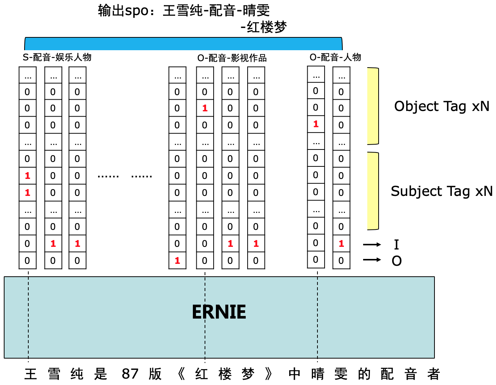

## Relation Extraction Baseline System—InfoExtractor 2.0  
### Abstract  
InfoExtractor 2.0 is a relation extraction baseline system developed for DuIE 2.0.
Different from [DuIE 1.0](http://lic2019.ccf.org.cn/kg), the new 2.0 task is more inclined to colloquial language, and further introduces **complex relations** which entails multiple objects in one single SPO.
For detailed information about the dataset, please refer to the official website of our [competition](http://bjyz-ai.epc.baidu.com/aistudio/competition/detail/34?isFromCcf=true).  
InfoExtractor 2.0 is built upon a SOTA pre-trained language model [ERNIE](https://arxiv.org/abs/1904.09223) using PaddlePaddle.
We design a structured **tagging strategy** to directly fine-tune ERNIE, through which multiple, overlapped SPOs can be extracted in **a single pass**.
The InfoExtractor 2.0 system is simple yet effective, achieving 0.554 F1 on the DuIE 2.0 demo data and 0.848 F1 on DuIE 1.0.
The hyperparameters are simply set to: BATCH_SIZE=16, LEARNING_RATE=2e-5, and EPOCH=10 (without tuning).

### Tagging Strategy  
Our tagging strategy is designed to discover multiple, overlapped SPOs in the DuIE 2.0 task.
Based on the classic 'BIO' tagging scheme, we assign tags (also known as labels) to each token to indicate its position in an entity span.
The only difference lies in that a "B" tag here is further distinguished by different predicates and subject/object dichotomy.
Suppose there are N predicates. Then a "B" tag should be like "B-predicate-subject" or "B-predicate-object",
which results in 2*N **mutually exclusive** "B" tags.
After tagging, we treat the task as token-level multi-label classification, with a total of (2*N+2) labels (2 for the “I” and “O” tags).  
Below is a visual illustration of our tagging strategy:
<div  align="center">  

</div>

For **complex relations** in the DuIE 2.0 task, we simply treat affiliated objects as independent instances (SPOs) which share the same subject.
Anything else besides the tagging strategy is implemented in the most straightforward way. The model input is:
 <CLS> *input text* <SEP>, and the final hidden states are directly projected into classification probabilities.

### Environments  
Python3 + Paddle Fluid 1.5 for training/evaluation/prediction (please confirm your Python path in scripts).  
Python2 for official evaluation script.  
Dependencies are listed in `./requirements.txt`.  
The code is tested on a single P40 GPU, with CUDA version=10.1, GPU Driver Version = 418.39.

### Download pre-trained ERNIE model  
Download ERNIE1.0 Base（max-len-512）model and extract it into `./pretrained_model/`  
```
cd ./pretrained_mdoel/
wget --no-check-certificate https://ernie.bj.bcebos.com/ERNIE_1.0_max-len-512.tar.gz
tar -zxvf ERNIE_1.0_max-len-512.tar.gz
```
### Training  
```
sh ./script/train.sh
```
By default the checkpoints will be saved into `./checkpoints/`  
GPU ID can be specified in the script. On P40 devices, the batch size can be assigned up to 64 under 256 max-seq-len setting.  
Multi-gpu training is supported after `LD_LIBRARY_PATH` is specified in the script:  
```
export LD_LIBRARY_PATH=/your/custom/path:$LD_LIBRARY_PATH
```
**Accuracy** (token-level and example-level) is printed during the during the training procedure.

### Prediction  
Specify your checkpoints dir in the prediction script, and then run:
```
sh ./script/predict.sh
```
This will write the predictions into a json file with the same format as the original dataset (required for final official evaluation). GPU ID and batch size can be specified in the script. The final prediction file is saved into `./data/`

### Official Evaluation  
Zip your prediction json file and then run official evaluation:
```
zip ./data/predict_test.json.zip ./data/predict_test.json
python2 ./script/re_official_evaluation.py --golden_file=./data/dev_demo.json  --predict_file=./data/predict_test.json.zip [--alias_file alias_dict]
```
Precision, Recall and F1 scores are used as the official evaluation metrics to measure the performance of participating systems. Alias file lists entities with more than one correct mentions. It is not provided due to security reasons.
