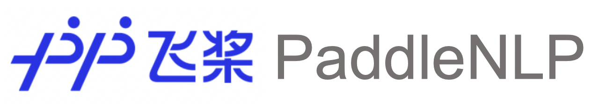

简体中文 | [English](./README_en.md)

<p align="center">
  
</p>


PaddleNLP旨在帮助开发者提高文本建模的效率，通过丰富的模型库、简洁易用的API，提供飞桨2.0的最佳实践并加速NLP领域应用产业落地效率。


# 特性

- **丰富的模型库**

  - 涵盖了NLP主流应用相关的前沿模型，包括中文词向量、预训练模型、词法分析、文本分类、文本匹配、文本生成、机器翻译、通用对话、问答系统等。

- **简洁易用的API**

  - 深度兼容飞桨2.0的高层API体系，提供更多可复用的文本建模模块，可大幅度减少数据处理、组网、训练环节的代码开发，提高开发效率。

- **高性能分布式训练**

  - 通过高度优化的Transformer网络实现，结合混合精度与Fleet分布式训练API，可充分利用GPU集群资源，高效完成预训练模型的分布式训练。


# 安装

## 环境依赖

- python >= 3.6
- paddlepaddle >= 2.0.0-rc1

```
pip install paddlenlp==2.0.0b
```


# 快速开始

## 数据集快速加载

```python
from paddlenlp.datasets import ChnSentiCorp

train_dataset, dev_dataset, test_dataset= ChnSentiCorp.get_datasets(['train', 'dev', 'test'])
```

可参考[Dataset文档](./docs/datasets.md)查看更多数据集。

## 一键加载中文词向量

```python
from paddlenlp.embeddings import TokenEmbedding

wordemb = TokenEmbedding("w2v.baidu_encyclopedia.target.word-word.dim300")
print(wordemb.cosine_sim("国王", "王后"))
>>> 0.63395125
wordemb.cosine_sim("艺术", "火车")
>>> 0.14792643
```

内置50+中文词向量，更多使用方法请参考 [Embedding文档](./examples/word_embedding/README.md)。

## 一键加载经典模型

```python
from paddlenlp.models import Ernie, Senta, SimNet

ernie = Ernie("ernie-1.0", num_classes=2, task="seq-cls")

senta = Senta(network="bow", vocab_size=1024, num_classes=2)

simnet = SimNet(network="gru", vocab_size=1024, num_classes=2)
```

更多使用方法请参考[Models API](./docs/models.md)。

## 一键加载高质量中文预训练模型

```python
from paddlenlp.transformers import ErnieModel, BertModel, RobertaModel, ElectraModel

ernie = ErnieModel.from_pretrained('ernie-1.0')

bert = BertModel.from_pretrained('bert-wwm-chinese')

roberta = RobertaModel.from_pretrained('roberta-wwm-ext')

electra = ElectraModel.from_pretrained('chinese-electra-small')
```

请参考 [Pretrained-Models](./docs/transformers.md)查看目前支持的预训练模型。


# API 使用文档

- [Transformer API](./docs/transformers.md)

- [Data API](./docs/data.md)

- [Dataset API](./docs/datasets.md)

- [Embedding API](./docs/embeddings.md)

- [Metrics API](./docs/metrics.md)

- [Models API](./docs/models.md)


# 可交互式Notebook教程

- [使用seq2vec模块进行句子情感分类](https://aistudio.baidu.com/aistudio/projectdetail/1283423)
- [如何通过预训练模型Fine-tune下游任务](https://aistudio.baidu.com/aistudio/projectdetail/1294333)
- [使用BiGRU-CRF模型完成快递单信息抽取](https://aistudio.baidu.com/aistudio/projectdetail/1317771)
- [使用预训练模型ERNIE优化快递单信息抽取](https://aistudio.baidu.com/aistudio/projectdetail/1329361)
- [使用Seq2Seq模型完成自动对联](https://aistudio.baidu.com/aistudio/projectdetail/1321118)
- [使用预训练模型ERNIE-GEN实现智能写诗](https://aistudio.baidu.com/aistudio/projectdetail/1339888)
- [使用TCN网络完成新冠疫情病例数预测](https://aistudio.baidu.com/aistudio/projectdetail/1290873)

更多教程参见[PaddleNLP on AI Studio](https://aistudio.baidu.com/aistudio/personalcenter/thirdview/574995)。


# 社区贡献与技术交流

- 欢迎您加入PaddleNLP的SIG社区，贡献优秀的模型实现、公开数据集、教程与案例、外围小工具。
- 现在就加入PaddleNLP的QQ技术交流群，一起交流NLP技术吧！⬇️

<div align="center">
  
</div>  


# License

PaddleNLP遵循[Apache-2.0开源协议](./LICENSE)。
