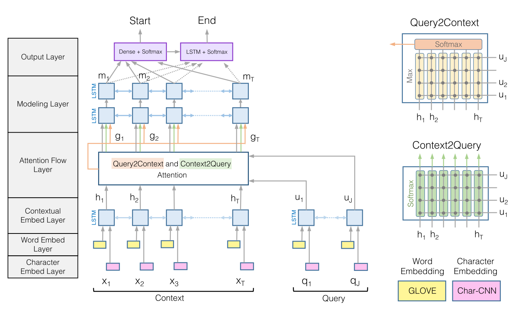

# 简介

## 机器阅读理解任务
在机器阅读理解(MRC)任务中，我们会给定一个问题(Q)以及一个或多个段落(P)/文档(D)，然后利用机器在给定的段落中寻找正确答案(A)，即Q + P or D => A. 机器阅读理解(MRC)是自然语言处理(NLP)中的关键任务之一，需要机器对语言有深刻的理解才能找到正确的答案。

## DuReader数据集
DuReader是一个大规模、面向真实应用、由人类生成的中文阅读理解数据集。DuReader聚焦于真实世界中的不限定领域的问答任务。相较于其他阅读理解数据集，DuReader的优势包括:

 - 问题来自于真实的搜索日志
 - 文章内容来自于真实网页
 - 答案由人类生成
 - 面向真实应用场景
 - 标注更加丰富细致

更多关于DuReader数据集的详细信息可在[DuReader官网](https://ai.baidu.com//broad/subordinate?dataset=dureader)找到。

## DuReader基线系统

DuReader基线系统利用[PaddlePaddle](http://paddlepaddle.org)深度学习框架，针对[DuReader阅读理解数据集](https://ai.baidu.com//broad/subordinate?dataset=dureader)实现并升级了一个经典的阅读理解模型 —— [BiDAF](https://arxiv.org/abs/1611.01603). 该基线系统相较于DuReader论文中的基线，效果上有了大幅提升(在DuReader2.0验证集、测试集的表现见下表)
  
|      Model     | Dev ROUGE-L | Test ROUGE-L |
| :------------- | :---------: | :----------: |
| BiDAF (原始[论文](https://arxiv.org/abs/1711.05073)基线) |    39.29    |     45.90    |
| 本基线系统  |    47.68    |     54.66    |


# 快速开始

## 安装
### 环境依赖
经测试，基线系统可在以下环境正常运行

 * 系统：CentOS 6.3, cuda 9.0, CuDNN 7.0
 * python 2.7.13
 * PaddlePaddle 1.3.1
 
### 安装PaddlePaddle
关于PaddlePaddle框架的安装教程，详见[PaddlePaddle官方网站](http://www.paddlepaddle.org/#quick-start)。

### 安装代码
克隆工具集代码库到本地

```shell
git clone https://github.com/PaddlePaddle/models.git
cd models/PaddleNLP/reading_comprehension/
```


### 下载第三方依赖
在本基线系统中，我们采用了Bleu以及Rouge-L指标作为模型的评估标准。这些指标的计算脚本位于[coco-caption](https://github.com/tylin/coco-caption), 可以通过运行以下命令进行下载

```
cd utils && bash download_thirdparty.sh
```

## 运行

### 下载数据集以及模型
为了方便开发者进行测试，我们提供了预处理(分词、计算answer span等)过后的DuReader 2.0数据集、训练好的模型参数以及词表。通过运行以下命令即可下载：

```
cd data && bash download.sh
```
此外，用户还可以利用[paddlehub](https://github.com/PaddlePaddle/PaddleHub)的方式下载模型参数，例如

```
hub download dureader_machine_reading-bidaf
```

### 段落抽取
我们采用了一种新的段落抽取策略以提升模型在DuReader 2.0数据集上的表现(策略内容详见src/UPDATES.md)。该段落抽取策略可通过运行以下命令执行:

```
sh run.sh --para_extraction
```

请注意，在运行上面命令之前，需要先下载预处之后的DuReader 2.0数据 (见”下载数据集以及模型“章节)。段落抽取得到的结果会存放在
`data/extracted/`文件夹中。

### 评估
通过运行以下命令，开发者可以利用上面提供的模型在DuReader 2.0验证集进行评估：

```
sh run.sh --evaluate  --load_dir ../data/saved_model --devset ../data/extracted/devset/zhidao.dev.json ../data/extracted/devset/search.dev.json
```
在评估结束后，程序会自动计算ROUGE-L指标并显示最终结果。


### 预测
通过运行以下命令，开发者可以利用上面提供的模型在DuReader 2.0测试集进行预测：

```
sh run.sh --predict  --load_dir  ../data/saved_model --testset ../data/extracted/testset/zhidao.test.json ../data/extracted/testset/search.test.json
```
模型预测的答案将被保存在`data/results`文件夹中。


### 训练
如果开发者希望重新训练模型参数，可以参考本章节步骤。

在模型训练开始之前，需要先运行以下命令来生成词表以及创建一些必要的文件夹，用于存放模型参数等：

```
sh run.sh --prepare --trainset ../data/extracted/trainset/zhidao.train.json ../data/extracted/trainset/search.train.json --devset ../data/extracted/devset/zhidao.dev.json ../data/extracted/devset/search.dev.json --testset ../data/extracted/testset/zhidao.test.json ../data/extracted/testset/search.test.json
```
建立好的词表会存放在`data/vocab`文件夹中。

然后运行下面的命令，即可开始训练:

```
sh run.sh --train --pass_num 5 --trainset ../data/extracted/trainset/zhidao.train.json ../data/extracted/trainset/search.train.json --devset ../data/extracted/devset/zhidao.dev.json ../data/extracted/devset/search.dev.json
```
以上参数配置会对模型进行5轮训练，并在每轮结束后利用验证集自动进行评估。每轮过后，程序会自动将模型参数保存到`data/models`文件夹当中，并以该轮的ID命名。

如果开发者需要改变模型训练时的超参数， 例如初始学习率、隐层维度等，可以通过指定以下参数来实现： 

```
sh run.sh --train --pass_num 5 --learning_rate 0.00001 --hidden_size 100 --trainset ../data/extracted/trainset/zhidao.train.json ../data/extracted/trainset/search.train.json --devset ../data/extracted/devset/zhidao.dev.json ../data/extracted/devset/search.dev.json
```

更多参数配置可在`paddle/args.py`中找到。


### 提交测试集结果
当开发者通过调参、修改模型结构得到更好的结果后，可以将DuReader 2.0测试集的预测结果提交到[官网](http://ai.baidu.com/broad/submission?dataset=dureader)来进行评测。在提交结果之前，请确保以下几点：

1. 训练已经全部结束；
2. 通过训练日志在`data/models`文件夹中选择在验证集表现最佳的模型；
3. 通过上面章节描述的方法在测试集上进行预测，并得到完整结果。


# 进阶使用
## 任务定义与建模
阅读理解任务的输入包括：

 - 一个问题Q (已分词)，例如：["明天"， "的", "天气", "怎么样", "？"]；
 - 一个或多个段落P (已分词)，例如：[["今天", "的", "天气", "是", "多云", "转", "晴", "，", "温度", "适中", "。"],  ["明天", "气温", "较为", "寒冷", "，", "请", "注意", "添加", "衣物", "。"]]。

模型输出包括：

 - 段落P中每个词是答案起始位置的概率以及答案结束位置的概率 (boundary model)，例如：起始概率=[[0.01, 0.02, ...], [0.80, 0.10, ...]]，结束概率=[[0.01, 0.02, ...], [0.01, 0.01, ...]]，其中概率数组的维度和输入分词后的段落维度相同。

模型结构包括：

 - 嵌入层 (embedding layer)：输入采用one-hot方式表示的词，得到词向量；
 - 编码层 (encoding layer)：对词向量进行编码，融入上下文信息；
 - 匹配层 (matching layer)：对问题Q和段落P之间进行匹配；
 - 融合层 (fusion layer)：融合匹配后的结果；
 - 预测层 (output layer)：预测得到起始、结束概率。

## 模型原理介绍
下图显示了原始的[BiDAF](https://arxiv.org/abs/1611.01603)模型结构。在本基线系统中，我们去掉了char级别的embedding，在预测层中使用了[pointer network](https://arxiv.org/abs/1506.03134)，并且参考了[R-NET](https://www.microsoft.com/en-us/research/wp-content/uploads/2017/05/r-net.pdf)中的一些网络结构。
<p align="center">
 <br />
</p>


## 数据格式说明
DuReader数据集中每个样本都包含若干文档(documents)，每个文档又包含若干段落(paragraphs)。有关数据的详细介绍可见[官网](https://ai.baidu.com//broad/subordinate?dataset=dureader)、[论文](https://arxiv.org/abs/1711.05073)以及数据集中包含的说明文件，下面是一个来自训练集的样本示例

```
{
    "documents": [
        {
            "is_selected": true,
            "title": "板兰根冲剂_百度百科",
            "most_related_para": 11,
            "segmented_title": ["板兰根", "冲剂", "_", "百度百科"],
            "segmented_paragraphs": [
                    ["板兰根", "冲剂", "，", "药", "名", ":", ... ],
                    ["【", "功效", "与", "主治", "】", ...],
                    ...
            ],
            "paragraphs": [
                "板兰根冲剂，药名...",
                "【功效与主治】...",
                ...
            ],
            "bs_rank_pos": 0
        },
        {
            "is_selected": true,
            "title": "长期喝板蓝根颗粒有哪些好处和坏处",
            "most_related_para": 0,
            "segmented_title": ["长期", "喝", "板蓝根", "颗粒", "有", "哪些", "好处", "和", "坏处"],
            "segmented_paragraphs": [
                ["板蓝根", "对", "感冒", "、", "流感","、", ...],
                ...
            ],
            "paragraphs": [
                "板蓝根对感冒、流感、流脑、...",
                ...
            ],
            "bs_rank_pos": 1
        },
        ...
    ],
    "answer_spans": [[5, 28]],
    "fake_answers": ["清热解毒、凉血;用于温热发热、发斑、风热感冒、咽喉肿烂、流行性乙型脑炎、肝炎、腮腺炎。"],
    "question": "板蓝根颗粒的功效与作用",
    "segmented_answers": [
        ["清热解毒", "、", "凉血", "；", "用于", "温", "热", "发热", ...],
        ["板蓝根", "的", "用途", "不仅", "是", "治疗", "感冒", ...],
        ...
    ],
    "answers": [
        "清热解毒、凉血；用于温热发热、发斑、风热感冒、咽喉肿烂、流行性乙型脑炎、肝炎、 腮腺炎 。",
        "板蓝根的用途不仅是治疗感冒，板蓝根的功效与作用多，对多种细菌性、病毒性疾病都有较好的预防与治疗作用。",
        ...
    ],
    "answer_docs": [0],
    "segmented_question": ["板蓝根颗粒", "的", "功效", "与", "作用"],
    "question_type": "DESCRIPTION",
    "question_id": 91161,
    "fact_or_opinion": "FACT",
    "match_scores": [
        0.9583333333333334
    ]
}
```


## 目录结构

```text
.
├── data                 # 包含数据、词表、模型 (需下载)
├── README.md            # 本文档
├── src                  # 源码
└── utils                # 包含评测脚本 (需下载)
```

## 如何组建自己的模型
开发者可以通过修改src/rc_model.py中的网络结构来组建自己的模型。

# 其他

## Copyright and License
Copyright 2017 Baidu.com, Inc. All Rights Reserved

Licensed under the Apache License, Version 2.0 (the "License");
you may not use this file except in compliance with the License.
You may obtain a copy of the License at

    http://www.apache.org/licenses/LICENSE-2.0

Unless required by applicable law or agreed to in writing, software
distributed under the License is distributed on an "AS IS" BASIS,
WITHOUT WARRANTIES OR CONDITIONS OF ANY KIND, either express or implied.
See the License for the specific language governing permissions and
limitations under the License.

## 如何贡献代码

我们欢迎开发者向DuReader基线系统贡献代码。如果您开发了新功能，发现了bug……欢迎提交Pull request与issue到Github。
