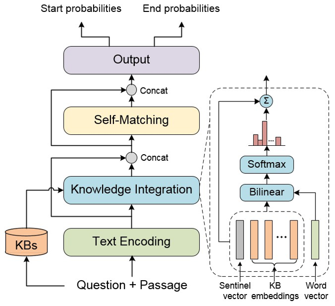

# KT-NET

## Introduction

KT-NET (Knowledge and Text fusion NET) is a machine reading comprehension (MRC) model which integrates knowledge from knowledge bases (KBs) into pre-trained contextualized representations. The model is proposed in ACL2019 paper [Enhancing Pre-Trained Language Representations with Rich Knowledge for Machine Reading Comprehension](https://www.aclweb.org/anthology/P19-1226). The overall architecture of the model is shown as follows:

<p align="center">
 <br />
Overall Architecture of KT-NET
</p>

This repository contains the PaddlePaddle implementation of KT-NET. The trained checkpoints are also provided for reproducing the results in the paper.

## How to Run

### Environment

This project should work fine if the following requirements have been satisfied:
+ python >= 3.7
+ paddlepaddle-gpu (the latest develop version is recommended)
+ NLTK >= 3.3 (with WordNet 3.0)
+ tqdm
+ CoreNLP (3.8.0 version is recommended)
+ pycorenlp
+ CUDA, CuDNN and NCCL (CUDA 9.0, CuDNN v7 and NCCL 2.3.7 are recommended)

All of the experiments in the paper are performed on 4 P40 GPUs.

### Download the MRC datasets

In this work, we empirically evaluate our model on two benchmarks: 

#### 1. ReCoRD

[ReCoRD](https://sheng-z.github.io/ReCoRD-explorer/) (Reading Comprehension with Commonsense Reasoning Dataset) is a large-scale MRC dataset requiring commonsense reasoning. The official dataset in JSON format can be downloaded using Google drive (training set: [link](https://drive.google.com/file/d/1PoHmphyH79pETNws8kU2OwuerU7SWLHj/view), valid set: [link](https://drive.google.com/file/d/1WNaxBpXEGgPbymTzyN249P4ub-uU5dkO/view)). *(For convenience, we have provided the MD5 for each downloadable file of this readme in `downloaded_files.md5`. It's recommended to use it to check the completeness of the downloaded file.)* Please place the downloaded files `train.json` and `dev.json` into the `data/ReCoRD/` directory of this repository. We will also use the official evaluation script of ReCoRD, so please run the following command:
```
curl -o record_official_evaluate.py https://sheng-z.github.io/ReCoRD-explorer/evaluation.py
mv record_official_evaluate.py reading_comprehension/src/eval/
```

#### 2. SQuAD v1.1

[SQuAD v1.1](https://rajpurkar.github.io/SQuAD-explorer/) is a well-known extractive MRC dataset that consists of questions created by crowdworkers for Wikipedia articles. Please run the following command to download the official dataset and evaluation script.
```
curl -O https://rajpurkar.github.io/SQuAD-explorer/dataset/train-v1.1.json
curl -O https://rajpurkar.github.io/SQuAD-explorer/dataset/dev-v1.1.json
mv train-v1.1.json dev-v1.1.json data/SQuAD/
curl -o squad_v1_official_evaluate.py https://worksheets.codalab.org/rest/bundles/0xbcd57bee090b421c982906709c8c27e1/contents/blob/
mv squad_v1_official_evaluate.py reading_comprehension/src/eval/
```

### Retrieve KB entries

Relevant knowledge should be retrieved and encoded before training the model. In this project, we leveraged two KBs: [WordNet](https://wordnet.princeton.edu/) and [NELL](http://rtw.ml.cmu.edu/rtw/). WordNet records lexical relations between words and NELL stores beliefs about entities. The following procedure describes how we retrieve relevant WordNet synsets and NELL concepts for MRC samples.

#### 1. Named entity recognition (only for SQuAD)

To retrieve NELL concepts about entities, the named entity mentions in MRC samples should be annotated. For ReCoRD, the entity mentions have been provided in the dataset. For SQuAD, named entity recognition (NER) needs to be performed before the retrieval. We use [Stanford CoreNLP](https://stanfordnlp.github.io/CoreNLP/index.html) in this step. After CoreNLP is [downloaded](http://nlp.stanford.edu/software/stanford-corenlp-full-2017-06-09.zip) and unzipped, run the following command at the CoreNLP directory to start the CoreNLP server:
```
java -mx10g -cp "*" edu.stanford.nlp.pipeline.StanfordCoreNLPServer -port 9753 -timeout 20000
```
Then run the command:
```
cd retrieve_concepts/ner_tagging_squad
python3 tagging.py
```
The tagged dataset will be saved at `retrieve_concepts/ner_tagging_squad/output` directory. We have provided our output files for convenience ([download link](https://baidu-nlp.bj.bcebos.com/KTNET_preprocess_squad_tagging_output.tar.gz)).

#### 2. Tokenization

Tokenization should be performed for retrieval. We use the same tokenizer with [BERT](https://github.com/google-research/bert). 
For ReCoRD, run the following command to tokenize the raw dataset (or directly download our output from [link](https://baidu-nlp.bj.bcebos.com/KTNET_preprocess_tokenize_result_record.tar.gz)):
```
cd retrieve_concepts/tokenization_record
python3 do_tokenization.py
```
For SQuAD, run the following command to process the NER tagged dataset (or directly download our output from [link](https://baidu-nlp.bj.bcebos.com/KTNET_preprocess_tokenize_result_squad.tar.gz)):
```
cd retrieve_concepts/tokenization_squad
python3 do_tokenization.py
```

#### 3. Retrieve WordNet

This step retrieves the WordNet (WN18) synsets for each non-stop word in the MRC samples. 
For ReCoRD, run the command:
```
cd retrieve_concepts/retrieve_wordnet
python3 retrieve.py --train_token ../tokenization_record/tokens/train.tokenization.uncased.data --eval_token ../tokenization_record/tokens/dev.tokenization.uncased.data --output_dir output_record/ --no_stopwords
```
For SQuAD, run the command:
```
cd retrieve_concepts/retrieve_wordnet
python3 retrieve.py --train_token ../tokenization_squad/tokens/train.tokenization.uncased.data --eval_token ../tokenization_squad/tokens/dev.tokenization.uncased.data --output_dir output_squad/ --no_stopwords
```
The outputs are pickled into binary files. We have also provided our output files for convenience ([download link](https://baidu-nlp.bj.bcebos.com/KTNET_preprocess_wordnet_concepts.tar.gz)).

#### 4. Retrieve NELL

Using string mapping, this step finds corresponding named entities for each entity mention in the given MRC example and returns their categories as relevant NELL concepts. The latest NELL beliefs should be downloaded first.
```
wget http://rtw.ml.cmu.edu/resources/results/08m/NELL.08m.1115.esv.csv.gz
gzip -d NELL.08m.1115.esv.csv.gz
mv NELL.08m.1115.esv.csv retrieve_concepts/retrieve_nell
```
For ReCoRD, run the command:
```
cd retrieve_concepts/retrieve_nell
python3 retrieve.py --train_token ../tokenization_record/tokens/train.tokenization.uncased.data --eval_token ../tokenization_record/tokens/dev.tokenization.uncased.data --output_dir output_record/
```
For SQuAD, run the command:
```
cd retrieve_concepts/retrieve_nell
python3 retrieve.py --train_token ../tokenization_squad/tokens/train.tokenization.uncased.data --eval_token ../tokenization_squad/tokens/dev.tokenization.uncased.data --output_dir output_squad/
```
The outputs are pickled into binary files. The output files can also be downloaded from [download link](https://baidu-nlp.bj.bcebos.com/KTNET_preprocess_nell_concepts.tar.gz).

#### 5. Prepare KB embedding

Following the work of [Yang et al., 2015](https://arxiv.org/pdf/1412.6575.pdf), we leverage their KB embedding for WordNet synsets and NELL categories trained by the BILINEAR model. 
```
curl -O https://raw.githubusercontent.com/bishanyang/kblstm/master/embeddings/wn_concept2vec.txt
curl -O https://raw.githubusercontent.com/bishanyang/kblstm/master/embeddings/nell_concept2vec.txt
mv wn_concept2vec.txt nell_concept2vec.txt retrieve_concepts/KB_embeddings
```
The 100-dimensional embeddings are stored in the following format:
```
concept:coach -0.123886 0.0477016 0.517474 0.154645 0.32559 ...
```
For other knowledge bases, please refer to the source code for training the BILINEAR model from [Yang's github repo](https://github.com/bishanyang/kblstm/tree/master/code/models).

### Training KT-NET

#### Prepare BERT checkpoint

The text encoder module of KT-NET is initialized with pretrained BERT large-cased parameters, run the command:
```
cd reading_comprehension
wget https://bert-models.bj.bcebos.com/cased_L-24_H-1024_A-16.tar.gz --no-check-certificate
tar xvf cased_L-24_H-1024_A-16.tar.gz
```

#### Directly fine-tuning

We have provided scripts to execute training and inference for KT-NET. To train a model for ReCoRD dataset with both WordNet and NELL concepts employed, just run the command:
```
cd reading_comprehension && sh ./run_record_twomemory.sh
```
The hyper-parameters, such as training epochs, learning rate and batch size, can be adjusted in the script. After training and evaluation, the following files and directories will be created:
+ `output/eval_result.json`: the performance of the trained model on the benchmark
+ `output/predictions.json`: the predicted answers for the development set
+ `output/nbest_predictions.json`: n-best predicted answers for the development set
+ `output/step_XXXX`: the directory of model checkpoint
+ `log/train.log`: the logging file

To run with single KB, replace `run_record_twomemory.sh` with `run_record_wordnet.sh` or `run_record_nell.sh`. 

Similarly, for SQuAD, use `run_squad_twomemory.sh`, `run_squad_wordnet.sh` or `run_squad_nell.sh`.

#### Two-staged fine-tuning (Recommended)

In our experiments, we found that employing a "two-staged" training strategy achieves better model performance, which freezes BERT params in the first stage and unfreezes them later. We recommend to adopt this strategy to train KT-NET. To run two-staged fine-tuning, just first execute the `XXX_pretrain.sh` script and then run `XXX_finetune.sh`. E.g., to train a KT-NET on ReCoRD with both KBs, firstly run
```
cd reading_comprehension && sh ./run_record_twomemory_pretrain.sh
```
and then run the command after the first stage has been finished
```
sh ./run_record_twomemory_finetune.sh
```

The finally created `output/` and `log/` directories have the same folder structure with directly fine-tuning.

In the first stage, we trained 10 epochs for ReCoRD and 1 epoch for SQuAD. As for the second stage, we recommend to fine-tune 2-4 epochs for ReCoRD and 2-3 epochs for SQuAD.

#### Reproduce the paper results

We have released the following checkpoints for our trained KT-NET which can reproduce the performance in the paper:

|  ReCoRD Model  | F1 score | Exact Match | Inference Script |
| :------------- | :---------: | :----------: | :--------- |
| [KT-NET (WordNet)](https://baidu-nlp.bj.bcebos.com/KTNET_fine-tuned-model_record_wordnet.tar.gz) | 72.76 | 70.56 | eval_record_wordnet.sh | 
| [KT-NET (NELL)](https://baidu-nlp.bj.bcebos.com/KTNET_fine-tuned-model_record_nell.tar.gz) | 72.52 | 70.54 | eval_record_nell.sh | 
| [KT-NET (Both)](https://baidu-nlp.bj.bcebos.com/KTNET_fine-tuned-model_record_both.tar.gz) | 73.62 | 71.60 | eval_record_twomemory.sh | 

|   SQuAD Model  | F1 score | Exact Match | Inference Script |
| :------------- | :---------: | :----------: | :--------- |
| [KT-NET (WordNet)](https://baidu-nlp.bj.bcebos.com/KTNET_fine-tuned-model_squad_wordnet.tar.gz) | 91.70 | 85.16 | eval_squad_wordnet.sh | 
| [KT-NET (NELL)](https://baidu-nlp.bj.bcebos.com/KTNET_fine-tuned-model_squad_nell.tar.gz) | 91.70 | 85.02 | eval_squad_nell.sh | 
| [KT-NET (Both)](https://baidu-nlp.bj.bcebos.com/KTNET_fine-tuned-model_squad_both.tar.gz) | 91.65 | 84.97 | eval_squad_twomemory.sh | 

After downloading and extracting the checkpoint file, please execute the corresponding inference script. E.g.:
```
cd reading_comprehension && sh ./eval_record_twomemory.sh extracted_ckpt_dir_path
```
The following result is expected to be created in the `output/` directory:
```
{
    "exact_match": 71.61,
    "f1": 73.62396522806482
}
```

## Citation

If you use any source code included in this project in your work, please cite the following paper:
```
@inproceedings{yang-etal-2019-enhancing-pre,
    title = {Enhancing Pre-Trained Language Representations with Rich Knowledge for Machine Reading Comprehension},
    author = {An Yang, Quan Wang, Jing Liu, Kai Liu, Yajuan Lyu, Hua Wu, Qiaoqiao She and Sujian Li},
    booktitle = {Proceedings of the 57th Annual Meeting of the Association for Computational Linguistics},
    year = {2019},
    publisher = {Association for Computational Linguistics},
    pages = {2346--2357},
}
```

## Copyright and License

Copyright 2019 Baidu.com, Inc. All Rights Reserved
Licensed under the Apache License, Version 2.0 (the "License");
you may not use this file except in compliance with the License.
You may obtain a copy of the License at
    http://www.apache.org/licenses/LICENSE-2.0
Unless required by applicable law or agreed to in writing, software
distributed under the License is distributed on an "AS IS" BASIS,
WITHOUT WARRANTIES OR CONDITIONS OF ANY KIND, either express or implied.
See the License for the specific language governing permissions and
limitations under the License.