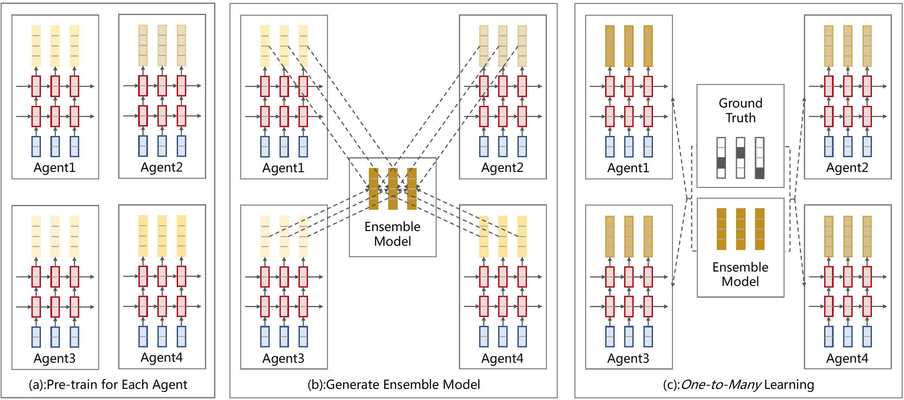

# Multi-agent Learning for Neural Machine Translation（MAL）

## 简介

MAL是百度翻译团队近期提出的首个多智能体端到端联合学习框架，该框架显著提升了单智能体学习能力，在多个机器翻译测试集上刷新了当前最好结果。 该框架投稿并被EMNLP2019录用 [Multi-agent Learning for Neural Machine Translation](https://www.aclweb.org/anthology/D19-1079.pdf)。 具体结构如下：

<p align="center">
 <br />
MAL整体框架
</p>

这个repo包含了PaddlePaddle版本的MAL实现，框架在论文的基础上做了一些修改，在WMT英德2014测试集上BLEU达到30.04，超过了论文中的结果，在不改变模型结构的基础上，刷新了SOTA。

### 实验结果

#### WMT 英德

|  Models  | En-De |
| :------------- | :---------: |
| [ConvS2S](https://pdfs.semanticscholar.org/bb3e/bc09b65728d6eced04929df72a006fb5210b.pdf) | 25.20 | 
| [Transformer](https://papers.nips.cc/paper/7181-attention-is-all-you-need.pdf) | 28.40 | 
| [Rel](https://www.aclweb.org/anthology/N18-2074.pdf) | 29.20 | 
| [DynamicConv](https://openreview.net/pdf?id=SkVhlh09tX) | 29.70 | 
| L2R | 28.88 | 
| MAL-L2R | **30.04** | 


## 运行

### 环境

运行环境需要满足如下要求:
+ python 2.7
+ paddlepaddle-gpu (1.6.1)
    + CUDA, CuDNN and NCCL (CUDA 9.0, CuDNN v7 and NCCL 2.3.5)

    WMT英德的实验结果复现需要56张 32G V100, 运行30W步左右。

### 数据准备
    运行get_data.sh脚本拉取原始数据并做预处理，形成训练需要的文件格式
    ```
    sh get_data.sh
    ```
### 模型运行
    在运行前，需要配置CUDA, CuDNN, NCCL的路径，具体路径修改在env/env.sh
    调用train.sh运行MAL，产出的模型在output下，模型会边训练，边预测，针对训练过程中解码出来的文件，可以调用evaluate.sh来测BLEU
    在train.sh中有个参数是distributed_args，这里需要使用者根据自身机器的情况来改变，需要修改的有nproc_per_node和selected_gpus，nproc_per_node代表每台机器需要使用几张卡，selected_gpus为gpu的卡号，例如一台8卡的v100，使用8张卡跑训练，那么nproc_per_node设置为8，selected_gpus为0, 1, 2, 3, 4, 5, 6, 7
    ```
    sh train.sh ip1,ip2,ip3...(机器的ip地址，不要写127.0.0.1，填写hostname -i的结果) &
    sh evaluate.sh file_path(预测出的文件，在output路径下)
    ```
### 复现论文中结果
    我们提供了MAL在英德任务上训练出的模型，调用infer.sh可以观察到最终结果(因为测试集需要提前生成，所以在调用infer.sh前，请先调用get_data.sh，同时也需要设置好CUDA, CuDNN路径)
    ```
    sh infer.sh
    ```

### 代码结构
    我们主要的代码均在src文件夹中
    train.py 训练的入口文件
    infer.py 模型预测入口
    config.py 定义了该项目模型的相关配置，包括具体模型类别、以及模型的超参数
    reader.py 定义了读入数据的功能
    bleu_hook.py BLEU计算脚本
