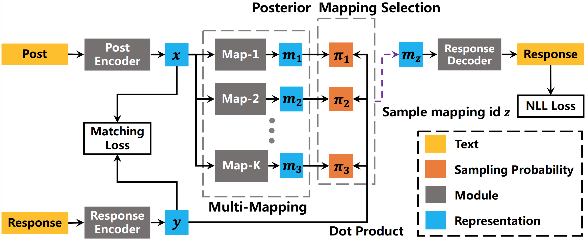

# IJCAI2019-MMPMS

## 1. Introduction
This is an implementation of **MMPMS** model for the one-to-many problem in open-domain conversation.  MMPMS employs a *multi-mapping* mechanism to capture the one-to-many responding regularities between an input post and its diverse responses with multiple mapping modules. MMPMS also incorporates a *posterior mapping selection* module to identify the mapping module corresponding to the target response for accurate optimization. Experiments on Weibo and Reddit conversation dataset demonstrate the capacity of MMPMS in generating multiple diverse and informative responses.For more details, see the IJCAI-2019 paper: [Generating Multiple Diverse Responses with Multi-Mapping and Posterior Mapping Selection](https://arxiv.org/abs/1906.01781).

<p align="center">

</p>


## 2. Quick Start

### Requirements
- Python >= 3.6
- PaddlePaddle >= 1.3.2 && <= 1.4.1
- NLTK

### Data Preparation
Prepare one-turn conversation dataset (e.g. [Weibo](https://www.aclweb.org/anthology/P15-1152) and [Reddit](https://www.ijcai.org/proceedings/2018/0643.pdf)), and put the train/valid/test data files into the `data` folder:

```
data/
├── dial.train
├── dial.valid
└── dial.test
```
In the data file, each line is a post-response pair formatted by `post \t response`.

Prepare pre-trained word embedding (e.g. [sgns.weibo.300d.txt](https://pan.baidu.com/s/1zbuUJEEEpZRNHxZ7Gezzmw) for Weibo and [glove.840B.300d.txt](http://nlp.stanford.edu/data/glove.840B.300d.zip) for Reddit), and put it into the `data` folder. The first line of pre-trained word embedding file should be formatted by `num_words embedding_dim`.

Preprocess the data by running:
```pyhton
python preprocess.py
```
The vocabulary and the preprocessed data will be saved in the same `data` folder:
```
data/
├── dial.train.pkl
├── dial.valid.pkl
├── dial.test.pkl
└── vocab.json
```

### Train

To train a model, run:
```python
python run.py --data_dir DATA_DIR
```
The logs and model parameters will be saved to the `./output` folder by default.


### Test
Generate text result to `RESULT_FILE` with the saved model in `MODEL_DIR` by running:
```python
python run.py --infer --model_dir MODEL_DIR --result_file RESULT_FILE
```
The `RESULT_FILE` will be a Json file containing the input post, target response and predicted response from each mapping module.

Then evaluate the generation result with the following command:
```python
python eval.py RESULT_FILE
```

**Note**:

- The data files in the `data` folder are just samples to illustrate the data format. Remember to replace them with your data.
- To use GPU in Train or Test, please set the `GPU_ID` first: `export CUDA_VISIBLE_DEVICES=GPU_ID`.

## 3. Citation
If you use any source code included in this toolkit in your work, please cite the following paper:
```
@inproceedings{IJCAI2019-MMPMS ,
  title={Generating Multiple Diverse Responses with Multi-Mapping and Posterior Mapping Selection},
  author={Chaotao Chen, Jinhua Peng, Fan Wang, Jun Xu and Hua Wu},
  booktitle={Proceedings of the 28th International Joint Conference on Artificial Intelligence},
  pages={  --  },
  year={2019}
}
```
