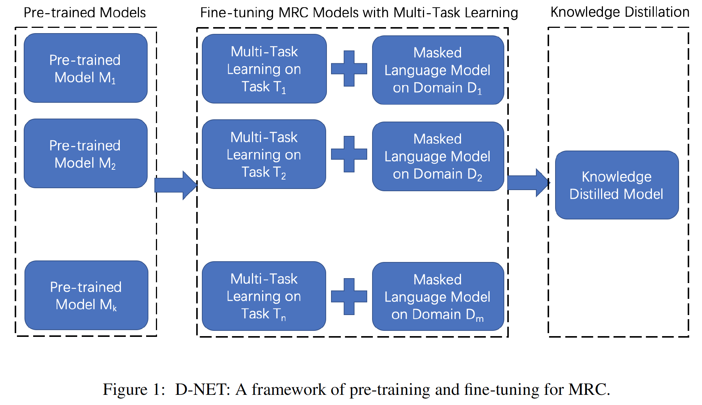

# D-NET

## Introduction
D-NET is a simple pre-training and fine-tuning framework that Baidu used for the MRQA (Machine Reading for Question Answering) 2019 Shared Task, which focused on the generalization of machine reading comprehension (MRC) models. Our system is ranked at top 1 of all the participants in terms of the averaged F1 score. Additionally, we won the first place for 10 of the 12 test sets and the second place for the other two in terms of F1 scores. 

In this repository, we release the related code, data and model parametrs which have been used in the D-NET framework. 

## Framework
An overview of the D-NET framework is shown in the figure below. To improve the generalization capability of a MRC system, we use mainly two techniques, i.e. **multi-task learning (MTL)** and **ensemble of multiple pre-trained models**.

<p align="center">

</p>


#### Multi-task learning
In addition to the MRC task, we further introduce several auxiliary tasks in the fine-tuning stage to learn more general language representations. Specifically, we have the following auxiliary tasks:

 - Unsupervised Task: masked Language Model
 - Supervised Tasks:
 	- natural language inference
 	- paragraph ranking

We use the [PALM](https://github.com/PaddlePaddle/PALM) multi-task learning library based on [PaddlePaddle](https://www.paddlepaddle.org.cn/) in our experiments, which makes the implementation of new tasks and pre-trained models much easier than from scratch. To train the MRQA data sets with MTL, please refer to the instructions [here](multi_task_learning) (under `multi_task_learning/`).

#### Ensemble of multiple pre-trained models
In our experiments, we found that the ensemble system based on different pre-trained models shows better generalization capability than the system that based on the single ones. In this repository, we provide the parameters of 3 models that are fine-tuned on the MRQA in-domain data, based on ERNIE2.0, XL-NET and BERT, respectively. The ensemble of these models are implemented as servers. Please refer the instructions [here](server) (under `server/`) for more detials.

## Directory structure
```
├── multi_task_learning/                        # scripts for multi-task learning
│   ├── configs/                                # PALM config files
│   ├── scripts/                                # auxiliary scripts
│   ├── wget_pretrained_model.sh                # download pretrained model
│   ├── wget_data.sh                            # download data for MTL
│   ├── run_build_palm.sh                       # MLT preparation
│   ├── run_evaluation.sh                       # evaluation
│   ├── run_multi_task.sh                       # start MTL training
├── server/                                     # scripts for the ensemble of multiple pretrained models
│   ├── ernie_server/                           # ERNIE mdoel server
│   ├── xlnet_server/                           # XL-NET mdoel server
│   ├── bert_server/                            # BERT mdoel server
│   ├── main_server.py                          # main server scripts for ensemble
│   ├── client/                                 # client scripts which read examples and make requests
│   ├── wget_server_inference_model.sh          # script for downlowding model parameters
│   ├── start.sh                                # script for launching all the servers
```
## Copyright and License
Copyright 2019 Baidu.com, Inc. All Rights Reserved Licensed under the Apache License, Version 2.0 (the "License"); you may not use this file except in compliance with the License. You may obtain a copy of the License at http://www.apache.org/licenses/LICENSE-2.0 Unless required by applicable law or agreed to in writing, software distributed under the License is distributed on an "AS IS" BASIS, WITHOUT WARRANTIES OR CONDITIONS OF ANY KIND, either express or implied. See the License for the specific language governing permissions and limitations under the License.
