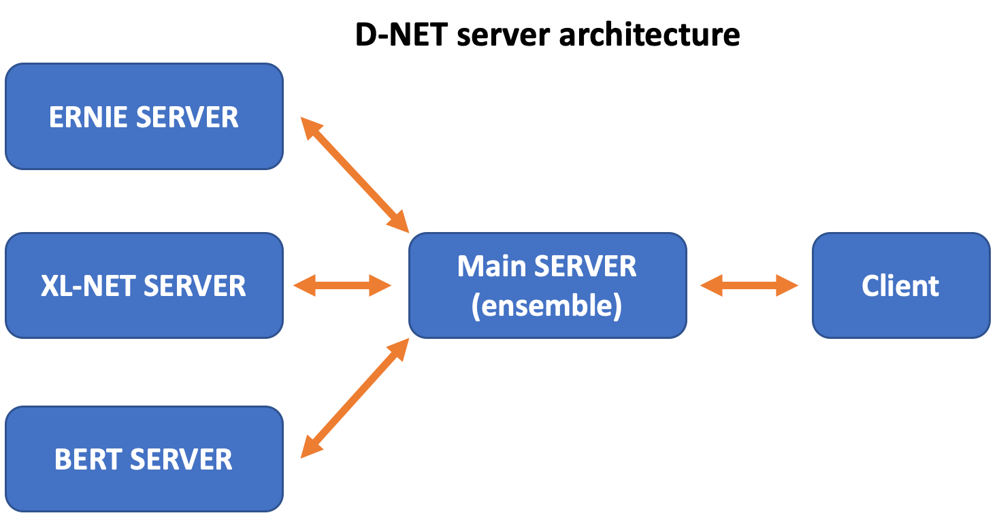

# ensemble server system
This directory contains the ensemble system for the three models that are fine-tuned on the MRQA in-domain data (i.e. models based on ERNIE2.0, XL-NET and BERT). The architecture of the ensemble system is shown in the figure below. We first start 3 independent model server for ERNIE, XL-NET and BERT. We then start a main server to receive client requests, invoke model servers and ensemble model results. 
For convinience, users are able to explore **any ensemble combinations** (e.g. ERNIE+XL-NET, BERT+XL-NET), by simply modifying the configurations.

<p align="center">

</p>


## Environment
In our test environment, we use 

 - Python 2.7.13
 - PaddlePaddle 1.5.2
 - sentencepiece 0.1.83
 - flask 1.1.1
 - Cuda 9.0
 - CuDNN 7.0

## Download model parameters 
To downlowd the model parameters that are fine-tuned on the MRQA in-domain data, run
 
```
bash wget_server_inference_model.sh
```
A folder named `infere_model` will appear in `ernie_server/`, `xlnet_server/` and `bert_server/`. 

## Start servers

Before starting the server, please make sure the ports `5118` to `5121` are available, and specify the `gpu_id` in `start.sh` (by default `GPU 0` on the machine will be used). 

To start the servers, run

```
bash start.sh
```
The log for the main server will be saved in `main_server.log`, and the logs for the 3 model servers witll be saved in `ernie_server/ernie.log`, `xlnet_server/xlnet.log` and `bert_server/bert.log`. 

By default, the main server will ensemble the results from ERNIE and XL-NET. To explore other ensemble combinations, one can change the configuration in `start.sh` (e.g. `python main_server.py --ernie --xlnet --bert` for 3 models, `python main_server.py --bert --xlnet` for BERT and XL-NET only). 

Note that in our test environment, we use Tesla K40 (12G) and the three modles are able to fit in a single card. For GPUs with smaller RAM, one can choose to put three models on different card by modifying the configurations in  `start.sh`.

## Send requests
Once the servers are successfully launched, one can use the client script to send requests.

```
cd client
python client.py demo.txt results.txt 5121
```
This will the read the examples in `demo.txt`, send requests to the main server, and save results into `results.txt`. The format of the input file (i.e. `demo.txt`) need to be in [MRQA official format](https://github.com/mrqa/MRQA-Shared-Task-2019).