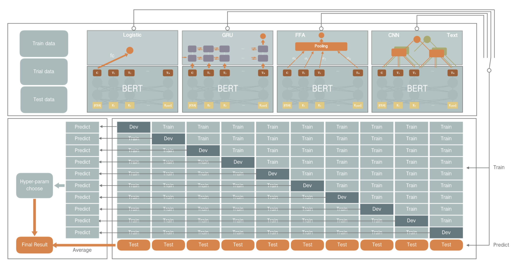

# Multi-Perspective Models

This model won the first place in SemEval 2019 Task 9 SubTask A - Suggestion Mining from Online Reviews and Forums.

See more information about SemEval 2019: [http://alt.qcri.org/semeval2019/](http://alt.qcri.org/semeval2019/)

## 1. Introduction
This paper describes our system participated in Task 9 of SemEval-2019: the task is focused on suggestion mining and it aims to classify given sentences into suggestion and non-suggestion classes in domain specific and cross domain training setting respectively. We propose a multi-perspective architecture for learning representations by using different classical models including Convolutional Neural Networks (CNN), Gated Recurrent Units (GRU), Feed Forward Attention (FFA), etc. To leverage the semantics distributed in large amount of unsupervised data, we also have adopted the pre-trained Bidirectional Encoder Representations from Transformers (BERT) model as an encoder to produce sentence and word representations. The proposed architecture is applied for both sub-tasks, and achieved f1-score of 0.7812 for subtask A, and 0.8579 for subtask B. We won the first and second place for the two tasks respectively in the final competition.

## 2. Quick Start
### Installation
This project depends on python2.7 and paddlepaddle-gpu = 1.3.2, please follow [quick start](http://www.paddlepaddle.org/#quick-start) to install.
### Data Preparation
- Download the competition's data

```
# Download the competition's data
cd ./data && git clone https://github.com/Semeval2019Task9/Subtask-A.git
cd ../
```

- Download BERT and pre-trained model

```
# Download BERT code
git clone https://github.com/PaddlePaddle/LARK && mv LARK/BERT ./
# Download BERT pre-trained model
wget https://bert-models.bj.bcebos.com/uncased_L-24_H-1024_A-16.tar.gz
tar zxf uncased_L-24_H-1024_A-16.tar.gz -C ./
```

### Train
Use this command to start training:

```
# run training script
sh train.sh
```
The models will output to ./output .

### Ensemble & Evaluation
Use this commad to evaluate ensemble result:

```
# run evaluation
python evaluation.py \
        ./data/Subtask-A/SubtaskA_EvaluationData_labeled.csv \
        ./probs/prob_raw.txt \
        ./probs/prob_cnn.txt \
        ./probs/prob_gru.txt \
        ./probs/prob_ffa.txt \
```
Due to the dataset size is small, the training result may fluctuate, please try re-training several times more.

## 3. Advance
### Task Introduction
[Semeval2019-Task9](https://www.aclweb.org/anthology/S19-2151) presents the pilot SemEval task on Suggestion Mining. The task consists of subtasks A and B, creating labeled data from feedback forum and hotel reviews respectively. Examples:

|Source |Sentence |Label|
|------| ------|------|
|Hotel reviews |Be sure to specify a room at the back of the hotel. |suggestion|
|Hotel reviews |The point is, don’t advertise the service if there are caveats that go with it.|non-suggestion|
|Suggestion forum| Why not let us have several pages that we can put tiles on and name whatever we want to |suggestion|
|Suggestion forum| It fails with a uninformative message indicating deployment failed.|non-suggestion|

### Model Introduction
Model's framwork is shown in Figure 1:
<p align="center">
 <br />
<b>Figure 1: An overall framework and pipeline of our system for suggestion mining</b>
</p>
As shown in Figure 1. our model architecture is constituted of two modules which includes a universal encoding module as either a sentence or a word encoder, and a task specified module used for suggestion classification. To fully explored the information generated by the encoder, we stack a serious of different task specified modules upon the encoder according to different perspective. Intuitively, we could use the sentence encoding directly to make a classification, to go further beyond that, as language is time-series information in essence, the time perspective based GRU cells can also be applied to model the sequence state to learn the structure for the suggestion mining task. Similarly, the spatial perspective based CNN can be used to mimic the n-gram model, as well. Moreover, we also introduce a convenient attention mechanism FFA (Raffel and Ellis, 2015) to automatically learns the combination of most important features. At last, we ensemble those models by a voting strategy as final prediction by this system.

### Result
| Models | CV f1-score | test score |
| ----- | ----- | ------ |
BERT-Large-Logistic | 0.8522 (±0.0213) | 0.7697
BERT-Large-Conv | 0.8520 (±0.0231) | 0.7800
BERT-Large-FFA | 0.8516 (±0.0307) | 0.7722
BERT-Large-GRU | 0.8503 (±0.0275) | 0.7725
Ensemble | – | 0.7812


## 4. Others
If you use the library in you research project, please cite the paper "OleNet at SemEval-2019 Task 9: BERT based Multi-Perspective Models for Suggestion Mining".
### Citation

```
@inproceedings{BaiduMPM,
    title={OleNet at SemEval-2019 Task 9: BERT based Multi-Perspective Models for Suggestion Mining},
    author={Jiaxiang Liu, Shuohuan Wang, and Yu Sun},
    booktitle={Proceedings of the 13th International Workshop on Semantic Evaluation (SemEval-2019)},
    year={2019}
}
```
