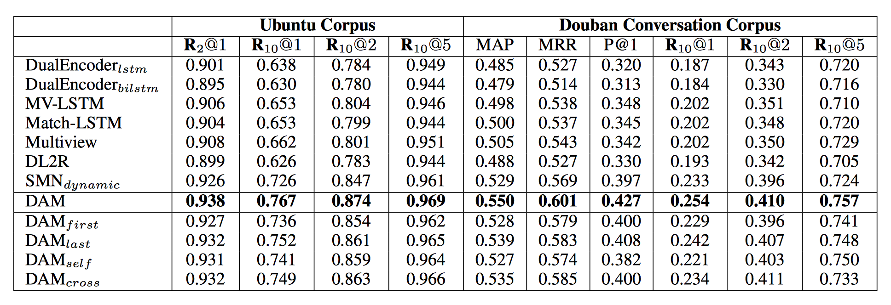

# __Deep Attention Matching Network__
## 简介
### 任务说明
深度注意力机制模型（Deep Attention Matching Network）是开放领域多轮对话匹配模型。根据多轮对话历史和候选回复内容，排序出最合适的回复。
网络结构如下，更多内容可以参考论文:[http://aclweb.org/anthology/P18-1103](http://aclweb.org/anthology/P18-1103).

<p align="center">
 <br />
Overview of Deep Attention Matching Network
</p>

### 效果说明
该模型在两个公开数据集上效果如下：

<p align="center">
 <br />
</p>

## 快速开始
### 安装说明
1. paddle安装

    本项目依赖于Paddle Fluid 1.3.1 及以上版本，请参考[安装指南](http://www.paddlepaddle.org/#quick-start)进行安装

2. 安装代码

    克隆数据集代码库到本地
    ```
    git clone https://github.com/PaddlePaddle/models.git
    cd models/PaddleNLP/dialogue_model_toolkit/deep_attention_matching
    ```

3. 环境依赖

    python版本依赖python 2.7

### 开始第一次模型调用
1. 数据准备

    下载经过预处理的数据，运行该脚本之后，data目录下会存在ubuntu和douban两个文件夹。
    ```
      cd data
      sh download_data.sh
      ```
2. 模型训练
    ```
    python -u main.py \
      --do_train True \
      --use_cuda \
      --data_path ./data/ubuntu/data_small.pkl \
      --save_path ./model_files/ubuntu \
      --use_pyreader \
      --vocab_size 434512 \
      --_EOS_ 28270 \
      --batch_size 32
    ```
3. 模型评估
    ```
    python -u main.py \
      --do_test True \
      --use_cuda \
      --data_path ./data/ubuntu/data_small.pkl \
      --save_path ./model_files/ubuntu/step_372 \
      --model_path ./model_files/ubuntu/step_372 \
      --vocab_size 434512 \
      --_EOS_ 28270 \
      --batch_size 100
    ```
## 进阶使用
### 任务定义与建模
多轮对话匹配任务输入是多轮对话历史和候选回复，输出是回复匹配得分，根据匹配得分排序。
### 模型原理介绍
可以参考论文:[http://aclweb.org/anthology/P18-1103](http://aclweb.org/anthology/P18-1103).
### 数据格式说明
训练、预测、评估使用的数据示例如下，数据由三列组成，以制表符（'\t'）分隔，第一列是以空
格分开的上文id，第二列是以空格分开的回复id，第三列是标签
```
286 642 865 36    87 25 693       0
17 54 975         512 775 54 6    1
```

注：本项目额外提供了分词预处理脚本（在preprocess目录下），可供用户使用，具体使用方法如
下：
```
python tokenizer.py \
  --test_data_dir ./test.txt.utf8 \
  --batch_size 1 > test.txt.utf8.seg
```
### 代码结构说明
main.py：该项目的主函数，封装包括训练、预测的部分

config.py：定义了该项目模型的相关配置，包括具体模型类别、以及模型的超参数

reader.py：定义了读入数据，加载词典的功能

evaluation.py：定义评估函数

run.sh：训练、预测运行脚本

## 其他
如何贡献代码

如果你可以修复某个issue或者增加一个新功能，欢迎给我们提交PR。如果对应的PR被接受了，我们将根据贡献的质量和难度进行打分（0-5分，越高越好）。如果你累计获得了10分，可以联系我们获得面试机会或者为你写推荐信。
