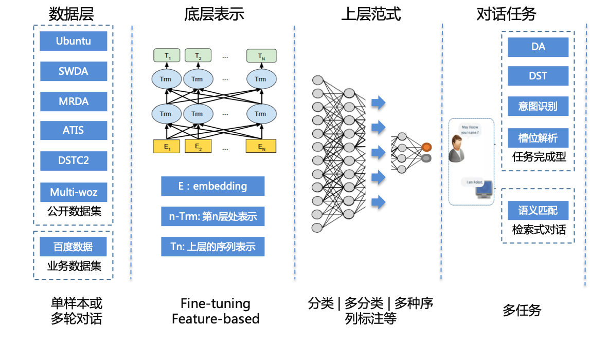

# 对话通用理解模块DGU

 * [1、模型简介](#1、模型简介)
 * [2、快速开始](#2、快速开始)
 * [3、进阶使用](#3、进阶使用)
 * [4、参考论文](#4、参考论文)
 * [5、版本更新](#5、版本更新)

## 1、模型简介

&ensp;&ensp;&ensp;&ensp;对话相关的任务中，Dialogue System常常需要根据场景的变化去解决多种多样的任务。任务的多样性（意图识别、槽位解析、DA识别、DST等等），以及领域训练数据的稀少，给Dialogue System的研究和应用带来了巨大的困难和挑战，要使得dialogue system得到更好的发展，需要开发一个通用的对话理解模型。为此，我们给出了基于BERT的对话通用理解模块(DGU: DialogueGeneralUnderstanding)，通过实验表明，使用base-model(BERT)并结合常见的学习范式，就可以在几乎全部对话理解任务上取得比肩甚至超越各个领域业内最好的模型的效果，展现了学习一个通用对话理解模型的巨大潜力。

## 2、快速开始

### 安装说明

#### &ensp;&ensp;a、环境依赖
- Python >= 2.7
- cuda >= 9.0
- cudnn >= 7.0
- PaddlePaddle >= 1.3.1，请参考[安装指南](http://www.paddlepaddle.org/#quick-start)进行安装, 由于模块内模型基于bert做finetuning, 训练速度较慢, 建议用户安装GPU版本PaddlePaddle进行训练。

&ensp;&ensp;注意：使用Windows GPU环境的用户，需要将示例代码中的[fluid.ParallelExecutor](http://paddlepaddle.org/documentation/docs/zh/1.4/api_cn/fluid_cn.html#parallelexecutor)替换为[fluid.Executor](http://paddlepaddle.org/documentation/docs/zh/1.4/api_cn/fluid_cn.html#executor)。
#### &ensp;&ensp;b、下载代码

&ensp;&ensp;&ensp;&ensp;克隆代码库到本地

```
git clone https://github.com/PaddlePaddle/models.git
cd models/PaddleNLP/dialogue_model_toolkit/dialogue_general_understanding
```

### 任务简介
&ensp;&ensp;&ensp;&ensp;本模块内共包含6个任务，内容如下：

```
udc: 使用Ubuntu Corpus V1公开数据集，实现对话匹配任务;
atis_slot: 使用微软提供的公开数据集(Airline Travel Information System)，实现槽位识别任务；
dstc2: 使用对话状态跟踪挑战（Dialog State Tracking Challenge）2公开数据集，实现对话状态追踪（DST）任务;
atis_intent: 使用微软提供的公开数据集(Airline Travel Information System)，实现意图识别任务；
mrda: 使用公开数据集Meeting Recorder Dialogue Act，实现DA识别任务;
swda：使用公开数据集Switchboard Dialogue Act Corpus，实现DA识别任务;
```

注意: 目前dgu模块内提供的训练好的官方模型及效果, 均是在GPU单卡上面训练和预测得到的, 用户如需复线效果, 可使用单卡相同的配置.

### 数据准备
&ensp;&ensp;&ensp;&ensp;数据集说明：

```
UDC: Ubuntu Corpus V1;
ATIS: 微软提供的公开数据集(Airline Travel Information System)，模块内包含意图识别和槽位解析两个任务的数据;
DSTC2: 对话状态跟踪挑战（Dialog State Tracking Challenge）2;
MRDA: Meeting Recorder Dialogue Act;
SWDA：Switchboard Dialogue Act Corpus;
```

&ensp;&ensp;&ensp;&ensp;数据集、相关模型下载：

```
cd dgu && bash prepare_data_and_model.sh
```

&ensp;&ensp;&ensp;&ensp;下载的数据集中已提供了训练集，测试集和验证集，用户如果需要重新生成某任务数据集的训练数据，可执行：

```
cd dgu/scripts && bash run_build_data.sh task_name
参数说明：
task_name: udc, swda, mrda, atis, dstc2,  选择5个数据集选项中用户需要生成的数据名
```

### 单机训练

#### &ensp;&ensp;&ensp;&ensp;方式一: 推荐直接使用模块内脚本训练

```
bash run.sh task_name task_type
参数说明：
task_name: udc, swda, mrda, atis_intent, atis_slot, dstc2，选择6个任务中任意一项；
task_type: train，predict, evaluate, inference, all, 选择5个参数选项中任意一项(train: 只执行训练，predict: 只执行预测，evaluate：只执行评估过程，依赖预测的结果，inference: 保存inference model，all: 顺序执行训练、预测、评估、保存inference model的过程)；

训练示例： bash run.sh atis_intent train
```

&ensp;&ensp;&ensp;&ensp;方式一如果为CPU训练: 

```
请将run.sh内参数设置为: 
1、export CUDA_VISIBLE_DEVICES=
```

&ensp;&ensp;&ensp;&ensp;方式一如果为GPU训练: 

```
请将run.sh内参数设置为: 
1、如果为单卡训练（用户指定空闲的单卡）：
export CUDA_VISIBLE_DEVICES=0 
2、如果为多卡训练（用户指定空闲的多张卡）：
export CUDA_VISIBLE_DEVICES=0,1,2,3
```

#### &ensp;&ensp;&ensp;&ensp;方式二: 执行训练相关的代码:

```
export FLAGS_sync_nccl_allreduce=0
export FLAGS_eager_delete_tensor_gb=1  #开启显存优化

export CUDA_VISIBLE_DEVICES=0  #GPU单卡训练
#export CUDA_VISIBLE_DEVICES=0,1,2,3  #GPU多卡训练
#export CUDA_VISIBLE_DEVICES=  #CPU训练

if  [ ! "$CUDA_VISIBLE_DEVICES" ]
then
    use_cuda=false
else
    use_cuda=true
fi

TASK_NAME="atis_intent"  #指定训练的任务名称
BERT_BASE_PATH="data/pretrain_model/uncased_L-12_H-768_A-12"

if [ ! -d "./data/saved_models/${TASK_NAME}" ]; then
    mkdir "./data/saved_models/${TASK_NAME}"
fi

python -u main.py \
       --task_name=${TASK_NAME} \
       --use_cuda=${use_cuda} \
       --do_train=true \
       --in_tokens=true \
       --epoch=20 \
       --batch_size=4096 \
       --do_lower_case=true \
       --data_dir="./data/input/data/atis/${TASK_NAME}" \
       --bert_config_path="${BERT_BASE_PATH}/bert_config.json" \
       --vocab_path="${BERT_BASE_PATH}/vocab.txt" \
       --init_from_pretrain_model="${BERT_BASE_PATH}/params" \
       --save_model_path="./data/saved_models/${TASK_NAME}" \
       --save_param="params" \
       --save_steps=100 \
       --learning_rate=2e-5 \
       --weight_decay=0.01 \
       --max_seq_len=128 \
       --print_steps=10 \
       --use_fp16 false 
```

注：
1) 采用方式二时，模型训练过程可参考run.sh内相关任务的参数设置
2) 用户进行模型训练、预测、评估等, 可通过修改data/config/dgu.yaml配置文件或者从命令行传入来进行参数配置, 优先推荐命令行参数传入;

### 模型预测
#### &ensp;&ensp;&ensp;&ensp;方式一: 推荐直接使用模块内脚本预测

```
bash run.sh task_name task_type
参数说明：
task_name: udc, swda, mrda, atis_intent, atis_slot, dstc2，选择6个任务中任意一项；
task_type: train，predict, evaluate, inference, all, 选择5个参数选项中任意一项(train: 只执行训练，predict: 只执行预测，evaluate：只执行评估过程，依赖预测的结果，inference: 保存inference model，all: 顺序执行训练、预测、评估、保存inference model的过程)；

预测示例： bash run.sh atis_intent predict
```

&ensp;&ensp;&ensp;&ensp;方式一如果为CPU预测: 

```
请将run.sh内参数设置为: 
1、export CUDA_VISIBLE_DEVICES=
```

&ensp;&ensp;&ensp;&ensp;方式一如果为GPU预测: 

```
请将run.sh内参数设置为: 
支持单卡预测（用户指定空闲的单卡）：
export CUDA_VISIBLE_DEVICES=0 
```

注：预测时，如采用方式一，用户可通过修改run.sh中init_from_params参数来指定自己训练好的需要预测的模型，目前代码中默认为加载官方已经训练好的模型;

#### &ensp;&ensp;&ensp;&ensp;方式二: 执行预测相关的代码:

```
export FLAGS_sync_nccl_allreduce=0
export FLAGS_eager_delete_tensor_gb=1  #开启显存优化

export CUDA_VISIBLE_DEVICES=0  #单卡预测
#export CUDA_VISIBLE_DEVICES=  #CPU预测

if  [ ! "$CUDA_VISIBLE_DEVICES" ]
then
    use_cuda=false
else
    use_cuda=true
fi

TASK_NAME="atis_intent"  #指定预测的任务名称
BERT_BASE_PATH="./data/pretrain_model/uncased_L-12_H-768_A-12"

python -u main.py \
       --task_name=${TASK_NAME} \
       --use_cuda=${use_cuda} \
       --do_predict=true \
       --in_tokens=true \
       --batch_size=4096 \
       --do_lower_case=true \
       --data_dir="./data/input/data/atis/${TASK_NAME}" \
       --init_from_params="./data/saved_models/trained_models/${TASK_NAME}/params" \
       --bert_config_path="${BERT_BASE_PATH}/bert_config.json" \
       --vocab_path="${BERT_BASE_PATH}/vocab.txt" \
       --output_prediction_file="./data/output/pred_${TASK_NAME}" \
       --max_seq_len=128
```

注：采用方式二时，模型预测过程可参考run.sh内具体任务的参数设置

### 模型评估
&ensp;&ensp;&ensp;&ensp;模块中6个任务，各任务支持计算的评估指标内容如下：

```
udc: 使用R1@10、R2@10、R5@10三个指标评估匹配任务的效果;
atis_slot: 使用F1指标来评估序列标注任务；
dstc2: 使用joint acc 指标来评估DST任务的多标签分类结果;
atis_intent: 使用acc指标来评估分类结果；
mrda: 使用acc指标来评估DA任务分类结果;
swda：使用acc指标来评估DA任务分类结果;
```

&ensp;&ensp;&ensp;&ensp;效果上，6个任务公开数据集评测效果如下表所示：

| task_name | udc | udc | udc | atis_slot | dstc2 | atis_intent | swda | mrda |
| :------ | :------ | :------ | :------ | :------| :------ | :------ | :------ | :------ |
| 对话任务 | 匹配 | 匹配 | 匹配 | 槽位解析 | DST | 意图识别 | DA | DA |
| 任务类型 | 分类 | 分类 | 分类 | 序列标注 | 多标签分类 | 分类 | 分类 | 分类 |
| 任务名称 | udc | udc | udc| atis_slot | dstc2 | atis_intent | swda | mrda |
| 评估指标 | R1@10 | R2@10 | R5@10 | F1 | JOINT ACC | ACC | ACC | ACC |
| SOTA | 76.70% | 87.40% | 96.90% | 96.89% | 74.50% | 98.32% | 81.30% | 91.70% |
| DGU | 82.03% | 90.59% | 97.73% | 97.14% | 91.23% | 97.76% | 80.37% | 91.53% |

#### &ensp;&ensp;&ensp;&ensp;方式一: 推荐直接使用模块内脚本评估

```
bash run.sh task_name task_type
参数说明：
task_name: udc, swda, mrda, atis_intent, atis_slot, dstc2，选择6个任务中任意一项；
task_type: train，predict, evaluate, inference, all, 选择5个参数选项中任意一项(train: 只执行训练，predict: 只执行预测，evaluate：只执行评估过程，依赖预测的结果，inference: 保存inference model，all: 顺序执行训练、预测、评估、保存inference model的过程)；

评估示例： bash run.sh atis_intent evaluate
```

注：评估计算ground_truth和predict_label之间的打分，默认CPU计算即可；

#### &ensp;&ensp;&ensp;&ensp;方式二: 执行评估相关的代码: 

```
TASK_NAME="atis_intent"  #指定预测的任务名称

python -u main.py \
    --task_name=${TASK_NAME} \
    --use_cuda=false \
    --do_eval=true \
    --evaluation_file="./data/input/data/atis/${TASK_NAME}/test.txt" \
    --output_prediction_file="./data/output/pred_${TASK_NAME}"
```

### 模型推断
#### &ensp;&ensp;&ensp;&ensp;方式一: 推荐直接使用模块内脚本保存inference model

```
bash run.sh task_name task_type
参数说明：
task_name: udc, swda, mrda, atis_intent, atis_slot, dstc2，选择6个任务中任意一项；
task_type: train，predict, evaluate, inference, all, 选择5个参数选项中任意一项(train: 只执行训练，predict: 只执行预测，evaluate：只执行评估过程，依赖预测的结果，inference: 保存inference model，all: 顺序执行训练、预测、评估、保存inference model的过程)；

保存模型示例： bash run.sh atis_intent inference
```

&ensp;&ensp;&ensp;&ensp;方式一如果为CPU执行inference model过程: 

```
请将run.sh内参数设置为: 
1、export CUDA_VISIBLE_DEVICES=
```

&ensp;&ensp;&ensp;&ensp;方式一如果为GPU执行inference model过程:

```
请将run.sh内参数设置为: 
1、单卡模型推断（用户指定空闲的单卡）：
export CUDA_VISIBLE_DEVICES=0
```

#### &ensp;&ensp;&ensp;&ensp;方式二: 执行inference model相关的代码: 

```
TASK_NAME="atis_intent"  #指定预测的任务名称
BERT_BASE_PATH="./data/pretrain_model/uncased_L-12_H-768_A-12"

export CUDA_VISIBLE_DEVICES=0  #单卡推断inference model
#export CUDA_VISIBLE_DEVICES=  #CPU预测

if  [ ! "$CUDA_VISIBLE_DEVICES" ]
then
    use_cuda=false
else
    use_cuda=true
fi
python -u main.py \
    --task_name=${TASK_NAME} \
    --use_cuda=${use_cuda} \
    --do_save_inference_model=true \
    --init_from_params="./data/saved_models/trained_models/${TASK_NAME}/params" \
    --bert_config_path="${BERT_BASE_PATH}/bert_config.json" \
    --inference_model_dir="data/inference_models/${TASK_NAME}"
```

### 预训练模型
&ensp;&ensp;&ensp;&ensp;支持PaddlePaddle官方提供的BERT及ERNIE相关模型作为预训练模型

| Model | Layers | Hidden size | Heads |Parameters |
| :------| :------: | :------: |:------: |:------: |
| [BERT-Base, Uncased](https://bert-models.bj.bcebos.com/uncased_L-12_H-768_A-12.tar.gz) | 12 | 768 |12 |110M |
| [BERT-Large, Uncased](https://bert-models.bj.bcebos.com/uncased_L-24_H-1024_A-16.tar.gz) | 24 | 1024 |16 |340M |
|[BERT-Base, Cased](https://bert-models.bj.bcebos.com/cased_L-12_H-768_A-12.tar.gz)|12|768|12|110M|
|[BERT-Large, Cased](https://bert-models.bj.bcebos.com/cased_L-24_H-1024_A-16.tar.gz)|24|1024|16|340M|
|[ERNIE, english](https://ernie.bj.bcebos.com/ERNIE_en_1.0.tgz)|24|1024|16|3.8G|


### 服务部署
&ensp;&ensp;&ensp;&ensp;模块内提供已训练好6个对话任务的inference_model模型，用户可根据自身业务情况进行下载使用。
#### 服务器部署
&ensp;&ensp;&ensp;&ensp;请参考PaddlePaddle官方提供的[服务器端部署](https://www.paddlepaddle.org.cn/documentation/docs/zh/1.5/advanced_usage/deploy/inference/index_cn.html)文档进行部署上线。


## 3、进阶使用

### 背景介绍

&ensp;&ensp;&ensp;&ensp;dialogue_general_understanding模块，针对数据集开发了相关的模型训练过程，支持分类，多标签分类，序列标注等任务，用户可针对自己的数据集，进行相关的模型定制；并取得了比肩业内最好模型的效果：

### 模型概览

<p align="center">

</p>

&ensp;&ensp;&ensp;&ensp;训练、预测、评估使用的数据可以由用户根据实际的对话应用场景，自己组织数据。输入网络的数据格式统一为，示例如下：

```
[CLS] token11 token12 token13  [INNER_SEP] token11 token12 token13 [SEP]  token21 token22 token23 [SEP]  token31 token32 token33 [SEP]
```

&ensp;&ensp;&ensp;&ensp;输入数据以[CLS]开始，[SEP]分割内容为对话内容相关三部分，如上文，当前句，下文等，如[SEP]分割的每部分内部由多轮组成的话，使用[INNER_SEP]进行分割；第二部分和第三部分部分皆可缺省；

&ensp;&ensp;&ensp;&ensp;目前dialogue_general_understanding模块内已将数据准备部分集成到代码内，用户可根据上面输入数据格式，组装自己的数据；

&ensp;&ensp;&ensp;&ensp;用户也可以根据自己的需求，组建自定义的模型，具体方法如下所示：

&ensp;&ensp;&ensp;&ensp;a、自定义数据 

&ensp;&ensp;&ensp;&ensp;&ensp;&ensp;如用户目前有数据集为**task_name**, 则在**data/input/data**下定义**task_name**文件夹，将数据集存放进去；在**dgu/reader.py**中，新增自定义的数据处理的类，如**udc**数据集对应**UDCProcessor**;  在**train.py**内设置**task_name**和**processor**的对应关系(如**processors = {'udc': reader.UDCProcessor}**).

&ensp;&ensp;&ensp;&ensp;b、 自定义上层网络范式

&ensp;&ensp;&ensp;&ensp;&ensp;&ensp;如果用户自定义模型属于分类、多分类和序列标注这3种类型其中一个，则只需要在**dgu/define_paradigm.py** 内指明**task_name**和相应上层范式函数的对应关系即可，如用户自定义模型属于其他模型，则需要自定义上层范式函数并指明其与**task_name**之间的关系；

&ensp;&ensp;&ensp;&ensp;c、自定义预测封装接口

&ensp;&ensp;&ensp;&ensp;&ensp;&ensp;用户可在**dgu/define_predict_pack.py**内定义task_name和自定义封装预测接口的对应关系；

## 4、参考论文
1、Harshit Kumar, Arvind Agarwal, Riddhiman Dasgupta,Sachindra Joshi, and Arun Kumar. 2017.   Dia-logue act sequence labeling using hierarchical en-coder with crf.arXiv preprint arXiv:1709.04250.
2、Changliang Li, Liang Li, and Ji Qi. 2018.  A self-attentive model with gate mechanism for spoken lan-guage understanding.  InProceedings of the 2018Conference on Empirical Methods in Natural Lan-guage Processing, pages 3824–3833.
3、Ryan Lowe, Nissan Pow, Iulian Serban, and JoellePineau. 2015. The ubuntu dialogue corpus: A largedataset for research in unstructured multi-turn dia-logue systems.arXiv preprint arXiv:1506.08909.
4、Tomas Mikolov, Ilya Sutskever, Kai Chen, Greg S Cor-rado, and Jeff Dean. 2013. Distributed representa-tions of words and phrases and their compositional-ity. InAdvances in neural information processingsystems, pages 3111–3119.
5、Hiroki Ouchi and Yuta Tsuboi. 2016. Addressee andresponse selection for multi-party conversation. InProceedings of the 2016 Conference on EmpiricalMethods in Natural Language Processing, pages2133–2143.
6、Elizabeth Shriberg, Raj Dhillon, Sonali Bhagat, JeremyAng, and Hannah Carvey. 2004. The icsi meetingrecorder dialog act (mrda) corpus. Technical report,INTERNATIONAL COMPUTER SCIENCE INSTBERKELEY CA.
7、Andreas Stolcke, Klaus Ries, Noah Coccaro, Eliza-beth Shriberg, Rebecca Bates, Daniel Jurafsky, PaulTaylor, Rachel Martin, Carol Van Ess-Dykema, andMarie Meteer. 2000. Dialogue act modeling for au-tomatic tagging and recognition of conversationalspeech.Computational linguistics, 26(3):339–373.
8、Ye-Yi Wang, Li Deng, and Alex Acero. 2005.  Spo-ken language understanding.IEEE Signal Process-ing Magazine, 22(5):16–31.Jason Williams, Antoine Raux, Deepak Ramachan-dran, and Alan Black. 2013. The dialog state tracking challenge.  InProceedings of the SIGDIAL 2013Conference, pages 404–413.
9、Yonghui Wu, Mike Schuster, Zhifeng Chen, Quoc VLe,  Mohammad Norouzi,  Wolfgang Macherey,Maxim  Krikun,  Yuan  Cao,  Qin  Gao,  KlausMacherey,  et al. 2016.   Google’s neural ma-chine translation system: Bridging the gap betweenhuman and machine translation.arXiv preprintarXiv:1609.08144.Kaisheng 
10、Yao, Geoffrey Zweig, Mei-Yuh Hwang,Yangyang Shi, and Dong Yu. 2013. Recurrent neu-ral networks for language understanding. InInter-speech, pages 2524–2528.
11、Xiangyang Zhou, Lu Li, Daxiang Dong, Yi Liu, YingChen, Wayne Xin Zhao, Dianhai Yu, and Hua Wu.2018.  Multi-turn response selection for chatbotswith deep attention matching network. InProceed-ings of the 56th Annual Meeting of the Associationfor Computational Linguistics (Volume 1: Long Pa-pers), volume 1, pages 1118–1127.
12、Su Zhu and Kai Yu. 2017.  Encoder-decoder withfocus-mechanism for sequence labelling based spo-ken language understanding. In2017 IEEE Interna-tional Conference on Acoustics, Speech and SignalProcessing (ICASSP), pages 5675–5679. IEEE.
13、Jason Williams, Antoine Raux, Deepak Ramachan-dran, and Alan Black. 2013. The dialog state track-ing challenge. InProceedings of the SIGDIAL 2013Conference, pages 404–413.

## 5、版本更新

第一版：PaddlePaddle 1.4.0版本
主要功能：支持对话6个数据集上任务的训练、预测和评估

第二版：PaddlePaddle 1.6.0版本
更新功能：在第一版的基础上，根据PaddlePaddle的模型规范化标准，对模块内训练、预测、评估等代码进行了重构，提高易用性；

## 作者

zhangxiyuan01@baidu.com

zhouxiangyang@baidu.com

## 如何贡献代码

&ensp;&ensp;&ensp;&ensp;如果你可以修复某个issue或者增加一个新功能，欢迎给我们提交PR。如果对应的PR被接受了，我们将根据贡献的质量和难度进行打分（0-5分，越高越好）。如果你累计获得了10分，可以联系我们获得面试机会或者为你写推荐信。
