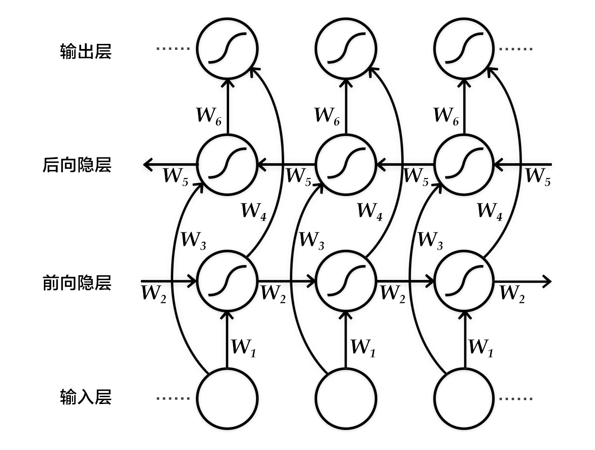
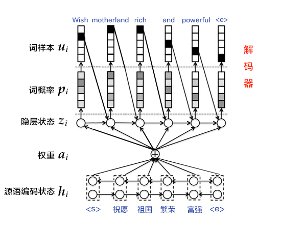

运行本目录下的范例模型需要安装PaddlePaddle Fluid 1.0版。如果您的 PaddlePaddle 安装版本低于此要求，请按照[安装文档](http://paddlepaddle.org/documentation/docs/zh/1.2/beginners_guide/install/index_cn.html)中的说明更新 PaddlePaddle 安装版本。

# 机器翻译：RNN Search

以下是本范例模型的简要目录结构及说明：

```text
.
├── README.md              # 文档，本文件
├── args.py                # 训练、预测以及模型参数
├── train.py               # 训练主程序
├── infer.py               # 预测主程序
├── attention_model.py     # 带注意力机制的翻译模型配置
└── no_attention_model.py  # 无注意力机制的翻译模型配置
```

## 简介
机器翻译（machine translation, MT）是用计算机来实现不同语言之间翻译的技术。被翻译的语言通常称为源语言（source language），翻译成的结果语言称为目标语言（target language）。机器翻译即实现从源语言到目标语言转换的过程，是自然语言处理的重要研究领域之一。

近年来，深度学习技术的发展不断为机器翻译任务带来新的突破。直接用神经网络将源语言映射到目标语言，即端到端的神经网络机器翻译（End-to-End Neural Machine Translation, End-to-End NMT）模型逐渐成为主流，此类模型一般简称为NMT模型。

本目录包含一个经典的机器翻译模型[RNN Search](https://arxiv.org/pdf/1409.0473.pdf)的Paddle Fluid实现。事实上，RNN search是一个较为传统的NMT模型，在现阶段，其表现已被很多新模型（如[Transformer](https://arxiv.org/abs/1706.03762)）超越。但除机器翻译外，该模型是许多序列到序列（sequence to sequence, 以下简称Seq2Seq）类模型的基础，很多解决其他NLP问题的模型均以此模型为基础；因此其在NLP领域具有重要意义，并被广泛用作Baseline.

本目录下此范例模型的实现，旨在展示如何用Paddle Fluid实现一个带有注意力机制（Attention）的RNN模型来解决Seq2Seq类问题，以及如何使用带有Beam Search算法的解码器。如果您仅仅只是需要在机器翻译方面有着较好翻译效果的模型，则建议您参考[Transformer的Paddle Fluid实现](https://github.com/PaddlePaddle/models/tree/develop/fluid/neural_machine_translation/transformer)。

## 模型概览
RNN Search模型使用了经典的编码器-解码器（Encoder-Decoder）的框架结构来解决Seq2Seq类问题。这种方法先用编码器将源序列编码成vector，再用解码器将该vector解码为目标序列。这其实模拟了人类在进行翻译类任务时的行为：先解析源语言，理解其含义，再根据该含义来写出目标语言的语句。编码器和解码器往往都使用RNN来实现。关于此方法的具体原理和数学表达式，可以参考[深度学习101](http://paddlepaddle.org/documentation/docs/zh/1.2/beginners_guide/basics/machine_translation/index.html).

本模型中，在编码器方面，我们的实现使用了双向循环神经网络（Bi-directional Recurrent Neural Network）；在解码器方面，我们使用了带注意力（Attention）机制的RNN解码器，并同时提供了一个不带注意力机制的解码器实现作为对比；而在预测方面我们使用柱搜索（beam search）算法来生成翻译的目标语句。以下将分别介绍用到的这些方法。

### 双向循环神经网络
这里介绍Bengio团队在论文\[[2](#参考文献),[4](#参考文献)\]中提出的一种双向循环网络结构。该结构的目的是输入一个序列，得到其在每个时刻的特征表示，即输出的每个时刻都用定长向量表示到该时刻的上下文语义信息。
具体来说，该双向循环神经网络分别在时间维以顺序和逆序——即前向（forward）和后向（backward）——依次处理输入序列，并将每个时间步RNN的输出拼接成为最终的输出层。这样每个时间步的输出节点，都包含了输入序列中当前时刻完整的过去和未来的上下文信息。下图展示的是一个按时间步展开的双向循环神经网络。该网络包含一个前向和一个后向RNN，其中有六个权重矩阵：输入到前向隐层和后向隐层的权重矩阵（$W_1, W_3$），隐层到隐层自己的权重矩阵（$W_2,W_5$），前向隐层和后向隐层到输出层的权重矩阵（$W_4, W_6$）。注意，该网络的前向隐层和后向隐层之间没有连接。

<p align="center">
<br/>
图1. 按时间步展开的双向循环神经网络
</p>

<p align="center">
<br/>
图2. 使用双向LSTM的编码器
</p>

### 注意力机制
如果编码阶段的输出是一个固定维度的向量，会带来以下两个问题：1）不论源语言序列的长度是5个词还是50个词，如果都用固定维度的向量去编码其中的语义和句法结构信息，对模型来说是一个非常高的要求，特别是对长句子序列而言；2）直觉上，当人类翻译一句话时，会对与当前译文更相关的源语言片段上给予更多关注，且关注点会随着翻译的进行而改变。而固定维度的向量则相当于，任何时刻都对源语言所有信息给予了同等程度的关注，这是不合理的。因此，Bahdanau等人\[[4](#参考文献)\]引入注意力（attention）机制，可以对编码后的上下文片段进行解码，以此来解决长句子的特征学习问题。下面介绍在注意力机制下的解码器结构。

与简单的解码器不同，这里$z_i$的计算公式为 （由于Github原生不支持LaTeX公式，请您移步[这里](http://www.paddlepaddle.org/documentation/docs/zh/1.2/beginners_guide/basics/machine_translation/index.html)查看）：

$$z_{i+1}=\phi _{\theta '}\left ( c_i,u_i,z_i \right )$$

可见，源语言句子的编码向量表示为第$i$个词的上下文片段$c_i$，即针对每一个目标语言中的词$u_i$，都有一个特定的$c_i$与之对应。$c_i$的计算公式如下：

$$c_i=\sum _{j=1}^{T}a_{ij}h_j, a_i=\left[ a_{i1},a_{i2},...,a_{iT}\right ]$$

从公式中可以看出，注意力机制是通过对编码器中各时刻的RNN状态$h_j$进行加权平均实现的。权重$a_{ij}$表示目标语言中第$i$个词对源语言中第$j$个词的注意力大小，$a_{ij}$的计算公式如下：

$$a_{ij} = {exp(e_{ij}) \over {\sum_{k=1}^T exp(e_{ik})}}$$
$$e_{ij} = {align(z_i, h_j)}$$

其中，$align$可以看作是一个对齐模型，用来衡量目标语言中第$i$个词和源语言中第$j$个词的匹配程度。具体而言，这个程度是通过解码RNN的第$i$个隐层状态$z_i$和源语言句子的第$j$个上下文片段$h_j$计算得到的。传统的对齐模型中，目标语言的每个词明确对应源语言的一个或多个词（hard alignment）；而在注意力模型中采用的是soft alignment，即任何两个目标语言和源语言词间均存在一定的关联，且这个关联强度是由模型计算得到的实数，因此可以融入整个NMT框架，并通过反向传播算法进行训练。

<p align="center">
<br/>
图3. 基于注意力机制的解码器
</p>

### 柱搜索算法

柱搜索（[beam search](http://en.wikipedia.org/wiki/Beam_search)）是一种启发式图搜索算法，用于在图或树中搜索有限集合中的最优扩展节点，通常用在解空间非常大的系统（如机器翻译、语音识别）中，原因是内存无法装下图或树中所有展开的解。如在机器翻译任务中希望翻译“`<s>你好<e>`”，就算目标语言字典中只有3个词（`<s>`, `<e>`, `hello`），也可能生成无限句话（`hello`循环出现的次数不定），为了找到其中较好的翻译结果，我们可采用柱搜索算法。

柱搜索算法使用广度优先策略建立搜索树，在树的每一层，按照启发代价（heuristic cost）（本教程中，为生成词的log概率之和）对节点进行排序，然后仅留下预先确定的个数（文献中通常称为beam width、beam size、柱宽度等）的节点。只有这些节点会在下一层继续扩展，其他节点就被剪掉了，也就是说保留了质量较高的节点，剪枝了质量较差的节点。因此，搜索所占用的空间和时间大幅减少，但缺点是无法保证一定获得最优解。

使用柱搜索算法的解码阶段，目标是最大化生成序列的概率。思路是：

1. 每一个时刻，根据源语言句子的编码信息$c$、生成的第$i$个目标语言序列单词$u_i$和$i$时刻RNN的隐层状态$z_i$，计算出下一个隐层状态$z_{i+1}$。
2. 将$z_{i+1}$通过`softmax`归一化，得到目标语言序列的第$i+1$个单词的概率分布$p_{i+1}$。
3. 根据$p_{i+1}$采样出单词$u_{i+1}$。
4. 重复步骤1~3，直到获得句子结束标记`<e>`或超过句子的最大生成长度为止。

注意：$z_{i+1}$和$p_{i+1}$的计算公式同解码器中的一样。且由于生成时的每一步都是通过贪心法实现的，因此并不能保证得到全局最优解。

## 数据介绍

本教程使用[WMT-14](http://www-lium.univ-lemans.fr/~schwenk/cslm_joint_paper/)数据集中的[bitexts(after selection)](http://www-lium.univ-lemans.fr/~schwenk/cslm_joint_paper/data/bitexts.tgz)作为训练集，[dev+test data](http://www-lium.univ-lemans.fr/~schwenk/cslm_joint_paper/data/dev+test.tgz)作为测试集和生成集。

### 数据预处理

我们的预处理流程包括两步：
- 将每个源语言到目标语言的平行语料库文件合并为一个文件：
  - 合并每个`XXX.src`和`XXX.trg`文件为`XXX`。
  - `XXX`中的第$i$行内容为`XXX.src`中的第$i$行和`XXX.trg`中的第$i$行连接，用'\t'分隔。
- 创建训练数据的“源字典”和“目标字典”。每个字典都有**DICTSIZE**个单词，包括：语料中词频最高的（DICTSIZE - 3）个单词，和3个特殊符号`<s>`（序列的开始）、`<e>`（序列的结束）和`<unk>`（未登录词）。

### 示例数据

因为完整的数据集数据量较大，为了验证训练流程，PaddlePaddle接口paddle.dataset.wmt14中默认提供了一个经过预处理的[较小规模的数据集](http://paddlepaddle.bj.bcebos.com/demo/wmt_shrinked_data/wmt14.tgz)。

该数据集有193319条训练数据，6003条测试数据，词典长度为30000。因为数据规模限制，使用该数据集训练出来的模型效果无法保证。

## 训练模型

`train.py`包含训练程序的主函数，要使用默认参数开始训练，只需要简单地执行：
```sh
python train.py
```
您可以使用命令行参数来设置模型训练时的参数。要显示所有可用的命令行参数，执行：
```sh
python train.py -h
```
这样会显示所有的命令行参数的描述，以及其默认值。默认的模型是带有注意力机制的。您也可以尝试运行无注意力机制的模型，命令如下：
```sh
python train.py --no_attention
```
训练好的模型默认会被保存到`./models`路径下。您可以用命令行参数`--save_dir`来指定模型的保存路径。默认每个pass结束时会保存一个模型。

## 生成预测结果

在模型训练好后，可以用`infer.py`来生成预测结果。同样的，使用默认参数，只需要执行：
```sh
python infer.py
```
您也可以同样用命令行来指定各参数。注意，预测时的参数设置必须与训练时完全一致，否则载入模型会失败。您可以用`--pass_num`参数来选择读取哪个pass结束时保存的模型。同时您可以使用`--beam_width`参数来选择beam search宽度。

## 参考文献

1. Koehn P. [Statistical machine translation](https://books.google.com.hk/books?id=4v_Cx1wIMLkC&printsec=frontcover&hl=zh-CN&source=gbs_ge_summary_r&cad=0#v=onepage&q&f=false)[M]. Cambridge University Press, 2009.
2. Cho K, Van Merriënboer B, Gulcehre C, et al. [Learning phrase representations using RNN encoder-decoder for statistical machine translation](http://www.aclweb.org/anthology/D/D14/D14-1179.pdf)[C]//Proceedings of the 2014 Conference on Empirical Methods in Natural Language Processing (EMNLP), 2014: 1724-1734.
3. Chung J, Gulcehre C, Cho K H, et al. [Empirical evaluation of gated recurrent neural networks on sequence modeling](https://arxiv.org/abs/1412.3555)[J]. arXiv preprint arXiv:1412.3555, 2014.
4.  Bahdanau D, Cho K, Bengio Y. [Neural machine translation by jointly learning to align and translate](https://arxiv.org/abs/1409.0473)[C]//Proceedings of ICLR 2015, 2015.
5. Papineni K, Roukos S, Ward T, et al. [BLEU: a method for automatic evaluation of machine translation](http://dl.acm.org/citation.cfm?id=1073135)[C]//Proceedings of the 40th annual meeting on association for computational linguistics. Association for Computational Linguistics, 2002: 311-318.

<br/>
<a rel="license" href="http://creativecommons.org/licenses/by-sa/4.0/"></a><br /><span xmlns:dct="http://purl.org/dc/terms/" href="http://purl.org/dc/dcmitype/Text" property="dct:title" rel="dct:type">本教程</span> 由 <a xmlns:cc="http://creativecommons.org/ns#" href="http://book.paddlepaddle.org" property="cc:attributionName" rel="cc:attributionURL">PaddlePaddle</a> 创作，采用 <a rel="license" href="http://creativecommons.org/licenses/by-sa/4.0/">知识共享 署名-相同方式共享 4.0 国际 许可协议</a>进行许可。
