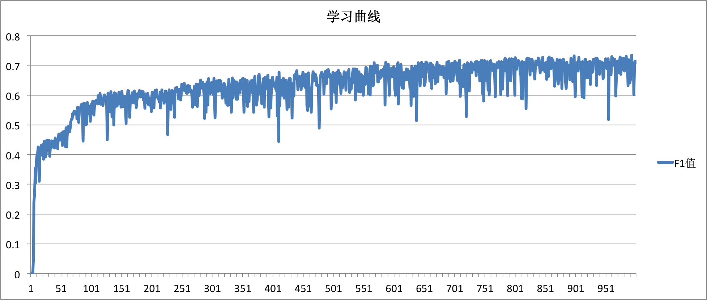

# 命名实体识别

以下是本例的简要目录结构及说明：

```text
.
├── data                 # 存储运行本例所依赖的数据，从外部获取
├── network_conf.py      # 模型定义
├── reader.py            # 数据读取接口, 从外部获取
├── README.md            # 文档
├── train.py             # 训练脚本
├── infer.py             # 预测脚本
├── utils.py             # 定义通用的函数, 从外部获取
└── utils_extend.py      # 对utils.py的拓展
```


## 简介，模型详解

在PaddlePaddle v2版本[命名实体识别](https://github.com/PaddlePaddle/models/blob/develop/legacy/sequence_tagging_for_ner/README.md)中对于命名实体识别任务有较详细的介绍，在本例中不再重复介绍。
在模型上，我们沿用了v2版本的模型结构，唯一区别是我们使用LSTM代替原始的RNN。

## 数据获取

完整数据的获取请参考PaddlePaddle v2版本[命名实体识别](https://github.com/PaddlePaddle/models/blob/develop/legacy/sequence_tagging_for_ner/README.md) 一节中的方式。本例的示例数据同样可以通过运行data/download.sh来获取。

## 训练

1. 运行 `sh data/download.sh`
2. 修改 `train.py` 的 `main` 函数，指定数据路径

    ```python
    main(
        train_data_file="data/train",
        test_data_file="data/test",
        vocab_file="data/vocab.txt",
        target_file="data/target.txt",
        emb_file="data/wordVectors.txt",
        model_save_dir="models",
        num_passes=1000,
        use_gpu=False,
        parallel=False)
    ```

3. 运行命令 `python train.py` ，**需要注意：直接运行使用的是示例数据，请替换真实的标记数据。**

    ```text
    Pass 127, Batch 9525, Cost 4.0867705, Precision 0.3954984, Recall 0.37846154, F1_score0.38679245
    Pass 127, Batch 9530, Cost 3.137265, Precision 0.42971888, Recall 0.38351256, F1_score0.405303
    Pass 127, Batch 9535, Cost 3.6240938, Precision 0.4272152, Recall 0.41795665, F1_score0.4225352
    Pass 127, Batch 9540, Cost 3.5352352, Precision 0.48464164, Recall 0.4536741, F1_score0.46864685
    Pass 127, Batch 9545, Cost 4.1130385, Precision 0.40131578, Recall 0.3836478, F1_score0.39228293
    Pass 127, Batch 9550, Cost 3.6826708, Precision 0.43333334, Recall 0.43730888, F1_score0.43531203
    Pass 127, Batch 9555, Cost 3.6363933, Precision 0.42424244, Recall 0.3962264, F1_score0.4097561
    Pass 127, Batch 9560, Cost 3.6101768, Precision 0.51363635, Recall 0.353125, F1_score0.41851854
    Pass 127, Batch 9565, Cost 3.5935276, Precision 0.5152439, Recall 0.5, F1_score0.5075075
    Pass 127, Batch 9570, Cost 3.4987144, Precision 0.5, Recall 0.4330218, F1_score0.46410686
    Pass 127, Batch 9575, Cost 3.4659843, Precision 0.39864865, Recall 0.38064516, F1_score0.38943896
    Pass 127, Batch 9580, Cost 3.1702557, Precision 0.5, Recall 0.4490446, F1_score0.47315437
    Pass 127, Batch 9585, Cost 3.1587276, Precision 0.49377593, Recall 0.4089347, F1_score0.4473684
    Pass 127, Batch 9590, Cost 3.5043538, Precision 0.4556962, Recall 0.4600639, F1_score0.45786962
    Pass 127, Batch 9595, Cost 2.981989, Precision 0.44981414, Recall 0.45149255, F1_score0.4506518
    [TrainSet] pass_id:127 pass_precision:[0.46023396] pass_recall:[0.43197003] pass_f1_score:[0.44565433]
    [TestSet] pass_id:127 pass_precision:[0.4708409] pass_recall:[0.47971722] pass_f1_score:[0.4752376]
    ```
## 预测
1. 修改 [infer.py](./infer.py) 的 `infer` 函数，指定：需要测试的模型的路径、测试数据、字典文件，预测标记文件的路径，默认参数如下：

    ```python
    infer(
        model_path="models/params_pass_0",
        batch_size=6,
        test_data_file="data/test",
        vocab_file="data/vocab.txt",
        target_file="data/target.txt",
        use_gpu=False
    )
    ```

2. 在终端运行 `python infer.py`，开始测试，会看到如下预测结果（以下为训练70个pass所得模型的部分预测结果）：

    ```text
    leicestershire    B-ORG    B-LOC
    extended    O    O
    their    O    O
    first    O    O
    innings    O    O
    by    O    O
    DGDG    O    O
    runs    O    O
    before    O    O
    being    O    O
    bowled    O    O
    out    O    O
    for    O    O
    296    O    O
    with    O    O
    england    B-LOC    B-LOC
    discard    O    O
    andy    B-PER    B-PER
    caddick    I-PER    I-PER
    taking    O    O
    three    O    O
    for    O    O
    DGDG    O    O
    .    O    O
    ```

    输出分为三列，以“\t” 分隔，第一列是输入的词语，第二列是标准结果，第三列为生成的标记结果。多条输入序列之间以空行分隔。

## 结果示例

<p align="center">
<br/>
图1. 学习曲线, 横轴表示训练轮数，纵轴表示F1值
</p>
