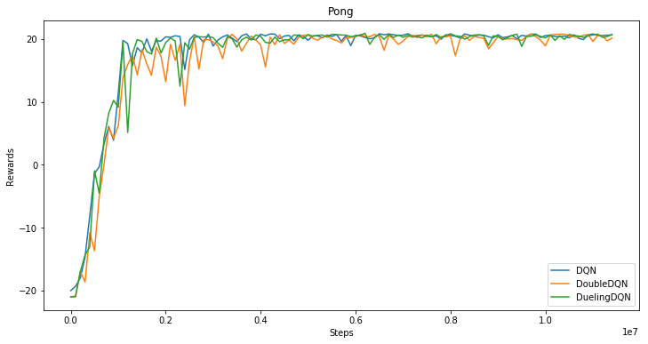

[中文版](README_cn.md)

## Reproduce DQN, DoubleDQN, DuelingDQN model with Fluid version of PaddlePaddle
Based on PaddlePaddle's next-generation API Fluid, the DQN model of deep reinforcement learning is reproduced, and the same level of indicators of the paper is reproduced in the classic Atari game. The model receives the image of the game as input, and uses the end-to-end model to directly predict the next step. The repository contains the following three types of models:
+ DQN in
[Human-level Control Through Deep Reinforcement Learning](http://www.nature.com/nature/journal/v518/n7540/full/nature14236.html)
+ DoubleDQN in:
[Deep Reinforcement Learning with Double Q-Learning](https://www.aaai.org/ocs/index.php/AAAI/AAAI16/paper/viewPaper/12389)
+ DuelingDQN in:
[Dueling Network Architectures for Deep Reinforcement Learning](http://proceedings.mlr.press/v48/wangf16.html)

## Atari benchmark & performance

### Atari games introduction

Please see [here](https://gym.openai.com/envs/#atari) to know more about Atari game.

### Pong game result

The average game rewards that can be obtained for the three models as the number of training steps changes during the training are as follows(about 3 hours/1 Million steps):

<div align="center">
</img>
</div>

## How to use
### Dependencies:
+ python2.7
+ gym
+ tqdm
+ opencv-python
+ paddlepaddle-gpu>=1.0.0
+ ale_python_interface

### Install Dependencies:
+ Install PaddlePaddle:
    recommended to compile and install PaddlePaddle from source code
+ Install other dependencies:
    ```
    pip install -r requirement.txt
    pip install gym[atari]
    ```
    Install ale_python_interface, please see [here](https://github.com/mgbellemare/Arcade-Learning-Environment).

### Start Training:
```
# To train a model for Pong game with gpu (use DQN model as default)
python train.py --rom ./rom_files/pong.bin --use_cuda

# To train a model for Pong with DoubleDQN
python train.py --rom ./rom_files/pong.bin --use_cuda --alg DoubleDQN

# To train a model for Pong with DuelingDQN
python train.py --rom ./rom_files/pong.bin --use_cuda --alg DuelingDQN
```

To train more games, you can install more rom files from [here](https://github.com/openai/atari-py/tree/master/atari_py/atari_roms).

### Start Testing:
```
# Play the game with saved best model and calculate the average rewards
python play.py --rom ./rom_files/pong.bin --use_cuda --model_path ./saved_model/DQN-pong

# Play the game with visualization
python play.py --rom ./rom_files/pong.bin --use_cuda --model_path ./saved_model/DQN-pong --viz 0.01
```
[Here](https://pan.baidu.com/s/1gIsbNw5V7tMeb74ojx-TMA) is saved models for Pong and Breakout games. You can use it to play the game directly.
